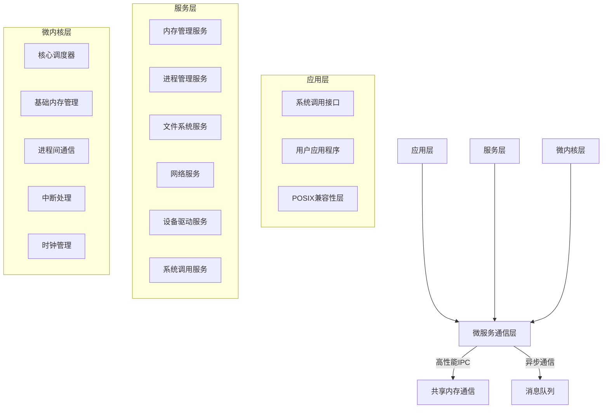

# NOS完整实施计划

## 1. 项目概况与执行摘要

### 1.1 项目现状
NOS是一个Rust开发的操作系统内核项目，具有以下特点：
- 功能完整度约75%，POSIX兼容性仅60%
- 跨平台支持达90%，架构设计合理但缺乏现代化特性
- 核心性能存在热点问题，如内存碎片、进程分配效率低
- 代码质量评分6.8/10，存在大文件、测试缺失和错误处理不一致等问题
- 基准测试覆盖不足，仅30%

### 1.2 改进目标
通过4个阶段的系统性优化，实现：
- 功能完整度提升至95%，POSIX兼容性达85%
- 核心性能提升2-5倍
- 代码质量评分提升至9.0/10
- 基准测试覆盖达90%
- 支持现代化特性（容器化、云原生）
- 达到生产级可用性

## 2. 混合架构设计

### 2.1 设计目标
将当前NOS宏内核架构重构为混合架构，实现以下目标：
- **高性能**：保持直接内存访问的低延迟特性
- **高扩展性**：模块间低耦合，支持独立开发和部署
- **高可维护性**：清晰的模块边界和接口定义
- **安全性**：模块间隔离，降低单一故障影响范围
- **渐进式迁移**：避免大规模重写，支持分阶段实施

### 2.2 架构分层


### 2.3 各层详细设计

#### 2.3.1 微内核层
**核心职责**：提供最基础的系统服务，确保系统的安全性和稳定性
**主要模块**：
- 核心调度器：线程/进程调度，CPU时间分配
- 基础内存管理：物理内存分配，地址空间隔离
- 进程间通信：共享内存、消息队列等通信机制
- 中断处理：硬件中断分发和处理
- 时钟管理：系统时钟和定时器服务

#### 2.3.2 服务层
**核心职责**：实现具体的系统功能，作为独立服务运行
**主要模块**：
- 内存管理服务：虚拟内存管理，内存保护，页表管理
- 进程管理服务：进程创建/销毁，资源分配，进程间通信
- 文件系统服务：VFS抽象，文件系统实现（ramfs, ext4等）
- 网络服务：TCP/IP协议栈，socket接口
- 设备驱动服务：设备抽象，驱动管理
- 系统调用服务：POSIX系统调用实现

#### 2.3.3 应用层
**核心职责**：提供用户应用程序的运行环境和接口
**主要模块**：
- 系统调用接口：POSIX标准接口暴露
- 用户应用程序：用户态进程和服务
- POSIX兼容性层：确保现有应用的兼容性

### 2.4 通信机制设计

#### 2.4.1 共享内存通信
- **用途**：高性能服务间通信
- **设计**：预分配共享内存区域，使用自旋锁或原子操作实现同步
- **优化**：零拷贝数据传输，批量操作支持

#### 2.4.2 异步消息队列
- **用途**：非阻塞、低优先级通信
- **设计**：基于环形缓冲区的消息队列，支持多生产者/多消费者
- **优化**：消息批处理，减少上下文切换

#### 2.4.3 系统调用通道
- **用途**：用户态与内核态通信
- **设计**：基于中断的系统调用接口，支持快速上下文切换

### 2.5 模块化开发规范

#### 2.5.1 服务接口定义
- 使用Rust trait定义服务接口
- 接口设计遵循最小化原则
- 支持版本化接口

#### 2.5.2 消息格式标准化
- 使用Protobuf或自定义二进制格式
- 消息结构清晰，字段含义明确
- 支持消息压缩和加密

#### 2.5.3 服务发现与注册
- 微内核提供服务注册和查询接口
- 服务启动时自动注册
- 支持服务健康检查

#### 2.5.4 版本兼容性管理
- 接口版本号包含在消息头中
- 支持向前和向后兼容
- 提供版本迁移工具

### 2.6 数据流与控制流分析

#### 2.6.1 系统调用流程
```
用户应用 → 系统调用接口 → 微内核 → 系统调用服务 → 具体服务 → 返回结果
```

#### 2.6.2 服务间通信流程
```
服务A → 通信层 → 微内核仲裁 → 通信层 → 服务B
```

#### 2.6.3 中断处理流程
```
硬件中断 → 微内核中断处理 → 设备驱动服务 → 应用层通知
```

### 2.7 性能优化策略
- **内存布局优化**：服务间共享内存区域预分配、减少内存碎片、优化缓存命中率
- **通信优化**：零拷贝数据传输、批量消息处理、减少上下文切换
- **调度优化**：服务优先级调度、实时调度支持、减少调度延迟

### 2.8 安全机制设计
- **模块隔离**：地址空间隔离、权限控制、资源访问限制
- **通信安全**：消息加密、身份验证、访问控制列表
- **故障隔离**：服务崩溃隔离、错误传播控制、自动恢复机制

## 3. 分阶段实施计划

### 3.1 第一阶段（0-6个月）：基础优化
**目标**：解决最严重的性能和代码质量问题，建立基础优化框架

**主要任务**：
- 内存分配器优化（BumpAllocator → 伙伴系统+Slab）
- 进程分配算法优化（O(n) → O(1)）
- 大文件拆分（syscall.rs、vfs.rs等）
- 测试框架建立和基础测试覆盖
- 错误处理一致性修复
- 缓冲缓存优化（线性查找 → 哈希表）
- 实现mmap、munmap、gettimeofday、clock_gettime等系统调用
- 完善POSIX信号处理
- 建立持续集成系统

### 3.2 第二阶段（6-12个月）：功能增强
**目标**：完善核心功能，提升POSIX兼容性，集成newlib作为用户空间C标准库

**主要任务**：
- 实现socket相关系统调用（socket、bind、listen、accept、connect）
- 实现sendfile、splice、ftruncate、fchmod、fchown、epoll/kqueue等系统调用
- 完善文件系统支持（EXT4、tmpfs、文件权限检查）
- 实现符号链接、文件锁机制、POSIX线程支持
- 实现进程组管理、资源限制（rlimit）、内存压缩、大页支持（huge pages）、NUMA感知的内存分配
- 集成newlib作为用户空间C标准库
- 实现newlib系统调用接口适配
- 适配newlib内存分配、文件I/O、线程和网络功能
- 基准测试覆盖提升至70%

### 3.3 第三阶段（12-18个月）：混合架构重构
**目标**：将宏内核架构重构为混合架构，实现高性能、高扩展性和高可维护性的系统架构

**主要任务**：
- 混合架构设计文档编写与评审
- 微内核核心功能实现（核心调度器、基础内存管理、进程间通信、中断处理、时钟管理）
- 服务注册与发现机制实现
- 内存管理服务、进程管理服务、文件系统服务、网络服务、设备驱动服务、系统调用服务分离与迁移
- 高性能IPC通信机制实现（共享内存、零拷贝传输、异步消息队列、消息队列、信号量）
- 通信层优化（零拷贝数据传输、批量操作、消息批处理）
- 模块化开发规范制定
- 实现NFS网络文件系统支持、容器运行时支持

### 3.4 第四阶段（18-24个月）：生产级特性
**目标**：达到生产级可用性和稳定性

**主要任务**：
- 云原生特性支持（virtio优化、OCI标准）
- 安全机制强化（ASLR、SMAP/SMEP、完整ACL、安全审计机制、入侵检测系统框架）
- 引入形式化验证工具
- 完善错误处理和诊断（错误恢复、报告、统计）
- 实现故障诊断工具和优雅降级
- 完善调试和监控系统（性能监控、系统调用跟踪、实时性能分析、调试符号支持）
- 实现NVMe、USB硬件抽象、动态设备发现和热插拔
- 生产环境文档完善

## 4. 详细TODO列表

### P0优先级（立即执行）
| 任务ID | 任务描述 | 预期结果 | 负责模块 | 时间估算 | 依赖 |
|--------|----------|----------|----------|----------|------|
| P0-001 | 将BumpAllocator替换为Buddy+Slab内存分配器 | 内存碎片率降低50%，分配效率提升3倍 | kernel/src/alloc.rs | 2周 | - |
| P0-002 | 进程分配算法从O(n)优化为O(1) | 进程创建/销毁时间降低90% | kernel/src/process.rs | 3周 | - |
| P0-003 | 拆分syscall.rs文件为多个子模块 | 单个文件代码量<500行，代码结构清晰 | kernel/src/syscall.rs | 2周 | - |
| P0-004 | 建立基本测试框架和测试覆盖 | 测试覆盖率达到30% | kernel/src/ | 4周 | - |
| P0-005 | 修复错误处理不一致问题 | 统一使用Result类型，错误码与POSIX兼容 | kernel/src/ | 3周 | - |

### P1优先级（0-6个月内完成）
| 任务ID | 任务描述 | 预期结果 | 负责模块 | 时间估算 | 依赖 |
|--------|----------|----------|----------|----------|------|
| P1-001 | 拆分vfs.rs文件为多个子模块 | 单个文件代码量<500行 | kernel/src/vfs.rs | 2周 | - |
| P1-002 | 缓冲缓存从线性查找改为哈希表 | 缓存查找效率提升10倍 | kernel/src/fs.rs | 3周 | - |
| P1-003 | 实现mmap和munmap系统调用 | 支持内存映射功能 | kernel/src/syscall.rs | 4周 | P0-003 |
| P1-004 | 实现gettimeofday和clock_gettime系统调用 | 支持高精度时间获取 | kernel/src/syscall.rs | 2周 | - |
| P1-005 | 完善POSIX信号处理 | 支持全部POSIX标准信号 | kernel/src/signal.rs | 3周 | - |
| P1-006 | 建立持续集成系统 | 自动运行测试和基准测试 | .github/ | 2周 | P0-004 |

### P2优先级（6-12个月内完成）
| 任务ID | 任务描述 | 预期结果 | 负责模块 | 时间估算 | 依赖 |
|--------|----------|----------|----------|----------|------|
| P2-001 | 实现socket相关系统调用 | 支持socket、bind、listen、accept、connect | kernel/src/syscall.rs | 8周 | P0-003 |
| P2-002 | 实现sendfile和splice系统调用 | 支持零拷贝I/O | kernel/src/syscall.rs | 4周 | P0-003 |
| P2-003 | 实现ftruncate、fchmod、fchown系统调用 | 完善文件系统操作 | kernel/src/syscall.rs | 3周 | P0-003 |
| P2-004 | 实现epoll/kqueue系统调用 | 支持高性能I/O | kernel/src/syscall.rs | 5周 | P0-003 |
| P2-005 | 完善文件系统支持 | 支持EXT4和tmpfs，实现完整的文件权限检查 | kernel/src/fs.rs | 8周 | - |
| P2-006 | 实现符号链接和文件锁机制 | 支持完整的文件系统特性 | kernel/src/fs.rs | 4周 | P2-005 |
| P2-007 | 实现POSIX线程支持 | 支持pthread API | kernel/src/ | 6周 | - |
| P2-008 | 实现进程组管理和资源限制（rlimit） | 完善进程管理功能 | kernel/src/process.rs | 4周 | - |
| P2-009 | 实现内存压缩机制 | 减少内存占用 | kernel/src/mm.rs | 5周 | - |
| P2-010 | 实现大页支持（huge pages） | 提升内存访问效率 | kernel/src/mm.rs | 4周 | - |
| P2-011 | 实现NUMA感知的内存分配 | 优化多NUMA系统性能 | kernel/src/mm.rs | 5周 | P2-010 |
| P2-012 | 集成newlib作为用户空间C标准库 | 完成newlib的交叉编译和基本集成 | user/ | 6周 | - |
| P2-013 | 实现newlib系统调用接口适配 | 实现newlib所需的系统调用接口层 | kernel/src/syscall.rs | 8周 | P2-012 |
| P2-014 | 适配newlib内存分配和文件I/O | 确保newlib的malloc/free和文件操作与NOS兼容 | kernel/src/mm.rs、kernel/src/fs.rs | 5周 | P2-013 |
| P2-015 | 适配newlib线程和网络功能 | 确保pthread和socket功能与newlib兼容 | kernel/src/process.rs、kernel/src/ipc/ | 6周 | P2-013、P2-001 |
| P2-016 | 基准测试覆盖提升至70% | 核心功能全部有基准测试 | benchmarks/ | 4周 | P0-004 |

### P3优先级（12-24个月内完成）
| 任务ID | 任务描述 | 预期结果 | 负责模块 | 时间估算 | 依赖 |
|--------|----------|----------|----------|----------|------|
| P3-001 | 混合架构设计文档编写与评审 | 完成并通过技术评审 | docs/ | 4周 | - |
| P3-002 | 微内核核心功能实现 | 实现核心调度器、基础内存管理、进程间通信、中断处理和时钟管理 | kernel/src/kernel/ | 6周 | - |
| P3-003 | 服务注册与发现机制 | 实现服务自动注册、查询和健康检查功能 | kernel/src/service/ | 4周 | P3-002 |
| P3-004 | 内存管理服务分离与迁移 | 将vm.rs/mm.rs迁移为独立服务，实现虚拟内存管理、内存保护和页表管理 | kernel/src/services/mm/ | 5周 | P3-003 |
| P3-005 | 进程管理服务分离与迁移 | 将process.rs迁移为独立服务，实现进程创建/销毁、资源分配和进程间通信 | kernel/src/services/process/ | 5周 | P3-003 |
| P3-006 | 文件系统服务分离与迁移 | 将fs.rs/vfs.rs迁移为独立服务，实现VFS抽象和文件系统支持 | kernel/src/services/fs/ | 6周 | P3-003 |
| P3-007 | 系统调用服务实现 | 实现统一的系统调用处理服务，支持POSIX标准接口 | kernel/src/services/syscall/ | 4周 | P3-005 |
| P3-008 | 网络服务实现 | 实现独立的网络服务，支持TCP/IP协议栈和socket接口 | kernel/src/services/network/ | 7周 | P3-003 |
| P3-009 | 设备驱动服务实现 | 实现独立的设备驱动服务，支持设备抽象和驱动管理 | kernel/src/services/drivers/ | 6周 | P3-003 |
| P3-010 | 高性能IPC通信机制 | 实现共享内存、零拷贝传输和异步消息队列通信 | kernel/src/ipc/ | 6周 | P3-002 |
| P3-011 | 模块化开发规范制定 | 制定服务接口定义、消息格式标准化和版本兼容性管理规范 | docs/ | 2周 | - |
| P3-012 | 通信层优化 | 实现零拷贝数据传输、批量操作和消息批处理优化 | kernel/src/ipc/ | 4周 | P3-010 |
| P3-013 | 实现NFS网络文件系统支持 | 支持网络文件访问 | kernel/src/fs/ | 6周 | P3-006 |
| P3-014 | 实现共享内存（shmget、shmop） | 支持进程间共享内存 | kernel/src/ipc/ | 4周 | P3-010 |
| P3-015 | 实现消息队列（msgget、msgop） | 支持进程间消息队列 | kernel/src/ipc/ | 4周 | P3-010 |
| P3-016 | 实现信号量（semget、semop） | 支持进程间信号量 | kernel/src/ipc/ | 3周 | P3-010 |
| P3-017 | 实现容器运行时支持 | 支持OCI标准 | kernel/src/ | 8周 | P3-005 |
| P3-018 | 云原生特性支持 | 支持virtio优化和OCI标准 | kernel/src/ | 8周 | P3-017 |
| P3-019 | 安全机制强化 | 实现ASLR、SMAP/SMEP、完整ACL | kernel/src/ | 8周 | - |
| P3-020 | 实现安全审计机制 | 记录系统安全事件 | kernel/src/ | 4周 | P3-019 |
| P3-021 | 实现入侵检测系统框架 | 支持系统安全威胁检测 | kernel/src/ | 6周 | P3-020 |
| P3-022 | 引入形式化验证工具 | 支持内核代码的形式化验证 | kernel/src/ | 4周 | - |
| P3-023 | 完善错误处理和诊断 | 实现错误恢复、报告和统计 | kernel/src/ | 6周 | - |
| P3-024 | 实现故障诊断工具和优雅降级 | 支持系统故障诊断和自动降级 | kernel/src/ | 5周 | P3-023 |
| P3-025 | 完善调试和监控系统 | 实现性能监控、系统调用跟踪和实时性能分析 | kernel/src/ | 8周 | - |
| P3-026 | 实现调试符号支持 | 便于内核调试 | kernel/src/ | 2周 | P3-025 |
| P3-027 | 实现NVMe和USB硬件抽象 | 支持现代硬件 | kernel/src/drivers.rs | 6周 | - |
| P3-028 | 实现动态设备发现和热插拔 | 支持设备自动发现和热插拔 | kernel/src/drivers.rs | 5周 | P3-027 |
| P3-029 | 生产环境文档完善 | 编写完整的生产环境部署和维护文档 | docs/ | 3周 | - |

## 5. 资源配置与风险管理

### 5.1 人力资源分配
| 角色 | 数量 | 技能要求 | 负责领域 |
|------|------|----------|----------|
| 核心开发工程师 | 2-3 | Rust、操作系统内核、计算机架构、newlib集成经验 | 内核核心功能开发、newlib集成 |
| 测试工程师 | 1 | 自动化测试、性能分析 | 测试框架和基准测试 |
| 系统架构师 | 1 | 操作系统架构、云原生技术、微内核设计 | 混合架构设计和现代化特性 |

### 5.2 技术栈要求
- 编程语言：Rust 1.75+
- 构建工具：Cargo、XTask
- 测试框架：Rust标准测试库、Criterion（基准测试）
- 调试工具：gdb、qemu
- CI/CD：GitHub Actions
- 文档工具：Markdown、MkDocs

### 5.3 工具链建设
1. 建立统一的开发环境配置（rust-toolchain.toml）
2. 完善XTask工具链，支持自动构建、测试和部署
3. 建立性能分析工具链（perf、火焰图等）
4. 建立代码质量检查工具链（Clippy、Rustfmt）

### 5.4 特殊资源需求（混合架构开发）
1. 高性能IPC测试环境：需要支持低延迟通信测试的硬件环境
2. 微内核调试工具：需要专门的调试工具支持微内核架构
3. 服务间通信模拟工具：用于测试服务模块的通信和隔离

### 5.5 风险管理

#### 5.5.1 风险识别
| 风险ID | 风险描述 | 影响等级 |
|--------|----------|----------|
| R-001 | 核心开发人员流失 | 高 |
| R-002 | 技术难度超出预期 | 中 |
| R-003 | 测试覆盖不足导致隐式错误 | 中 |
| R-004 | 与现有代码兼容性问题 | 低 |
| R-005 | 混合架构通信性能瓶颈 | 中 |
| R-006 | 服务模块迁移过程中的功能缺失 | 中 |
| R-007 | 服务间接口不一致导致系统不稳定 | 中 |

#### 5.5.2 缓解策略
| 风险ID | 缓解策略 |
|--------|----------|
| R-001 | 完善文档和代码注释，建立知识共享机制，培养后备开发人员 |
| R-002 | 分阶段实施，降低技术复杂度，引入外部专家咨询 |
| R-003 | 建立严格的测试流程，提高测试覆盖率，引入模糊测试 |
| R-004 | 建立CI/CD系统，自动检测兼容性问题，保持代码演进的平滑性 |
| R-005 | 提前进行IPC性能测试，优化通信机制，实现零拷贝和批量处理 |
| R-006 | 采用渐进式迁移策略，逐个模块迁移并测试，保持与旧架构的兼容性 |
| R-007 | 制定严格的模块化开发规范，使用接口定义语言，进行接口一致性测试 |

#### 5.5.3 成功指标
- 代码质量评分：≥9.0/10
- 测试覆盖率：≥90%
- POSIX兼容性：≥85%
- 核心性能：提升2-5倍
- 功能完整度：≥95%

## 6. 质量保证与进度跟踪

### 6.1 质量保证

#### 6.1.1 测试策略
1. 单元测试：覆盖核心功能和数据结构
2. 集成测试：验证模块间的交互
3. 系统测试：验证整体系统功能和性能
4. 基准测试：持续监控系统性能
5. 模糊测试：检测潜在的安全漏洞

#### 6.1.2 代码审查流程
1. 所有代码变更必须通过Pull Request
2. 至少需要2名核心开发人员的批准
3. 必须通过所有自动化测试和代码质量检查
4. 对重大架构变更进行专门的技术评审

#### 6.1.3 持续集成设置
1. 自动构建：支持所有目标架构
2. 自动测试：运行单元测试和集成测试
3. 代码质量检查：运行Clippy和Rustfmt
4. 基准测试：定期运行并生成性能报告
5. 安全扫描：定期进行代码安全审计

### 6.2 进度跟踪

```
[ ] 第一阶段（0-6个月）
    [ ] P0-001 内存分配器优化
    [ ] P0-002 进程分配算法优化
    [ ] P0-003 syscall.rs拆分
    [ ] P0-004 测试框架建立
    [ ] P0-005 错误处理修复
    [ ] P1-001 vfs.rs拆分
    [ ] P1-002 缓冲缓存优化
    [ ] P1-003 mmap系统调用实现
    [ ] P1-004 POSIX信号处理完善
    [ ] P1-005 CI系统建立

[ ] 第二阶段（6-12个月）
    [ ] P2-001 socket相关系统调用实现
    [ ] P2-002 sendfile和splice系统调用实现
    [ ] P2-003 ftruncate/fchmod/fchown系统调用实现
    [ ] P2-004 epoll/kqueue系统调用实现
    [ ] P2-005 文件系统支持完善（EXT4、tmpfs、权限检查）
    [ ] P2-006 符号链接和文件锁机制实现
    [ ] P2-007 POSIX线程支持
    [ ] P2-008 进程组管理和资源限制（rlimit）实现
    [ ] P2-009 内存压缩机制实现
    [ ] P2-010 大页支持（huge pages）实现
    [ ] P2-011 NUMA感知的内存分配实现
    [ ] P2-012 集成newlib作为用户空间C标准库
    [ ] P2-013 实现newlib系统调用接口适配
    [ ] P2-014 适配newlib内存分配和文件I/O
    [ ] P2-015 适配newlib线程和网络功能
    [ ] P2-016 基准测试覆盖提升至70%

[ ] 第三阶段（12-18个月）：混合架构重构
    [ ] P3-001 混合架构设计文档编写与评审
    [ ] P3-002 微内核核心功能实现
    [ ] P3-003 服务注册与发现机制
    [ ] P3-004 内存管理服务分离与迁移
    [ ] P3-005 进程管理服务分离与迁移
    [ ] P3-006 文件系统服务分离与迁移
    [ ] P3-007 系统调用服务实现
    [ ] P3-008 网络服务实现
    [ ] P3-009 设备驱动服务实现
    [ ] P3-010 高性能IPC通信机制
    [ ] P3-011 模块化开发规范制定
    [ ] P3-012 通信层优化
    [ ] P3-013 NFS网络文件系统支持
    [ ] P3-014 共享内存实现
    [ ] P3-015 消息队列实现
    [ ] P3-016 信号量实现
    [ ] P3-017 容器运行时支持

[ ] 第四阶段（18-24个月）：生产级特性
    [ ] P3-018 云原生特性支持
    [ ] P3-019 安全机制强化（ASLR、SMAP/SMEP、ACL）
    [ ] P3-020 安全审计机制实现
    [ ] P3-021 入侵检测系统框架实现
    [ ] P3-022 形式化验证工具引入
    [ ] P3-023 错误处理和诊断完善
    [ ] P3-024 故障诊断工具和优雅降级实现
    [ ] P3-025 调试和监控系统完善
    [ ] P3-026 调试符号支持实现
    [ ] P3-027 NVMe和USB硬件抽象实现
    [ ] P3-028 动态设备发现和热插拔实现
    [ ] P3-029 生产环境文档完善