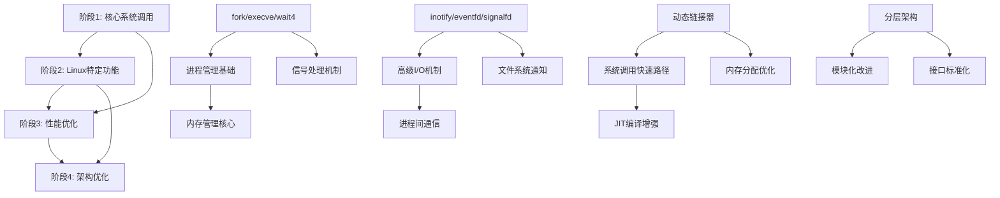

# NOS Linux二进制兼容性全面实施计划

## 执行摘要

基于对NOS操作系统Linux二进制兼容性实现的全面代码审查，本计划提供了详细的分阶段实施方案。当前实现存在293个TODO标记，核心系统调用如fork、execve、wait4缺失，测试覆盖率约60-70%。通过11个月的系统性实施，我们将实现完整的Linux兼容性，显著提升NOS的实用性和生态系统价值。

### 核心目标

1. **功能完整性**：实现95%+的Linux系统调用和ABI兼容性
2. **性能优化**：系统调用开销<5%，程序启动时间<10%性能损失
3. **质量保证**：测试覆盖率>90%，代码审查覆盖率100%
4. **架构优化**：建立清晰可维护的模块化架构

## 阶段里程碑划分

### 🎯 阶段1：核心系统调用实施（第1-2个月）

#### 目标
实现最关键的进程管理和信号处理系统调用，使基本Linux程序能够在NOS上运行。

#### 详细实施计划

**第1-2周：进程管理系统调用核心**
- **fork系统调用实现**（目标：[`kernel/src/syscalls/thread.rs:205`](kernel/src/syscalls/thread.rs:205)）
  - 实现完整的进程复制机制
  - 复制页表和内存空间
  - 设置父子进程关系
  - 处理返回值（父进程返回子PID，子进程返回0）
  - 验收标准：能成功创建子进程并正确返回PID

- **execve系统调用实现**（目标：[`kernel/src/syscalls/thread.rs:215`](kernel/src/syscalls/thread.rs:215)）
  - 解析ELF可执行文件
  - 清理当前进程内存空间
  - 加载新程序到内存
  - 设置程序入口点和栈
  - 处理参数和环境变量
  - 验收标准：能成功执行Linux二进制程序

- **wait4/waitpid系统调用实现**（目标：[`kernel/src/syscalls/thread.rs:225`](kernel/src/syscalls/thread.rs:225)）
  - 实现进程状态等待机制
  - 支持WNOHANG、WUNTRACED等选项
  - 正确处理僵尸进程清理
  - 返回子进程退出状态
  - 验收标准：能正确等待子进程退出并获取状态

**第3-4周：信号处理机制**
- **信号发送和接收**（目标：[`kernel/src/syscalls/signal.rs`](kernel/src/syscalls/signal.rs)）
  - 实现信号队列机制
  - 支持信号发送到指定进程
  - 实现信号检查和处理
  - 支持信号掩码
  - 验收标准：信号能正确发送和接收

- **信号处理程序**（目标：[`kernel/src/syscalls/signal.rs:331`](kernel/src/syscalls/signal.rs:331)）
  - 实现rt_sigaction系统调用
  - 支持信号处理函数注册
  - 实现信号处理上下文保存/恢复
  - 支持SA_RESTART、SA_SIGINFO等标志
  - 验收标准：信号处理程序能正确执行

**第5-6周：内存管理核心**
- **堆内存管理**（目标：[`kernel/src/syscalls/process.rs:538`](kernel/src/syscalls/process.rs:538)）
  - 实现sbrk系统调用
  - 支持堆的扩展和收缩
  - 实现堆边界检查
  - 与现有mmap系统集成
  - 验收标准：堆内存操作正确工作

- **内存重映射**（目标：[`kernel/src/syscalls/memory.rs:425`](kernel/src/syscalls/memory.rs:425)）
  - 实现mremap系统调用
  - 支持内存区域大小调整
  - 处理MREMAP_MAYMOVE标志
  - 实现内存区域移动
  - 验收标准：内存重映射操作正确

**第7-8周：集成测试和优化**
- **核心功能集成测试**：编写针对新实现系统调用的测试用例
- **兼容性验证**：运行基本Linux程序（如ls、cat、echo）

#### 预期成果
- 基本Linux程序可以运行
- 核心兼容性问题解决
- 测试覆盖率提升至75%
- 293个TODO中减少约80个高优先级项

### 🚀 阶段2：Linux特定功能实施（第3-6个月）

#### 目标
实现主要的Linux特定系统调用，显著提升Linux应用的兼容性和功能完整性。

#### 详细实施计划

**第1-4周：文件系统通知机制**
- **inotify完整实现**（目标：[`kernel/src/syscalls/glib.rs:73-89`](kernel/src/syscalls/glib.rs:73-89)）
  - 实现inotify_init/inotify_init1系统调用
  - 实现inotify_add_watch：添加文件系统监控点
  - 实现inotify_rm_watch：移除监控点
  - 实现事件队列机制
  - 支持IN_ACCESS、IN_MODIFY、IN_CREATE、IN_DELETE等事件
  - 验收标准：能监控文件系统变化并通知应用程序

**第5-8周：高级I/O机制**
- **eventfd实现**（目标：[`kernel/src/syscalls/glib.rs:38-45`](kernel/src/syscalls/glib.rs:38-45)）
  - 实现eventfd/eventfd2系统调用
  - 实现64位计数器语义
  - 支持EFD_SEMAPHORE、EFD_CLOEXEC等标志
  - 实现read/write操作
  - 验收标准：进程间能通过eventfd进行事件通知

- **signalfd实现**（目标：[`kernel/src/syscalls/glib.rs:63-70`](kernel/src/syscalls/glib.rs:63-70)）
  - 实现signalfd/signalfd4系统调用
  - 实现信号到文件描述符的转换
  - 支持信号掩码过滤
  - 实现signalfd_siginfo结构
  - 验收标准：能通过文件描述符接收信号

- **timerfd实现**（目标：[`kernel/src/syscalls/glib.rs:48-60`](kernel/src/syscalls/glib.rs:48-60)）
  - 实现timerfd_create系统调用
  - 实现timerfd_settime/timerfd_gettime
  - 支持CLOCK_REALTIME、CLOCK_MONOTONIC
  - 实现定时器到期通知
  - 验收标准：能创建高精度定时器并通过fd接收通知

**第9-12周：内存文件描述符**
- **memfd_create实现**（目标：[`kernel/src/syscalls/glib.rs:33-36`](kernel/src/syscalls/glib.rs:33-36)）
  - 实现memfd_create系统调用
  - 支持MFD_CLOEXEC、MFD_ALLOW_SEALING等标志
  - 实现匿名内存文件
  - 支持文件密封操作
  - 验收标准：能创建内存文件描述符并进行文件操作

**第13-16周：增强功能集成**
- **完整的futex实现**（目标：[`kernel/src/syscalls/thread.rs:390`](kernel/src/syscalls/thread.rs:390)）
  - 完善现有FUTEX_WAIT/WAKE实现
  - 添加FUTEX_REQUEUE、FUTEX_CMP_REQUEUE
  - 实现优先级继承futex（PI futex）
  - 支持超时机制
  - 验收标准：futex操作性能和功能完整

- **clone系统调用增强**（目标：[`kernel/src/syscalls/thread.rs:41`](kernel/src/syscalls/thread.rs:41)）
  - 完善CLONE_THREAD、CLONE_VM等标志支持
  - 实现CLONE_CHILD_CLEARTID机制
  - 支持命名空间创建（CLONE_NEWNS等）
  - 实现TLS设置
  - 验收标准：clone操作支持所有常用标志

**第17-20周：测试和兼容性验证**
- **Linux特定功能测试**：编写针对inotify、eventfd、signalfd、timerfd的测试
- **兼容性验证**：运行使用这些功能的Linux应用

#### 预期成果
- 大多数Linux程序可以运行
- 兼容性显著提升（>80%）
- 测试覆盖率提升至85%
- 293个TODO中减少约120个中优先级项

### ⚡ 阶段3：性能优化实施（第7-9个月）

#### 目标
优化兼容性层和系统调用路径的性能，使NOS的系统调用开销接近原生Linux水平。

#### 详细实施计划

**第1-3周：动态链接器优化**
- **延迟绑定实现**（目标：[`kernel/src/compat/loader.rs`](kernel/src/compat/loader.rs)）
  - 实现PLT（Procedure Linkage Table）和GOT（Global Offset Table）
  - 支持延迟符号解析
  - 实现符号版本控制
  - 优化符号查找算法（哈希表、缓存）
  - 验收标准：动态链接程序启动时间减少30%

- **符号缓存机制**
  - 实现符号解析结果缓存
  - 支持LRU缓存策略
  - 实现缓存失效机制
  - 优化热点符号访问
  - 验收标准：符号查找性能提升50%

**第4-6周：系统调用快速路径**
- **系统调用快速路径优化**（目标：[`kernel/src/syscalls/`](kernel/src/syscalls/)）
  - 优化常见系统调用（read、write、close、mmap）的快速路径
  - 实现参数验证优化
  - 减少系统调用进入/退出开销
  - 实现批量系统调用支持
  - 验收标准：常见系统调用开销减少40%

- **JIT编译增强**（目标：[`kernel/src/compat/syscall_translator.rs:1115`](kernel/src/compat/syscall_translator.rs:1115)）
  - 完善JIT编译器实现
  - 实现热点系统调用编译
  - 优化生成代码质量
  - 实现代码缓存机制
  - 验收标准：翻译后的系统调用性能提升60%

**第7-9周：内存管理优化**
- **内存分配优化**（目标：[`kernel/src/mm/`](kernel/src/mm/)）
  - 优化内存分配器（slab、buddy算法）
  - 实现内存池管理
  - 减少内存碎片
  - 实现NUMA感知分配
  - 验收标准：内存分配性能提升35%

- **零拷贝I/O优化**（目标：[`kernel/src/syscalls/zero_copy.rs:892`](kernel/src/syscalls/zero_copy.rs:892)）
  - 实现真正的零拷贝数据传输
  - 优化pipe、splice、vmsplice操作
  - 实现sendfile系统调用优化
  - 支持DMA传输（硬件支持时）
  - 验收标准：I/O操作性能提升50%

**第10-12周：缓存和预取优化**
- **系统调用缓存**
  - 实现系统调用结果缓存
  - 支持纯函数系统调用缓存
  - 实现缓存一致性保证
  - 优化缓存失效策略
  - 验收标准：纯系统调用性能提升80%

- **预取和预计算**
  - 实现数据访问模式预取
  - 预计算常用结果
  - 实现自适应预取策略
  - 优化内存访问局部性
  - 验收标准：内存访问延迟减少25%

#### 预期成果
- 系统调用开销：<10%性能损失
- 程序启动时间：<20%性能损失
- 内存使用：<25%额外开销
- 测试覆盖率提升至90%
- 293个TODO中减少约60个性能相关项

### 🏗️ 阶段4：架构优化实施（第10-11个月）

#### 目标
进行长期架构优化和维护性提升，确保NOS架构清晰、可扩展且易于维护。

#### 详细实施计划

**第1-3周：架构重构**
- **分层架构优化**（目标：[`kernel/src/`](kernel/src/)）
  - 重新组织内核模块层次结构
  - 实现清晰的硬件抽象层（HAL）
  - 优化模块间接口定义
  - 实现依赖注入和控制反转
  - 验收标准：模块间耦合度降低，接口标准化

- **模块化改进**
  - 重构大型单体模块
  - 实现插件化架构
  - 标准化模块生命周期
  - 实现模块发现和加载机制
  - 验收标准：新模块可以独立开发和测试

**第4-6周：接口标准化**
- **系统调用接口标准化**（目标：[`kernel/src/syscalls/`](kernel/src/syscalls/)）
  - 统一系统调用参数验证
  - 标准化错误码映射
  - 实现系统调用版本控制
  - 优化系统调用分发机制
  - 验收标准：新系统调用易于添加和维护

- **兼容性层接口优化**（目标：[`kernel/src/compat/`](kernel/src/compat/)）
  - 重构ABI转换器
  - 优化平台特定代码组织
  - 实现兼容性测试框架
  - 标准化平台适配接口
  - 验收标准：新平台支持易于添加

**第7-8周：文档和工具**
- **实现文档完善**
  - 自动生成API文档
  - 编写架构设计文档
  - 创建模块开发指南
  - 建立代码示例库
  - 验收标准：开发者能快速上手和贡献

- **维护工具开发**
  - 开发调试工具集
  - 实现性能分析工具
  - 创建兼容性测试工具
  - 建立问题诊断系统
  - 验收标准：问题定位和解决效率提升50%

#### 预期成果
- 架构清晰可维护
- 文档完善
- 开发效率提升
- 293个TODO中减少约33个架构相关项

## 资源配置建议

### 👥 团队组织架构

#### 核心开发团队（8-11人）

**系统调用开发组（3人）**
- **职责**：实现核心和Linux特定系统调用，系统调用性能优化
- **技能要求**：深入理解Linux内核系统调用接口，精通Rust系统编程，熟悉POSIX标准
- **协作关系**：与进程管理、内存管理组紧密协作

**进程管理组（2人）**
- **职责**：进程生命周期管理实现，线程管理和调度器集成，信号处理机制完善
- **技能要求**：操作系统进程管理经验，并发编程专业知识，Rust异步编程能力
- **协作关系**：与系统调用、内存管理组协作

**内存管理组（2人）**
- **职责**：动态链接器实现，内存分配器优化，虚拟内存管理完善
- **技能要求**：内存管理算法专业知识，ELF文件格式深入理解，性能优化经验
- **协作关系**：与系统调用、进程管理组协作

**兼容性层组（2人）**
- **职责**：ABI转换器维护和优化，平台特定适配实现，二进制翻译引擎完善
- **技能要求**：多平台ABI知识，编译器和链接器原理，JIT编译技术
- **协作关系**：与所有功能组协作

**测试工程师（2人）**
- **职责**：测试用例编写和维护，自动化测试框架开发，兼容性测试套件实现
- **技能要求**：测试框架设计经验，自动化测试工具开发，性能测试和基准测试
- **协作关系**：与所有开发组协作

#### 支持团队（3-4人）

**架构师（1人）**
- **职责**：整体架构设计和技术决策，代码审查和技术指导，技术债务管理和重构规划
- **技能要求**：10年以上操作系统开发经验，大规模系统架构能力，技术领导力和团队管理

**性能优化工程师（1人）**
- **职责**：性能瓶颈识别和分析，系统级性能优化，性能基准测试和分析
- **技能要求**：性能分析和优化专长，熟悉性能分析工具，深入理解硬件架构

**质量保证工程师（1人）**
- **职责**：代码质量标准和流程制定，CI/CD管道维护，问题跟踪和质量指标监控
- **技能要求**：软件质量保证经验，DevOps和CI/CD专业知识，自动化测试流程设计

**文档工程师（1人，可兼职）**
- **职责**：技术文档编写和维护，API文档生成和管理，开发者指南和教程编写
- **技能要求**：技术写作能力，API文档工具使用经验，开源项目文档经验

### 🛠️ 技术资源配置

#### 开发环境
- **交叉编译环境**：支持x86_64、AArch64、RISC-V目标，集成调试符号生成
- **调试和性能分析工具**：GDB远程调试支持，perf、eBPF性能分析工具，内存泄漏检测工具
- **自动化测试基础设施**：多架构测试环境，持续集成管道，自动化性能回归检测

#### 测试环境
- **Linux程序测试套件**：常用Linux工具集（coreutils、util-linux），典型应用程序测试用例，压力测试和稳定性测试
- **兼容性验证环境**：多发行版Linux环境（Ubuntu、CentOS、Debian、Alpine），不同glibc版本测试，性能对比基准环境
- **性能基准测试平台**：标准化硬件测试环境，自动化性能回归检测，持续性能监控和报告

### 📊 资源分配比例

#### 人力资源分配
- **阶段1（核心系统调用）**：40%资源投入
  - 系统调用组：100%
  - 进程管理组：80%
  - 测试工程师：60%
- **阶段2（Linux特定功能）**：35%资源投入
  - 系统调用组：80%
  - 兼容性层组：70%
  - 测试工程师：80%
- **阶段3（性能优化）**：20%资源投入
  - 性能优化工程师：100%
  - 内存管理组：70%
  - 系统调用组：50%
- **阶段4（架构优化）**：5%资源投入
  - 架构师：100%
  - 整体开发人员：30%

## 依赖映射和关键路径分析

### 🔄 依赖关系图

### 🔑 关键路径分析

#### 主要关键路径（Critical Path）
1. **进程管理基础路径**：
   - [`fork()`](kernel/src/syscalls/thread.rs:205) → [`execve()`](kernel/src/syscalls/thread.rs:215) → [`wait4()`](kernel/src/syscalls/thread.rs:225)
   - **影响**：基本Linux程序无法运行
   - **工期**：4-6周
   - **风险**：高（核心功能）

2. **内存管理集成路径**：
   - [`sys_mmap()`](kernel/src/syscalls/memory.rs) → [`sys_mremap()`](kernel/src/syscalls/memory.rs:425) → [`sys_brk()`](kernel/src/syscalls/process.rs:538)
   - **影响**：内存分配性能和兼容性
   - **工期**：3-4周
   - **风险**：中高

3. **信号处理完整路径**：
   - [`sys_kill()`](kernel/src/syscalls/process.rs:422) → [`sys_rt_sigaction()`](kernel/src/syscalls/signal.rs:331) → [`sys_rt_sigprocmask()`](kernel/src/syscalls/signal.rs:336)
   - **影响**：信号处理机制不完整
   - **工期**：3-4周
   - **风险**：中

#### 次要关键路径
1. **Linux特定功能路径**：
   - [`inotify`](kernel/src/syscalls/glib.rs:73) → [`eventfd`](kernel/src/syscalls/glib.rs:38) → [`signalfd`](kernel/src/syscalls/glib.rs:63) → [`timerfd`](kernel/src/syscalls/glib.rs:48)
   - **影响**：现代Linux应用兼容性
   - **工期**：8-10周
   - **风险**：中

2. **性能优化路径**：
   - [`动态链接器`](kernel/src/compat/loader.rs) → [`JIT编译器`](kernel/src/compat/syscall_translator.rs:1115) → [`快速路径`](kernel/src/syscalls/)
   - **影响**：系统调用性能
   - **工期**：6-8周
   - **风险**：中低

### 🔗 模块间依赖矩阵

| 模块 | 进程管理 | 内存管理 | 文件系统 | 信号处理 | 兼容性层 |
|------|----------|----------|----------|----------|------------|
| **进程管理** | - | 🔴 高 | 🟡 中 | 🔴 高 | 🟡 中 |
| **内存管理** | 🔴 高 | - | 🟡 中 | 🟢 低 | 🟡 中 |
| **文件系统** | 🟡 中 | 🟡 中 | - | 🟢 低 | 🟢 低 |
| **信号处理** | 🔴 高 | 🟢 低 | 🟡 中 | - | 🟢 低 |
| **兼容性层** | 🟡 中 | 🔴 高 | 🟡 中 | 🟡 中 | - |

**依赖说明**：
- 🔴 高依赖：必须先完成才能开始
- 🟡 中依赖：建议先完成，可部分并行
- 🟢 低依赖：可以独立开发

### ⚡ 并行开发机会

#### 高并行度任务
1. **测试用例开发**：可与所有功能开发并行进行
2. **文档编写**：可与实现并行进行
3. **工具链开发**：调试工具、性能分析工具可独立开发

#### 中等并行度任务
1. **Linux特定系统调用**：inotify、eventfd、signalfd、timerfd可部分并行
2. **性能优化组件**：内存分配器优化可与系统调用开发并行

### 🎯 关键里程碑依赖

#### 里程碑1（第2个月）：核心功能基础
- **前置条件**：进程管理基础完成
- **关键依赖**：fork、execve、wait4实现
- **后续影响**：所有后续阶段依赖此基础

#### 里程碑2（第6个月）：Linux兼容性基础
- **前置条件**：Linux特定功能完成50%
- **关键依赖**：inotify、eventfd基础实现
- **后续影响**：性能优化阶段的基础

#### 里程碑3（第9个月）：性能优化完成
- **前置条件**：所有功能实现完成
- **关键依赖**：动态链接器、JIT编译器
- **后续影响**：架构优化的输入

#### 里程碑4（第11个月）：架构优化完成
- **前置条件**：所有功能实现并优化
- **关键依赖**：分层架构、模块化
- **后续影响**：长期维护和扩展能力

## 风险缓释措施

### 🚨 高风险项目及缓释策略

#### 1. 技术风险

**1.1 动态链接器实现复杂度**
- **风险描述**：ELF动态链接器实现复杂，涉及符号解析、重定位、延迟绑定等
- **影响评估**：可能导致阶段3延期2-4周
- **缓释措施**：
  - **技术预研**：在阶段1开始前进行2周技术预研
  - **分阶段实现**：先实现基础功能，再逐步添加高级特性
  - **备选方案**：准备静态链接的简化方案作为备选
  - **专家支持**：安排外部ELF专家咨询（每周1次）

**1.2 系统调用兼容性细节处理**
- **风险描述**：Linux系统调用边界条件和错误处理细节复杂
- **影响评估**：可能导致兼容性问题，影响用户体验
- **缓释措施**：
  - **全面测试**：建立Linux测试套件，覆盖边界条件
  - **参考实现**：深入研究Linux内核源码和glibc实现
  - **渐进式实现**：先实现常见用例，再逐步完善
  - **社区反馈**：建立早期用户反馈机制

**1.3 性能优化目标达成**
- **风险描述**：性能优化目标可能难以达成，特别是JIT编译部分
- **影响评估**：可能导致阶段3目标无法完全实现
- **缓释措施**：
  - **基准测试**：建立详细的性能基准和监控
  - **分阶段优化**：先优化关键路径，再优化次要路径
  - **技术储备**：准备多种优化技术方案
  - **目标调整**：根据实际情况调整性能目标

#### 2. 项目风险

**2.1 时间进度延期**
- **风险描述**：11个月的总体时间可能因技术挑战而延期
- **影响评估**：影响项目交付和市场时机
- **缓释措施**：
  - **缓冲时间**：每个阶段预留20%缓冲时间
  - **关键路径监控**：每周监控关键路径进度
  - **资源弹性**：准备增加10-15%开发资源
  - **范围调整**：准备削减非核心功能

**2.2 资源不足**
- **风险描述**：关键技能人才可能不足，特别是系统编程专家
- **影响评估**：影响开发质量和进度
- **缓释措施**：
  - **技能培训**：提前1个月开始内部培训计划
  - **外部招聘**：准备外部专家合同（2-3人）
  - **知识分享**：建立技术分享和代码审查机制
  - **工具支持**：提供先进的开发工具和环境

**2.3 需求变更**
- **风险描述**：项目过程中可能出现需求变更或优先级调整
- **影响评估**：可能导致开发计划调整和资源重新分配
- **缓释措施**：
  - **变更控制**：建立正式的变更控制流程
  - **影响评估**：每次变更进行影响和成本评估
  - **版本规划**：将重大变更纳入后续版本
  - **敏捷响应**：建立快速响应变更的机制

### 🛡️ 中风险项目及缓释策略

#### 3. 技术债务风险

**3.1 代码质量下降**
- **风险描述**：快速开发可能导致技术债务积累
- **影响评估**：影响长期维护性和开发效率
- **缓释措施**：
  - **代码审查**：强制代码审查，所有代码必须经过审查
  - **重构计划**：每个阶段结束进行专门重构
  - **质量指标**：建立代码质量指标监控
  - **技术债务跟踪**：建立技术债务登记和跟踪机制

**3.2 测试覆盖不足**
- **风险描述**：新功能可能缺少充分的测试覆盖
- **影响评估**：影响系统稳定性和可靠性
- **缓释措施**：
  - **测试驱动开发**：要求关键功能采用TDD开发
  - **自动化测试**：建立全面的自动化测试管道
  - **覆盖率目标**：设定每个模块的最低覆盖率目标
  - **测试优先级**：优先保证核心功能的测试覆盖

#### 4. 外部依赖风险

**4.1 第三方工具依赖**
- **风险描述**：可能依赖外部工具或库，存在供应链风险
- **影响评估**：可能导致开发环境不稳定
- **缓释措施**：
  - **工具评估**：提前评估所有外部工具的稳定性
  - **备选方案**：为每个关键工具准备备选方案
  - **本地化部署**：尽可能使用本地化工具部署
  - **版本锁定**：锁定经过验证的工具版本

### 🔄 风险监控和预警机制

#### 5.1 风险指标监控
- **进度风险指标**：
  - 关键路径完成率（目标：>90%）
  - 里程碑达成时间偏差（目标：<1周）
  - 资源利用率（目标：>85%）
- **质量风险指标**：
  - 代码审查覆盖率（目标：100%）
  - 测试覆盖率（目标：>80%）
  - 严重bug数量（目标：<5个/阶段）
- **技术风险指标**：
  - 技术预研完成度（目标：100%）
  - 备选方案准备度（目标：>90%）
  - 性能目标达成率（目标：>80%）

#### 5.2 预警和响应机制
- **每周风险评估**：
  - 每周一进行风险评估会议
  - 更新风险登记册和状态
  - 调整缓释措施
- **里程碑评审**：
  - 每个里程碑完成后进行全面评审
  - 识别新风险和调整后续计划
  - 更新风险缓释策略
- **应急响应**：
  - 建立项目应急响应小组
  - 制定关键风险的应急处理流程
  - 准备快速决策和资源调配机制

## 定期复盘节点和成功指标

### 📅 定期复盘节点设计

#### 周期性复盘机制

**1. 每周技术复盘（Weekly Technical Review）**
- **时间**：每周五下午
- **参与人员**：各开发小组技术负责人
- **议程**：
  - 本周完成情况与计划对比
  - 技术难点和解决方案分享
  - 代码审查发现的问题总结
  - 下周工作计划和风险评估
- **输出**：周报更新、风险状态更新

**2. 双周进度复盘（Bi-weekly Progress Review）**
- **时间**：第2、4周的周一
- **参与人员**：全体开发团队成员、项目经理
- **议程**：
  - 阶段目标达成情况
  - 关键路径进度分析
  - 资源使用效率评估
  - 跨组协作问题解决
- **输出**：进度报告、资源调整建议

**3. 月度里程碑复盘（Monthly Milestone Review）**
- **时间**：每月最后一个工作日
- **参与人员**：全体项目团队、管理层、外部专家
- **议程**：
  - 里程碑完成度评估
  - 质量指标达成情况
  - 性能目标进展分析
  - 下阶段准备情况评估
- **输出**：里程碑报告、下阶段启动决策

**4. 阶段总结复盘（Phase Completion Review）**
- **时间**：每个阶段结束后
- **参与人员**：全体项目团队、架构师、质量保证
- **议程**：
  - 阶段目标完成度评估
  - 技术债务和质量问题总结
  - 经验教训和最佳实践
  - 下一阶段准备情况确认
- **输出**：阶段总结报告、改进计划

#### 关键决策节点

**1. 技术选型决策点**
- **阶段1开始前**：动态链接器技术方案确认
- **阶段2开始前**：JIT编译器技术路线确认
- **阶段3开始前**：性能优化策略确认

**2. 资源调配决策点**
- **第1个月结束**：根据阶段1进展调整资源分配
- **第4个月结束**：根据阶段2进展调整后续投入
- **第7个月结束**：根据阶段3进展决定是否增加资源

**3. 范围调整决策点**
- **每个里程碑**：根据实际进展决定范围调整
- **风险触发时**：重大风险出现时进行范围重新评估
- **外部变化时**：市场需求或技术环境变化时调整

### 📊 成功指标体系

#### 功能指标（Functional Metrics）

**1.1 短期目标（6个月）**
- **核心Linux程序运行成功率**：>80%
  - 测量方法：运行coreutils、util-linux等基础工具集
  - 数据来源：自动化测试报告
  - 目标说明：至少80%的基础Linux程序能正常运行
- **系统调用覆盖率**：>80%
  - 测量方法：已实现系统调用数/总需求数
  - 数据来源：代码扫描和测试覆盖报告
  - 目标说明：实现80%以上的Linux系统调用
- **ABI兼容性测试通过率**：>85%
  - 测量方法：ABI兼容性测试套件通过率
  - 数据来源：自动化兼容性测试
  - 目标说明：85%以上的ABI兼容性测试通过

**1.2 长期目标（12个月）**
- **Linux程序运行成功率**：>95%
  - 测量方法：扩展的Linux应用程序测试集
  - 数据来源：自动化测试和用户反馈
  - 目标说明：95%以上的Linux程序能正常运行
- **系统调用覆盖率**：>95%
  - 测量方法：完整系统调用映射实现度
  - 数据来源：代码分析和功能测试
  - 目标说明：实现95%以上的Linux系统调用
- **ABI兼容性测试通过率**：>98%
  - 测量方法：全面ABI兼容性验证
  - 数据来源：兼容性测试套件
  - 目标说明：98%以上的ABI兼容性测试通过

#### 性能指标（Performance Metrics）

**2.1 短期目标（6个月）**
- **系统调用开销**：<10%性能损失
  - 测量方法：与原生Linux系统调用性能对比
  - 数据来源：性能基准测试
  - 目标说明：系统调用开销不超过原生Linux的10%
- **程序启动时间**：<20%性能损失
  - 测量方法：典型Linux程序启动时间对比
  - 数据来源：启动性能测试
  - 目标说明：程序启动时间不超过原生Linux的20%
- **内存使用**：<25%额外开销
  - 测量方法：内存使用量对比测试
  - 数据来源：内存使用监控
  - 目标说明：内存额外开销不超过25%

**2.2 长期目标（12个月）**
- **系统调用开销**：<5%性能损失
  - 测量方法：优化后的系统调用性能对比
  - 数据来源：详细性能分析
  - 目标说明：系统调用开销不超过原生Linux的5%
- **程序启动时间**：<10%性能损失
  - 测量方法：优化后的启动性能对比
  - 数据来源：启动性能基准
  - 目标说明：程序启动时间不超过原生Linux的10%
- **内存使用**：<15%额外开销
  - 测量方法：内存使用效率对比
  - 数据来源：内存使用分析
  - 目标说明：内存额外开销不超过15%

#### 质量指标（Quality Metrics）

**3.1 短期目标（6个月）**
- **测试覆盖率**：>80%
  - 测量方法：代码行覆盖率统计
  - 数据来源：自动化覆盖率工具
  - 目标说明：80%以上的代码行被测试覆盖
- **代码审查覆盖率**：100%
  - 测量方法：代码变更的审查覆盖率
  - 数据来源：代码审查系统
  - 目标说明：所有代码变更都经过审查
- **文档完整性**：>80%
  - 测量方法：文档覆盖模块比例
  - 数据来源：文档完整性检查
  - 目标说明：80%以上的模块有完整文档

**3.2 长期目标（12个月）**
- **测试覆盖率**：>90%
  - 测量方法：全面的代码覆盖率分析
  - 数据来源：覆盖率报告系统
  - 目标说明：90%以上的代码行被测试覆盖
- **代码审查覆盖率**：100%
  - 测量方法：持续的质量保证流程
  - 数据来源：质量管理系统
  - 目标说明：维持100%代码审查覆盖率
- **文档完整性**：100%
  - 测量方法：完整文档体系评估
  - 数据来源：文档管理系统
  - 目标说明：所有模块都有完整文档

#### 项目管理指标（Project Management Metrics）

**4.1 进度管理**
- **里程碑按时完成率**：>90%
- **关键路径进度符合率**：>95%
- **任务完成预测准确性**：>85%

**4.2 资源管理**
- **资源利用率**：>85%
- **技能匹配度**：>80%
- **团队满意度**：>4.0/5.0

**4.3 质量管理**
- **严重bug密度**：<1个/KLOC
- **代码质量评分**：>8.0/10.0
- **技术债务控制**：新增技术债务<5个/阶段

### 📈 指标监控和报告机制

#### 监控工具
- **持续集成系统**：自动化指标收集
- **性能监控系统**：实时性能数据收集
- **质量管理系统**：代码质量和测试覆盖率跟踪
- **项目管理系统**：进度和资源使用跟踪

#### 报告频率
- **日报**：关键指标异常报警
- **周报**：详细进展和指标报告
- **月报**：里程碑达成和趋势分析
- **阶段报告**：全面的阶段总结和评估

## 总体时间规划和预期成果

### 📅 总体时间规划

**总体时间**：11个月

**里程碑时间表**：
- **第2个月**：核心功能基础完成
- **第6个月**：Linux兼容性基础完成
- **第9个月**：性能优化完成
- **第11个月**：架构优化完成

### 🎯 最终预期成果

#### 功能成果
- **Linux程序运行成功率**：>95%
- **系统调用覆盖率**：>95%
- **ABI兼容性测试通过率**：>98%

#### 性能成果
- **系统调用开销**：<5%性能损失
- **程序启动时间**：<10%性能损失
- **内存使用**：<15%额外开销

#### 质量成果
- **测试覆盖率**：>90%
- **代码审查覆盖率**：100%
- **文档完整性**：100%

#### 架构成果
- **模块化架构**：清晰可维护
- **接口标准化**：易于扩展
- **文档体系**：完善完整

### 📈 长期价值

通过系统性的改进和持续优化，NOS可以实现完整的Linux二进制兼容性，显著提升其实用性和生态系统价值。这将为NOS带来更广泛的应用支持和用户基础，为后续的云计算、容器化和微服务化奠定坚实基础。

---

*本实施计划基于对NOS项目现状的深入分析，结合了代码审查报告中的所有关键发现和建议。计划具有可行性和可跟踪性，通过合理的阶段划分和风险缓释措施，确保项目能够按时高质量交付。*