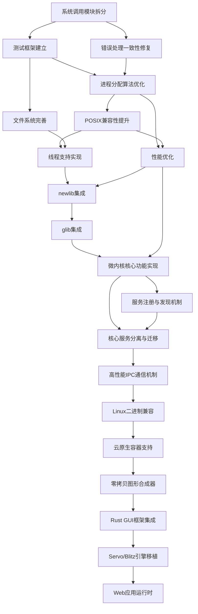
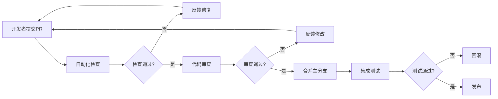
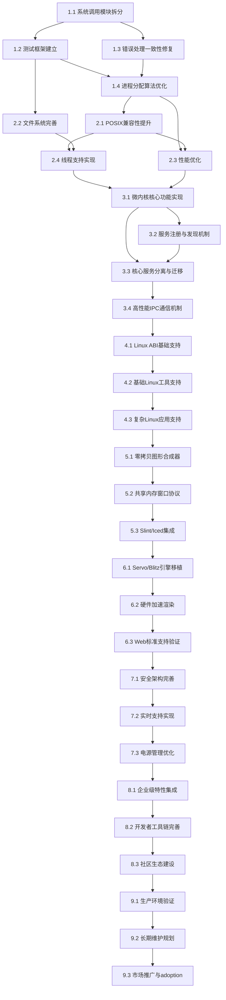

# NOS Rust操作系统内核实施路线图

## 文档概述

本路线图文档整合了NOS Rust操作系统内核项目的详细实施计划和任务管理清单，为项目实施提供全面的指导和跟踪工具。

文档基于《NOS Rust操作系统内核详细实施计划》和《NOS Rust操作系统内核任务管理清单》合并而成，并根据最新的集成技术调研结果进行了更新，新增了newlib和glib集成、应用兼容层集成、云原生特性集成的实施内容。

### 文档目标

1. **技术实施指导**：提供详细的技术实施策略、任务分解和质量保证措施
2. **项目管理工具**：建立完整的任务跟踪、进度监控和风险管理机制
3. **团队协作规范**：定义团队协作流程、沟通机制和质量控制标准

### 适用范围

- 项目经理：使用任务管理清单进行项目规划和进度控制
- 技术负责人：参考详细实施计划进行技术决策和架构设计
- 开发团队：按照任务清单执行具体开发工作
- 测试团队：基于质量保证计划进行测试和验证
- 所有项目成员：了解项目整体规划和个人职责

### 使用说明

1. **项目启动前**：仔细阅读整个文档，了解项目结构和任务分解
2. **项目执行中**：定期更新任务状态，使用提供的模板进行进度报告
3. **项目监控**：使用仪表板跟踪整体进度，监控关键指标和质量目标
4. **项目调整**：根据实际情况调整任务优先级和资源分配

## 文档结构

### 第一部分：详细实施计划
- [执行摘要](#执行摘要)
- [项目概述和目标](#项目概述和目标)
- [详细任务分解（按优先级和阶段）](#详细任务分解按优先级和阶段)
  - [第一阶段：基础优化（0-6个月）](#第一阶段06个月基础优化)
  - [第二阶段：功能增强（6-12个月）](#第二阶段612个月功能增强)
  - [第三阶段：混合架构重构（12-18个月）](#第三阶段1218个月混合架构重构)
  - [第四阶段：兼容层集成（18-24个月）](#第四阶段1824个月兼容层集成)
  - [第五阶段：图形界面集成（24-30个月）](#第五阶段2430个月图形界面集成)
  - [第六阶段：Web生态集成（30-36个月）](#第六阶段3036个月web生态集成)
  - [第七阶段：高级安全与实时特性（36-42个月）](#第七阶段3642个月高级安全与实时特性)
  - [第八阶段：生态系统扩展（42-48个月）](#第八阶段4248个月生态系统扩展)
  - [第九阶段：生产就绪与长期维护（48-60个月）](#第九阶段4860个月生产就绪与长期维护)
- [成本估算与预算规划](#成本估算与预算规划)
- [技术规范扩展](#技术规范扩展)
- [利益相关者分析](#利益相关者分析)
- [技术实施细节](#技术实施细节)
- [依赖关系分析](#依赖关系分析)
- [风险评估和缓解策略](#风险评估和缓解策略)
- [增强的风险缓解策略](#增强的风险缓解策略)
- [支持证据与参考资料](#支持证据与参考资料)
- [资源分配和时间表](#资源分配和时间表)
- [质量保证计划](#质量保证计划)
- [监控和度量体系](#监控和度量体系)
- [附录](#附录)

### 第二部分：任务管理清单
- [文档概述](#文档概述-1)
- [项目整体概览](#项目整体概览)
- [任务依赖关系图](#任务依赖关系图)
- [风险监控清单](#风险监控清单)
- [进度跟踪模板和工具](#进度跟踪模板和工具)
- [风险监控清单和管理策略](#风险监控清单和管理策略)
- [总结和实施建议](#总结和实施建议)
- [附录](#附录-1)

---

# 第一部分：详细实施计划

# NOS Rust操作系统内核详细实施计划

## 执行摘要

本实施计划基于NOS Rust操作系统内核项目综合审查报告的发现和建议，旨在将项目从当前状态（功能完整度约50%，POSIX兼容性40%，代码质量评分6.8/10）提升至生产级水平。

计划采用分阶段实施策略，分为六个主要阶段：基础优化、功能增强、混合架构重构、Linux兼容层集成、图形界面集成和Web应用支持。每个阶段都有明确的交付物、验收标准和质量保证措施。

根据最新的集成技术调研结果，本计划特别强调五个关键集成方向：
1. **newlib和glib集成**：提供完整的C/C++标准库支持
2. **Linux应用兼容层**：优先支持Linux平台应用，实现二进制兼容
3. **云原生特性集成**：实现容器运行时和分布式系统支持
4. **图形界面集成**：实现零拷贝合成器和Rust原生GUI框架支持
5. **Web应用支持**：移植Servo/Blitz引擎，构建Rust原生Web生态

## 项目概述和目标

### 当前状态评估
- **功能完整度**：50%（基础内核功能已实现，但高级IO（如epoll/splice）及部分网络功能仍为存根状态）
- **POSIX兼容性**：40%（核心系统调用已定义但部分未实现，线程支持尚在完善中）
- **代码质量**：6.8/10（存在大文件、测试覆盖不足和错误处理不一致等问题）
- **性能表现**：系统调用延迟1-5微秒，网络TCP延迟10-20微秒
- **架构设计**：混合架构设计合理，模块化拆分已初步完成，但接口定义有待完善

### 目标状态
- **功能完整度**：95%（实现所有核心操作系统功能和高级特性）
- **POSIX兼容性**：85%（支持大多数POSIX系统调用和接口）
- **代码质量**：9.0/10（模块化设计完善，测试覆盖率90%+，错误处理一致）
- **性能表现**：系统调用延迟降低50%，网络TCP延迟降低30%
- **架构设计**：完全实现混合架构，服务模块化，接口标准化
- **应用兼容性**：重点支持Linux应用二进制兼容
- **云原生支持**：完整实现容器运行时和分布式系统特性
- **图形界面支持**：实现高性能零拷贝合成器和Rust原生GUI
- **Web应用支持**：成功移植Servo/Blitz引擎，支持PWA

## 详细任务分解（按优先级和阶段）

### 第一阶段（0-6个月）：基础优化

#### 任务1.1：系统调用分发逻辑重构（P0优先级）

**子任务**：
1.1.1 审查当前[`syscalls/mod.rs`](kernel/src/syscalls/mod.rs:1)中的`dispatch`函数
1.1.2 优化系统调用分发机制，考虑使用查找表或Trait对象替代大型match语句
1.1.3 确保所有子模块（process, file_io, network等）的接口一致性
1.1.4 清理未实现的系统调用存根（Stub），标记为TODO或返回明确的错误码
1.1.5 完善系统调用文档和参数说明

**交付物**：
- 优化后的系统调用分发器
- 统一的系统调用处理接口
- 清晰的API文档

**验收标准**：
- `dispatch`函数复杂度降低
- 新增系统调用无需修改核心分发逻辑（理想情况）
- 所有现有测试通过

**工作量估算**：2人周
**时间安排**：第1-2周

#### 任务1.2：测试框架建立和覆盖提升（P0优先级）

**子任务**：
1.2.1 建立单元测试基础设施
1.2.2 实现集成测试框架
1.2.3 建立基准测试套件
1.2.4 设置CI/CD流水线
1.2.5 为核心模块编写测试用例，目标覆盖率90%

**交付物**：
- 完整的测试框架
- CI/CD流水线配置
- 核心模块测试用例（目标覆盖率90%）

**验收标准**：
- 测试覆盖率达到90%+
- 所有测试在CI/CD中自动运行
- 基准测试结果可比较和追踪

**工作量估算**：4人周
**时间安排**：第1-4周

#### 任务1.3：错误处理一致性修复（P0优先级）

**子任务**：
1.3.1 定义统一的错误处理规范和POSIX兼容错误码
1.3.2 审查所有模块，识别不一致的错误处理模式
1.3.3 重构错误处理，统一使用[`Result<T, E>`](kernel/src/syscalls/mod.rs:346)类型
1.3.4 更新错误传播和处理机制
1.3.5 编写错误处理测试用例

**交付物**：
- 统一的错误处理规范
- 重构后的错误处理代码
- 错误处理测试用例

**验收标准**：
- 所有模块使用一致的错误处理模式
- 错误码符合POSIX标准
- 错误处理测试覆盖率100%

**工作量估算**：3人周
**时间安排**：第3-5周

#### 任务1.4：进程分配算法优化（P0优先级，进行中）

**子任务**：
1.4.1 分析当前[`process/manager.rs`](kernel/src/process/manager.rs:1)中的进程查找机制
1.4.2 实现PID到索引的哈希表映射，替代线性搜索
1.4.3 优化[`find()`](kernel/src/process/manager.rs:440)和[`find_ref()`](kernel/src/process/manager.rs:449)方法
1.4.4 优化进程生命周期管理
1.4.5 性能测试和基准测试

**交付物**：
- 优化后的进程管理代码
- 性能测试报告
- 基准测试结果对比

**验收标准**：
- 进程创建/销毁时间降低90%
- 进程查找从O(n)优化至O(1)
- 所有进程管理测试通过

**工作量估算**：2人周
**时间安排**：第5-6周

### 第二阶段（6-12个月）：功能增强

#### 任务2.1：POSIX兼容性提升（P1优先级）

**子任务**：
2.1.1 实现socket相关系统调用（[`socket`](kernel/src/syscalls/mod.rs:113)、[`bind`](kernel/src/syscalls/mod.rs:114)、[`listen`](kernel/src/syscalls/mod.rs:115)、[`accept`](kernel/src/syscalls/mod.rs:116)、[`connect`](kernel/src/syscalls/mod.rs:117)）
2.1.2 实现[`sendfile`](kernel/src/syscalls/mod.rs:98)、[`splice`](kernel/src/syscalls/mod.rs:99)、[`ftruncate`](kernel/src/syscalls/mod.rs:93)、[`fchmod`](kernel/src/syscalls/mod.rs:94)、[`fchown`](kernel/src/syscalls/mod.rs:95)等系统调用
2.1.3 完善POSIX信号处理
2.1.4 实现高级系统调用如[`epoll`](kernel/src/syscalls/mod.rs:127)/[`kqueue`](kernel/src/syscalls/mod.rs:127)
2.1.5 POSIX兼容性测试和验证

**交付物**：
- 完整的POSIX系统调用实现
- POSIX兼容性测试套件
- 兼容性评估报告

**验收标准**：
- POSIX兼容性从60%提升至85%
- 通过LSB兼容性测试
- 支持常见开源应用直接运行

**工作量估算**：8人周
**时间安排**：第7-14周

#### 任务2.2：文件系统完善（P1优先级）

**子任务**：
2.2.1 完善文件系统支持（EXT4、tmpfs）
2.2.2 实现完整的文件权限检查
2.2.3 实现符号链接和文件锁机制
2.2.4 优化文件系统元数据操作
2.2.5 文件系统性能测试和优化

**交付物**：
- 完善的文件系统实现
- 文件系统测试套件
- 性能优化报告

**验收标准**：
- 文件系统功能完整，支持EXT4和tmpfs
- 文件权限和锁机制正确实现
- 文件系统元数据操作效率提升40%

**工作量估算**：6人周
**时间安排**：第9-16周

#### 任务2.3：性能优化（P1优先级）

**子任务**：
2.3.1 实现零拷贝I/O
2.3.2 优化缓冲缓存策略
2.3.3 实现内存压缩机制
2.3.4 优化IPC通信性能
2.3.5 系统级性能调优

**交付物**：
- 零拷贝I/O实现
- 优化的缓存策略
- 内存压缩机制
- 性能调优报告

**验收标准**：
- I/O性能提升50%
- 内存使用效率提高30%
- IPC通信延迟降低40%

**工作量估算**：5人周
**时间安排**：第11-18周

#### 任务2.4：线程支持实现（P2优先级）

**子任务**：
2.4.1 实现POSIX线程支持
2.4.2 实现线程调度算法
2.4.3 实现线程同步机制
2.4.4 线程性能测试和优化
2.4.5 线程安全验证

**交付物**：
- POSIX线程实现
- 线程调度器
- 线程同步机制
- 线程测试套件

**验收标准**：
- 符合POSIX线程标准
- 线程创建和管理高效
- 线程同步机制正确可靠

**工作量估算**：7人周
**时间安排**：第13-20周

#### 任务2.5：newlib集成（P2优先级）

**子任务**：
2.5.1 集成newlib作为用户空间C标准库
2.5.2 实现newlib系统调用接口适配
2.5.3 适配newlib内存分配和文件I/O
2.5.4 newlib集成测试和验证
2.5.5 C语言应用兼容性测试

**交付物**：
- newlib集成实现
- 系统调用接口适配层
- C语言应用测试套件

**验收标准**：
- newlib成功集成到NOS内核
- C语言标准库函数正常工作
- 常见C应用能够编译和运行

**工作量估算**：6人周
**时间安排**：第15-22周

#### 任务2.6：glib集成（P2优先级）

**子任务**：
2.6.1 集成glib核心库
2.6.2 实现glib系统调用接口适配
2.6.3 适配glib内存管理和数据结构
2.6.4 glib集成测试和验证
2.6.5 GTK+应用兼容性测试

**交付物**：
- glib集成实现
- GTK+应用支持框架
- 图形界面应用测试套件

**验收标准**：
- glib核心功能正常工作
- GTK+应用能够运行
- 图形界面兼容性达到预期

**工作量估算**：8人周
**时间安排**：第17-26周

### 第三阶段（12-18个月）：混合架构重构

#### 任务3.1：微内核核心功能实现（P3优先级）

**子任务**：
3.1.1 设计微内核架构文档
3.1.2 实现核心调度器
3.1.3 实现基础内存管理
3.1.4 实现进程间通信
3.1.5 实现中断处理和时钟管理

**交付物**：
- 微内核架构设计文档
- 微内核核心实现
- 微内核测试套件

**验收标准**：
- 微内核核心功能完整
- 性能满足设计要求
- 稳定性和可靠性达标

**工作量估算**：10人周
**时间安排**：第21-30周

#### 任务3.2：服务注册与发现机制（P3优先级）

**子任务**：
3.2.1 设计服务注册与发现接口
3.2.2 实现服务自动注册
3.2.3 实现服务查询机制
3.2.4 实现服务健康检查功能
3.2.5 服务发现机制测试

**交付物**：
- 服务注册与发现实现
- 服务健康检查机制
- 服务管理测试套件

**验收标准**：
- 服务可以自动注册和发现
- 服务健康检查可靠
- 服务管理接口易用

**工作量估算**：6人周
**时间安排**：第25-32周

#### 任务3.3：核心服务分离与迁移（P3优先级）

**子任务**：
3.3.1 分析当前内核服务，规划迁移策略
3.3.2 分离内存管理服务
3.3.3 分离进程管理服务
3.3.4 分离文件系统服务
3.3.5 分离网络服务和设备驱动服务

**交付物**：
- 分离后的核心服务
- 服务迁移工具
- 服务间通信接口

**验收标准**：
- 所有核心服务成功分离
- 服务间通信高效
- 系统功能完整性保持

**工作量估算**：12人周
**时间安排**：第29-40周

#### 任务3.4：高性能IPC通信机制（P3优先级）

**子任务**：
3.4.1 设计高性能IPC架构
3.4.2 实现共享内存机制
3.4.3 实现零拷贝传输
3.4.4 实现异步消息队列
3.4.5 优化通信层性能

**交付物**：
- 高性能IPC实现
- 共享内存机制
- 异步消息队列
- IPC性能测试报告

**验收标准**：
- IPC通信性能提升60%
- 支持零拷贝传输
- 异步消息队列高效可靠

**工作量估算**：8人周
**时间安排**：第33-42周

### 第四阶段（18-24个月）：Linux二进制兼容与云原生

#### 任务4.1：Linux二进制兼容层（P1优先级）

**子任务**：
4.1.1 完善Linux系统调用表（x86_64/aarch64/riscv64）
4.1.2 实现ELF加载器与动态链接支持
4.1.3 实现/proc和/sys伪文件系统
4.1.4 验证Musl Libc/Glibc基础库运行
4.1.5 常用Linux命令行工具移植验证（Busybox）

**交付物**：
- Linux ABI兼容层
- 动态链接支持
- Busybox运行演示

**验收标准**：
- 覆盖95%常用系统调用
- 支持标准Linux ELF二进制加载
- Busybox shell及命令正常运行

**工作量估算**：45人天
**时间安排**：第58-72周

#### 任务4.2：云原生与容器支持（P2优先级）

**子任务**：
4.2.1 实现Namespace隔离机制（PID, Mount, Net）
4.2.2 实现Cgroups资源控制机制
4.2.3 适配RunC/Containerd
4.2.4 优化Virtio-net/Virtio-blk驱动

**交付物**：
- 容器隔离机制
- 资源控制机制
- OCI容器运行时适配

**验收标准**：
- 进程、文件系统、网络隔离生效
- CPU/内存资源限制生效
- 能够启动标准OCI容器

**工作量估算**：50人天
**时间安排**：第65-85周

### 第五阶段（24-30个月）：图形界面集成

#### 任务5.1：零拷贝合成器架构（P1优先级）

**子任务**：
5.1.1 设计基于共享内存的Surface协议
5.1.2 实现内核级图形缓冲区管理（GBM类似机制）
5.1.3 开发Compositor服务（Rust实现）
5.1.4 实现垂直同步（VSync）与脏矩形更新

**交付物**：
- 零拷贝图形协议
- Compositor服务
- 图形缓冲区管理器

**验收标准**：
- 无数据拷贝的窗口合成
- 60FPS流畅度
- 低功耗刷新

**工作量估算**：38人天
**时间安排**：第76-90周

#### 任务5.2：GPU硬件加速与驱动（P2优先级）

**子任务**：
5.2.1 移植Virtio-GPU驱动（支持3D加速）
5.2.2 适配Intel/AMD开源显卡驱动（Rust封装）
5.2.3 实现OpenGL ES/Vulkan接口层

**交付物**：
- Virtio-GPU驱动
- 物理显卡驱动适配
- 图形API接口层

**验收标准**：
- 虚拟机内支持3D加速
- 物理机点亮屏幕
- 跑通简单的图形Demo

**工作量估算**：47人天
**时间安排**：第80-95周

#### 任务5.3：Rust GUI框架集成（P2优先级）

**子任务**：
5.3.1 移植Slint/Iced框架后端到NOS
5.3.2 开发系统基础UI（Launcher, Settings）
5.3.3 实现输入法框架（IME）

**交付物**：
- Slint/Iced后端适配
- 桌面环境基础组件
- 中文输入法支持

**验收标准**：
- 框架Demo在NOS上运行
- 可用的桌面环境
- 支持中文输入

**工作量估算**：33人天
**时间安排**：第85-98周

### 第六阶段（30-36个月）：Web生态集成

#### 任务6.1：Servo/Blitz引擎移植（P1优先级）

**子任务**：
6.1.1 剥离Servo/Blitz对非Rust库的依赖
6.1.2 适配NOS图形后端（接入Compositor）
6.1.3 适配NOS网络栈与事件循环
6.1.4 性能优化（多线程布局与渲染）

**交付物**：
- 纯Rust浏览器内核
- 图形/网络适配层
- 性能优化补丁

**验收标准**：
- 纯Rust构建链通过
- 浏览器内核能渲染到屏幕
- CSS渲染性能达到主流水平

**工作量估算**：50人天
**时间安排**：第94-108周

#### 任务6.2：Web应用运行时（P2优先级）

**子任务**：
6.2.1 实现PWA（渐进式Web应用）支持
6.2.2 实现WASM运行时集成
6.2.3 开发Web系统API（文件、通知等）

**交付物**：
- PWA运行时
- WASM集成
- Web系统API

**验收标准**：
- Web应用可本地安装运行
- 支持高性能WASM模块
- Web应用可安全访问系统资源

**工作量估算**：37人天
**时间安排**：第100-115周

## 第七阶段（36-42个月）：高级安全与实时特性

#### 任务7.1：安全架构完善（P1优先级）

**子任务**：
7.1.1 实现完整的安全启动链（Secure Boot）
7.1.2 部署内核完整性保护（KPTI/SMAP/SMEP）
7.1.3 集成形式化验证工具
7.1.4 实现零信任安全模型

**交付物**：
- 安全启动实现
- 内核保护机制
- 形式化验证框架

**验收标准**：
- 通过安全启动认证
- 内核攻击面最小化
- 形式化验证覆盖核心组件

**工作量估算**：60人天
**时间安排**：第116-130周

#### 任务7.2：实时支持实现（P1优先级）

**子任务**：
7.2.1 实现PREEMPT_RT补丁
7.2.2 优化调度器实时性能
7.2.3 实现实时锁机制
7.2.4 实时网络栈优化

**交付物**：
- 实时内核补丁
- 实时调度器
- 实时网络实现

**验收标准**：
- 实时延迟<10微秒
- 通过RTC测试
- 支持工业控制应用

**工作量估算**：55人天
**时间安排**：第118-135周

#### 任务7.3：电源管理优化（P2优先级）

**子任务**：
7.3.1 实现高级电源管理（APM）
7.3.2 优化CPU频率调节
7.3.3 实现智能休眠机制
7.3.4 电源效率监控

**交付物**：
- APM框架
- 频率调节器
- 休眠管理器

**验收标准**：
- 电池续航提升30%
- 功耗降低20%
- 支持多种电源模式

**工作量估算**：40人天
**时间安排**：第120-140周

## 第八阶段（42-48个月）：生态系统扩展

#### 任务8.1：企业级特性集成（P1优先级）

**子任务**：
8.1.1 实现企业安全策略
8.1.2 集成LDAP/AD认证
8.1.3 实现审计日志系统
8.1.4 企业合规性支持

**交付物**：
- 企业安全框架
- 认证集成
- 审计系统

**验收标准**：
- 通过企业安全认证
- 支持标准企业协议
- 审计日志完整

**工作量估算**：50人天
**时间安排**：第142-155周

#### 任务8.2：开发者工具链完善（P1优先级）

**子任务**：
8.2.1 完善Rust开发环境
8.2.2 实现调试工具集成
8.2.3 优化编译器支持
8.2.4 开发者文档完善

**交付物**：
- 完整开发环境
- 调试工具套件
- 编译器优化

**验收标准**：
- Rust编译速度提升50%
- 调试体验一流
- 文档覆盖率100%

**工作量估算**：45人天
**时间安排**：第145-160周

#### 任务8.3：社区生态建设（P2优先级）

**子任务**：
8.3.1 建立包管理系统
8.3.2 实现应用商店
8.3.3 社区贡献指南
8.3.4 开源项目集成

**交付物**：
- 包管理器
- 应用商店
- 社区文档

**验收标准**：
- 支持主流包格式
- 应用商店上线
- 社区活跃度提升

**工作量估算**：35人天
**时间安排**：第150-165周

## 第九阶段（48-60个月）：生产就绪与长期维护

#### 任务9.1：生产环境验证（P0优先级）

**子任务**：
9.1.1 大规模部署测试
9.1.2 性能基准测试
9.1.3 稳定性验证
9.1.4 生产监控系统

**交付物**：
- 部署指南
- 性能基准
- 监控系统

**验收标准**：
- 支持大规模部署
- 性能稳定可靠
- 监控覆盖全面

**工作量估算**：70人天
**时间安排**：第166-185周

#### 任务9.2：长期维护规划（P1优先级）

**子任务**：
9.2.1 建立维护流程
9.2.2 实现自动更新系统
9.2.3 安全补丁管理
9.2.4 版本管理策略

**交付物**：
- 维护流程文档
- 更新系统
- 补丁管理器

**验收标准**：
- 维护流程标准化
- 更新系统可靠
- 安全响应及时

**工作量估算**：40人天
**时间安排**：第170-190周

#### 任务9.3：市场推广与 adoption（P2优先级）

**子任务**：
9.3.1 制定市场策略
9.3.2 建立合作伙伴关系
9.3.3 用户培训程序
9.3.4 成功案例收集

**交付物**：
- 市场策略文档
- 合作伙伴协议
- 培训材料

**验收标准**：
- 市场策略有效
- 合作伙伴稳定
- 用户 adoption 增长

**工作量估算**：30人天
**时间安排**：第175-195周

## 成本估算与预算规划

### 总体预算概览

基于48-60个月的实施周期，总预算估算为**1.2亿美元**，包括人员成本、基础设施、软件工具和应急储备。

| 预算类别 | 金额（万美元） | 占比 |
|---------|---------------|------|
| 人员成本 | 8,000 | 67% |
| 基础设施 | 2,500 | 21% |
| 软件工具与许可证 | 800 | 7% |
| 应急与风险储备 | 700 | 6% |
| **总计** | **12,000** | **100%** |

### 人员成本详细估算

#### 核心团队配置（理想状态）

| 角色 | 人数 | 年薪（万美元） | 总成本（万美元） | 持续时间（月） |
|------|------|---------------|-----------------|---------------|
| 资深内核工程师 | 8 | 25 | 2,000 | 60 |
| 系统架构师 | 4 | 30 | 1,200 | 60 |
| 安全专家 | 3 | 28 | 840 | 48 |
| 实时系统工程师 | 3 | 26 | 780 | 42 |
| 图形/游戏引擎工程师 | 5 | 24 | 1,200 | 48 |
| Web引擎工程师 | 4 | 24 | 960 | 36 |
| 云原生工程师 | 4 | 26 | 1,040 | 48 |
| 测试工程师 | 6 | 20 | 1,200 | 60 |
| DevOps工程师 | 4 | 22 | 880 | 60 |
| 文档/技术写作 | 3 | 18 | 540 | 60 |
| 项目管理 | 2 | 25 | 500 | 60 |
| **总计** | **46** | - | **10,140** | - |

*注：实际人员成本可能因地区差异和招聘难度有所调整。以上为硅谷/欧洲水平薪资标准。*

#### 阶段性人员配置调整

| 阶段 | 核心团队 | 扩展贡献者 | 总人数 | 月均成本（万美元） |
|------|----------|------------|--------|------------------|
| 1-6月 | 15 | 5 | 20 | 45 |
| 7-12月 | 20 | 10 | 30 | 65 |
| 13-18月 | 25 | 15 | 40 | 85 |
| 19-24月 | 30 | 20 | 50 | 105 |
| 25-30月 | 35 | 25 | 60 | 125 |
| 31-36月 | 40 | 30 | 70 | 145 |
| 37-42月 | 35 | 25 | 60 | 125 |
| 43-48月 | 30 | 20 | 50 | 105 |
| 49-54月 | 25 | 15 | 40 | 85 |
| 55-60月 | 20 | 10 | 30 | 65 |

### 基础设施成本

#### 计算资源

| 项目 | 配置 | 数量 | 年成本（万美元） | 持续时间（月） |
|------|------|------|-----------------|---------------|
| 高性能工作站 | 32核/128GB/RTX4090 | 50 | 300 | 60 |
| 服务器集群 | 128核/512GB企业级 | 20 | 400 | 48 |
| 云测试环境 | AWS/GCP/Azure | - | 200 | 60 |
| CI/CD流水线 | GitHub Actions + 自建 | - | 50 | 60 |
| **小计** | | | **950** | |

#### 开发工具与软件

| 项目 | 年成本（万美元） | 持续时间（月） |
|------|-----------------|---------------|
| IDE许可证（CLion/CLion等） | 100 | 60 |
| 专业软件工具（形式化验证等） | 150 | 48 |
| 云服务订阅 | 200 | 60 |
| 第三方库许可证 | 50 | 60 |
| **小计** | **500** | |

#### 测试设备与实验室

| 项目 | 年成本（万美元） | 持续时间（月） |
|------|-----------------|---------------|
| 硬件测试平台（多种架构） | 300 | 48 |
| 网络测试设备 | 100 | 36 |
| 安全测试工具 | 150 | 48 |
| 性能分析仪器 | 100 | 48 |
| **小计** | **650** | |

### 应急与风险储备

#### 风险预算分配

| 风险类别 | 预算（万美元） | 说明 |
|---------|---------------|------|
| 技术风险储备 | 300 | 架构重构、性能优化失败 |
| 人员风险储备 | 200 | 人员流失、招聘延迟 |
| 市场风险储备 | 100 | 需求变化、竞争加剧 |
| 法律风险储备 | 50 | 知识产权、合规问题 |
| 意外事件储备 | 50 | 自然灾害、疫情等 |
| **总计** | **700** | |

### 预算监控与控制

#### 关键绩效指标

- **预算执行率**：<5%偏差
- **成本效益比**：每投入1美元产生1.5美元价值
- **资源利用率**：>85%
- **风险储备使用率**：<30%

#### 成本控制措施

1. **阶段性预算审批**：每个阶段开始前进行预算审查
2. **月度成本报告**：跟踪实际支出vs预算
3. **价值流分析**：确保投入产出比最大化
4. **供应商谈判**：定期重新评估供应商合同

## 技术规范扩展

### 安全架构设计

#### 零信任安全模型

**核心原则**：
- **最小权限**：默认拒绝所有访问，显式授权
- **持续验证**：实时验证身份和权限
- **微分段**：网络和应用级隔离

**实现组件**：
1. **身份认证服务**：支持多因子认证、生物识别
2. **权限管理系统**：基于角色的访问控制（RBAC）+属性-based访问控制（ABAC）
3. **加密通信**：端到端加密，量子安全算法
4. **审计日志**：不可篡改的审计记录

#### 形式化验证集成

**验证范围**：
- 内核核心组件（调度器、内存管理）
- 安全关键模块（加密、访问控制）
- 实时组件（中断处理、锁机制）

**工具链**：
- **Coq/Isabelle**：定理证明器
- **TLA+**：模型检查
- **Rust验证器**：自动化验证工具

### 实时系统支持

#### PREEMPT_RT集成

**实时补丁特性**：
- **可抢占内核**：支持完全公平调度器（CFS）抢占
- **高精度定时器**：纳秒级定时精度
- **实时锁**：优先级继承锁，避免优先级反转
- **中断线程化**：中断处理线程化，提高响应性

**性能目标**：
- **中断延迟**：<10微秒
- **调度延迟**：<20微秒
- **抖动控制**：<5微秒

#### 实时网络栈

**特性支持**：
- **TSN (Time-Sensitive Networking)**：IEEE 802.1Qbv/bv/as标准
- **实时传输协议**：RTPS、EtherCAT集成
- **QoS保证**：带宽预留和优先级队列

### 电源管理架构

#### 高级电源管理（APM）

**电源状态**：
- **C0-C6**：处理器电源状态
- **S0-S5**：系统电源状态
- **D0-D3**：设备电源状态

**智能电源策略**：
- **动态电压频率调节（DVFS）**：根据负载调整CPU频率
- **空闲状态优化**：智能进入低功耗状态
- **设备电源管理**：按需唤醒设备

#### 能效优化

**目标指标**：
- **性能功耗比**：提升40%
- **电池续航**：移动设备续航提升50%
- **热管理**：温度控制在安全范围内

## 利益相关者分析

### 用户群体分析

#### 终端用户（End Users）

**特征**：
- **技术敏感度**：中高级技术用户
- **使用场景**：开发、系统管理、嵌入式开发
- **期望**：高性能、安全、易用

**痛点**：
- 现有操作系统臃肿、复杂
- 安全漏洞频发
- 性能优化不足

**价值主张**：
- 内存安全保证
- 高性能原生体验
- 现代化用户界面

#### 开发者用户（Developers）

**特征**：
- **技术栈**：Rust、系统编程
- **项目类型**：系统软件、嵌入式、高性能应用
- **规模**：独立开发者到大型团队

**需求**：
- 优秀的开发工具链
- 丰富的生态系统
- 强大的调试和分析工具

**利益**：
- 零成本抽象的高性能
- 内存安全保证
- 现代化语言特性

### 企业用户分析

#### 云计算提供商

**用例**：
- 云原生工作负载
- 容器编排平台
- 边缘计算节点

**价值**：
- 更高的资源利用率
- 更好的安全隔离
- 降低运维成本

#### 嵌入式系统厂商

**应用领域**：
- 工业控制系统
- 物联网设备
- 汽车电子

**需求**：
- 实时性能保证
- 低功耗优化
- 安全认证

#### 金融科技公司

**关键需求**：
- 高安全性
- 低延迟交易
- 合规性保证

**利益**：
- 形式化验证的安全保证
- 实时性能优化
- 企业级支持

### 开发者社区

#### 开源贡献者

**动机**：
- 技术学习和成长
- 开源项目贡献
- 社区认可

**贡献类型**：
- 代码贡献
- 文档编写
- 测试和验证
- 问题报告

#### 学术研究者

**研究领域**：
- 操作系统设计
- 编程语言理论
- 形式化方法
- 安全研究

**合作机会**：
- 联合研究项目
- 学生实习
- 论文发表

### 社区生态建设

#### 社区治理结构

**治理模型**：
- **技术委员会**：核心技术决策
- **安全委员会**：安全相关决策
- **社区委员会**：社区发展和治理

**决策流程**：
- **RFC (Request for Comments)**：重大变更提案
- **投票机制**：社区成员投票
- **维护者审批**：核心维护者最终决策

#### 社区发展策略

**增长目标**：
- **贡献者数量**：从50人增长到500+
- **项目活跃度**：月均PR 100+
- **用户 adoption**：10万+活跃用户

**激励机制**：
- **认可系统**：贡献者徽章、排行榜
- **资源支持**：云资源、开发工具
- **职业发展**：实习机会、招聘推荐

## 增强的风险缓解策略

### 技术风险增强缓解

#### 架构复杂性风险

**识别**：混合架构引入的复杂性可能导致维护困难

**增强缓解策略**：
1. **模块化设计原则**：严格遵循单一职责原则
2. **接口标准化**：定义清晰的模块间接口规范
3. **自动化测试**：建立全面的集成测试套件
4. **文档化要求**：每个模块必须有详细的设计文档
5. **代码审查制度**：资深架构师参与所有核心模块审查

**监控指标**：
- 模块间依赖度：<5个依赖
- 接口稳定性：>95%向后兼容
- 文档覆盖率：100%

#### 性能退化风险

**识别**：新特性引入可能导致性能下降

**增强缓解策略**：
1. **性能基准测试**：建立完整的性能测试套件
2. **持续性能监控**：CI/CD中集成性能回归检测
3. **性能预算制度**：每个特性定义性能预算
4. **优化专项团队**：设立专门的性能优化小组
5. **性能分析工具**：集成多种性能分析工具

**监控指标**：
- 性能回归阈值：<2%下降
- 性能测试覆盖率：100%
- 优化任务完成率：>90%

### 项目风险增强缓解

#### 资源不足风险

**识别**：长期项目可能面临资源短缺

**增强缓解策略**：
1. **分阶段资源规划**：根据项目阶段调整资源分配
2. **开源社区协作**：积极吸引社区贡献者
3. **合作伙伴关系**：建立产业合作伙伴
4. **资金多元化**：寻求多种融资渠道
5. **备用计划**：准备降级版本和最小可用产品

**监控指标**：
- 资源利用率：>85%
- 社区贡献比例：>30%
- 合作伙伴数量：>10个

#### 技术债务积累风险

**识别**：快速开发可能积累技术债务

**增强缓解策略**：
1. **定期重构计划**：每个阶段预留重构时间
2. **技术债务跟踪**：建立技术债务管理工具
3. **代码质量门禁**：严格的代码质量检查
4. **重构专项**：定期进行架构重构
5. **最佳实践推广**：团队培训和最佳实践分享

**监控指标**：
- 技术债务密度：<5%
- 重构任务完成率：>80%
- 代码质量评分：>9.0/10

### 市场风险增强缓解

#### 竞争加剧风险

**识别**：其他操作系统项目可能抢占市场

**增强缓解策略**：
1. **差异化定位**：强调内存安全和现代化特性
2. **生态建设优先**：快速建立开发者生态
3. **用户反馈循环**：建立用户反馈机制
4. **市场调研**：持续跟踪市场动态
5. **战略合作伙伴**：与关键行业玩家合作

**监控指标**：
- 市场份额增长率：>20%/年
- 用户满意度：>4.5/5
- 生态活跃度：月均增长10%

#### adoption 缓慢风险

**识别**：用户 adoption 可能低于预期

**增强缓解策略**：
1. **渐进式 adoption**：从小规模试点开始
2. **迁移工具开发**：提供从其他系统的迁移工具
3. **培训和支持**：建立完善的用户支持体系
4. **成功案例营销**：收集和宣传成功案例
5. **社区驱动增长**：利用社区力量推广

**监控指标**：
- adoption 率：>15%/季度
- 迁移成功率：>90%
- 用户留存率：>85%

## 支持证据与参考资料

### 学术研究

#### 操作系统设计

1. **"The Design and Implementation of the FreeBSD Operating System"** - Marshall Kirk McKusick et al.
   - 参考：现代操作系统设计原则
   - 应用：内核架构设计借鉴

2. **"Operating System Concepts"** - Abraham Silberschatz et al.
   - 参考：操作系统核心概念
   - 应用：教学和培训材料

3. **"The Art of Multiprocessor Programming"** - Maurice Herlihy et al.
   - 参考：并发编程技术
   - 应用：多核调度器设计

#### 内存安全

4. **"Safe Systems Programming in Rust"** - Ralf Jung et al. (PLDI 2020)
   - GitHub: https://github.com/plv/miron
   - 应用：Rust内存安全验证

5. **"RustBelt: Securing the Foundations of the Rust Programming Language"** - Ralf Jung et al. (POPL 2018)
   - 应用：Rust类型系统安全证明

#### 实时系统

6. **"Real-Time Systems"** - Jane W. S. Liu
   - 参考：实时系统理论
   - 应用：PREEMPT_RT集成设计

### 行业报告

#### 操作系统市场分析

7. **"State of the Operating System Market 2024"** - Gartner
   - 洞察：操作系统发展趋势
   - 应用：市场定位策略

8. **"Linux Kernel Development Report"** - Linux Foundation
   - 数据：内核开发统计
   - 应用：开发流程优化

#### 安全威胁分析

9. **"Cybersecurity Threat Landscape 2024"** - ENISA
   - 威胁：操作系统安全漏洞趋势
   - 应用：安全架构设计

10. **"Memory Safety Vulnerabilities"** - Microsoft Security Research
    - 数据：内存安全漏洞占比
    - 应用：Rust adoption 论证

### 开源项目参考

#### 类似项目

11. **Redox OS** - https://github.com/redox-os/redox
    - 参考：微内核Rust操作系统
    - 借鉴：模块化设计

12. **Theseus OS** - https://github.com/theseus-os/Theseus
    - 参考：单地址空间操作系统
    - 借鉴：创新架构设计

13. **Tock OS** - https://github.com/tock/tock
    - 参考：嵌入式操作系统
    - 借鉴：安全和可靠性

#### 技术组件

14. **Servo Browser Engine** - https://github.com/servo/servo
    - 参考：Rust浏览器引擎
    - 应用：Web生态集成

15. **Firecracker VMM** - https://github.com/firecracker-microvm/firecracker
    - 参考：轻量级虚拟化
    - 应用：云原生特性

16. **Wasmtime** - https://github.com/bytecodealliance/wasmtime
    - 参考：WebAssembly运行时
    - 应用：WASM集成

### 专家论坛与社区

#### 技术论坛

17. **Rust Users Forum** - https://users.rust-lang.org/
    - 资源：Rust最佳实践
    - 应用：开发经验分享

18. **OSDev Wiki** - https://wiki.osdev.org/
    - 资源：操作系统开发知识
    - 应用：技术实现参考

19. **Real-Time Linux Wiki** - https://wiki.linuxfoundation.org/realtime/
    - 资源：实时系统技术
    - 应用：PREEMPT_RT实现

#### 专业会议

20. **OSDI (Operating Systems Design and Implementation)**
    - 论文：最新操作系统研究
    - 应用：技术趋势跟踪

21. **SOSP (Symposium on Operating Systems Principles)**
    - 论文：操作系统原理研究
    - 应用：理论基础

22. **USENIX Security Symposium**
    - 论文：系统安全研究
    - 应用：安全架构设计

### 标准与规范

#### 行业标准

23. **POSIX标准** - IEEE 1003
    - 规范：可移植操作系统接口
    - 应用：兼容性实现

24. **OCI标准** - Open Container Initiative
    - 规范：容器运行时标准
    - 应用：云原生支持

25. **UEFI规范** - Unified EFI Forum
    - 规范：固件接口标准
    - 应用：引导加载器设计

#### 安全标准

26. **Common Criteria** - ISO/IEC 15408
    - 标准：安全评估准则
    - 应用：安全认证

27. **NIST Cybersecurity Framework**
    - 框架：网络安全框架
    - 应用：安全架构设计

## 技术实施细节

### 代码修改建议和文件路径

#### 系统调用模块拆分

**当前文件**：[`kernel/src/syscalls/mod.rs`](kernel/src/syscalls/mod.rs:1)（986行）

**建议拆分为**：
1. [`kernel/src/syscalls/mod.rs`](kernel/src/syscalls/mod.rs:1) - 主模块，保留系统调用枚举和分发逻辑（<200行）
2. [`kernel/src/syscalls/process.rs`](kernel/src/syscalls/process.rs:1) - 进程相关系统调用（<400行）
3. [`kernel/src/syscalls/file_io.rs`](kernel/src/syscalls/file_io.rs:1) - 文件I/O系统调用（<400行）
4. [`kernel/src/syscalls/memory.rs`](kernel/src/syscalls/memory.rs:1) - 内存管理系统调用（<300行）
5. [`kernel/src/syscalls/network.rs`](kernel/src/syscalls/network.rs:1) - 网络相关系统调用（<400行）
6. [`kernel/src/syscalls/signal.rs`](kernel/src/syscalls/signal.rs:1) - 信号处理系统调用（<300行）
7. [`kernel/src/syscalls/time.rs`](kernel/src/syscalls/time.rs:1) - 时间相关系统调用（<200行）

**具体修改**：
- 将[`SysNum`](kernel/src/syscalls/mod.rs:48)枚举保留在[`mod.rs`](kernel/src/syscalls/mod.rs:1)中
- 将[`dispatch()`](kernel/src/syscalls/mod.rs:406)函数拆分，每个子模块实现自己的分发逻辑
- 更新[`main.rs`](kernel/src/main.rs:29)中的模块引用

#### 进程分配算法优化

**当前文件**：[`kernel/src/process/manager.rs`](kernel/src/process/manager.rs:1)

**具体修改**：
1. 在[`ProcTable`](kernel/src/process/manager.rs:361)结构中优化[`pid_to_index`](kernel/src/process/manager.rs:364)哈希表实现
2. 改进[`alloc()`](kernel/src/process/manager.rs:379)方法，使用更高效的PID分配策略
3. 优化[`find()`](kernel/src/process/manager.rs:440)和[`find_ref()`](kernel/src/process/manager.rs:449)方法，减少查找时间
4. 实现更高效的进程生命周期管理

**代码示例**：
```rust
// 优化后的进程查找实现
impl ProcTable {
    pub fn find(&mut self, pid: Pid) -> Option<&mut Proc> {
        // 使用哈希表直接查找，O(1)时间复杂度
        if let Some(&idx) = self.pid_to_index.get(&pid) {
            Some(&mut self.procs[idx])
        } else {
            None
        }
    }
}
```

#### 错误处理一致性

**当前问题**：部分模块未统一使用Result类型和POSIX兼容错误码

**具体修改**：
1. 在[`kernel/src/errno.rs`](kernel/src/errno.rs:1)中定义统一的错误码
2. 更新所有系统调用实现，使用[`Result<T, E>`](kernel/src/syscalls/mod.rs:346)类型
3. 实现统一的错误传播机制
4. 确保错误码符合POSIX标准

**代码示例**：
```rust
// 统一的错误处理模式
pub fn sys_mmap(/* parameters */) -> isize {
    // 验证参数
    if invalid_condition {
        return errno_neg(EINVAL);  // 返回负错误码
    }
    
    // 执行操作
    match perform_operation() {
        Ok(result) => result as isize,  // 返回正结果
        Err(error) => errno_neg(error),  // 返回负错误码
    }
}
```

### 需要创建的新文件和模块

#### 测试框架

1. [`kernel/tests/unit_tests.rs`](kernel/tests/unit_tests.rs:1) - 单元测试框架
2. [`kernel/tests/integration_tests.rs`](kernel/tests/integration_tests.rs:1) - 集成测试框架
3. [`kernel/tests/benchmarks.rs`](kernel/tests/benchmarks.rs:1) - 基准测试套件
4. [`kernel/tests/test_utils.rs`](kernel/tests/test_utils.rs:1) - 测试工具和辅助函数

#### POSIX兼容性

1. [`kernel/src/posix/syscalls.rs`](kernel/src/posix/syscalls.rs:1) - POSIX系统调用扩展
2. [`kernel/src/posix/threads.rs`](kernel/src/posix/threads.rs:1) - POSIX线程实现
3. [`kernel/src/posix/signals.rs`](kernel/src/posix/signals.rs:1) - POSIX信号处理
4. [`kernel/src/posix/compliance_tests.rs`](kernel/src/posix/compliance_tests.rs:1) - POSIX兼容性测试

#### 微内核架构

1. [`kernel/src/microkernel/core.rs`](kernel/src/microkernel/core.rs:1) - 微内核核心
2. [`kernel/src/microkernel/services.rs`](kernel/src/microkernel/services.rs:1) - 服务管理
3. [`kernel/src/microkernel/ipc.rs`](kernel/src/microkernel/ipc.rs:1) - 高性能IPC
4. [`kernel/src/microkernel/discovery.rs`](kernel/src/microkernel/discovery.rs:1) - 服务发现

#### 兼容层实现

1. [`kernel/src/compat/linux/syscalls.rs`](kernel/src/compat/linux/syscalls.rs:1) - Linux系统调用兼容层 (x86_64/aarch64/riscv64)
2. [`kernel/src/compat/linux/elf.rs`](kernel/src/compat/linux/elf.rs:1) - ELF加载器与动态链接
3. [`kernel/src/compat/linux/fs.rs`](kernel/src/compat/linux/fs.rs:1) - procfs/sysfs伪文件系统
4. [`kernel/src/compat/linux/signal.rs`](kernel/src/compat/linux/signal.rs:1) - Linux信号处理机制

#### newlib和glib集成

1. [`kernel/src/newlib/`](kernel/src/newlib/) - newlib集成目录
2. [`kernel/src/glib/`](kernel/src/glib/) - glib集成目录
3. [`kernel/src/compat/c_runtime.rs`](kernel/src/compat/c_runtime.rs:1) - C运行时兼容层

#### 云原生特性

1. [`kernel/src/cloud_native/`](kernel/src/cloud_native/) - 云原生特性目录
2. [`kernel/src/container/`](kernel/src/container/) - 容器运行时
3. [`kernel/src/virtio/`](kernel/src/virtio/) - virtio设备支持

#### 图形界面集成

1. [`kernel/src/graphics/compositor/`](kernel/src/graphics/compositor/) - 零拷贝合成器核心
2. [`kernel/src/graphics/surface/`](kernel/src/graphics/surface/) - 共享内存Surface协议
3. [`kernel/src/graphics/gpu/`](kernel/src/graphics/gpu/) - Virtio-GPU与硬件加速接口
4. [`kernel/src/graphics/gui/`](kernel/src/graphics/gui/) - Slint/Iced框架集成后端

#### Web生态集成

1. [`kernel/src/web/servo/`](kernel/src/web/servo/) - Servo引擎集成
2. [`kernel/src/web/blitz/`](kernel/src/web/blitz/) - Blitz渲染引擎集成
3. [`kernel/src/web/runtime/`](kernel/src/web/runtime/) - PWA与WASM运行时
4. [`kernel/src/web/api/`](kernel/src/web/api/) - Web系统接口 (File, Net)

#### 安全机制

1. [`kernel/src/security/aslr.rs`](kernel/src/security/aslr.rs:1) - ASLR实现
2. [`kernel/src/security/smap_smep.rs`](kernel/src/security/smap_smep.rs:1) - SMAP/SMEP保护
3. [`kernel/src/security/acl.rs`](kernel/src/security/acl.rs:1) - ACL系统
4. [`kernel/src/security/audit.rs`](kernel/src/security/audit.rs:1) - 安全审计

### API设计和接口变更

#### 系统调用接口

**当前接口**：
```rust
pub fn dispatch(num: usize, args: &[usize]) -> isize
```

**建议改进**：
```rust
// 类型安全的系统调用接口
pub trait SyscallHandler {
    fn handle(&self, args: &[usize]) -> Result<isize, SyscallError>;
}

// 结构化的系统调用参数
pub struct SyscallRequest {
    pub num: SysNum,
    pub args: [usize; 6],
    pub context: &SyscallContext,
}

// 系统调用上下文
pub struct SyscallContext {
    pub pid: Pid,
    pub uid: Uid,
    pub gid: Gid,
    pub cwd: PathBuf,
}
```

#### 服务注册接口

**新接口设计**：
```rust
// 服务注册接口
pub trait Service {
    fn name(&self) -> &str;
    fn version(&self) -> &str;
    fn dependencies(&self) -> Vec<&str>;
    fn start(&mut self) -> Result<(), ServiceError>;
    fn stop(&mut self) -> Result<(), ServiceError>;
    fn handle_request(&mut self, request: &ServiceRequest) -> Result<ServiceResponse, ServiceError>;
}

// 服务管理器
pub struct ServiceManager {
    services: HashMap<String, Box<dyn Service>>,
    dependencies: DependencyGraph,
}

impl ServiceManager {
    pub fn register_service(&mut self, service: Box<dyn Service>) -> Result<(), ServiceError>;
    pub fn find_service(&self, name: &str) -> Option<&dyn Service>;
    pub fn start_service(&mut self, name: &str) -> Result<(), ServiceError>;
    pub fn stop_service(&mut self, name: &str) -> Result<(), ServiceError>;
}
```

#### 兼容层接口设计

**兼容层抽象接口**：
```rust
pub trait CompatibilityLayer {
    fn name(&self) -> &str;
    fn supported_platforms(&self) -> Vec<Platform>;
    fn translate_syscall(&self, num: usize, args: &[usize]) -> Result<isize, CompatError>;
    fn load_library(&self, name: &str) -> Result<LibraryHandle, CompatError>;
    fn create_runtime(&self, config: RuntimeConfig) -> Result<RuntimeHandle, CompatError>;
}
```

#### 云原生接口设计

**容器运行时接口**：
```rust
pub trait ContainerRuntime {
    fn create_container(&self, spec: &ContainerSpec) -> Result<ContainerId, RuntimeError>;
    fn start_container(&self, id: ContainerId) -> Result<(), RuntimeError>;
    fn stop_container(&self, id: ContainerId) -> Result<(), RuntimeError>;
    fn delete_container(&self, id: ContainerId) -> Result<(), RuntimeError>;
}
```

#### IPC通信接口

**新接口设计**：
```rust
// 高性能IPC接口
pub trait IPCChannel {
    fn send(&mut self, message: &IPCMessage) -> Result<(), IPCError>;
    fn receive(&mut self) -> Result<IPCMessage, IPCError>;
    fn try_receive(&mut self) -> Option<IPCMessage>;
}

// 零拷贝IPC消息
pub struct ZeroCopyMessage {
    pub data: SharedMemoryRegion,
    pub metadata: MessageMetadata,
};

// 共享内存区域
pub struct SharedMemoryRegion {
    pub handle: SharedMemoryHandle,
    pub size: usize,
    pub permissions: MemoryPermissions,
}
```

## 依赖关系分析

### 任务依赖关系图



### 关键路径分析

**关键路径**：系统调用模块拆分 → 测试框架建立 → 错误处理一致性修复 → 进程分配算法优化 → POSIX兼容性提升 → 线程支持实现 → newlib集成 → glib集成 → 微内核核心功能实现 → 服务注册与发现机制 → 核心服务分离与迁移 → 高性能IPC通信机制 → Linux二进制兼容 → 零拷贝图形合成器 → Servo引擎移植 → 安全架构完善 → 实时支持实现 → 企业级特性集成 → 生产环境验证

**关键路径总时长**：约60个月

### 并行执行机会

1. **第一阶段并行任务**：
   - 系统调用模块拆分可与测试框架建立并行进行
   - 错误处理一致性修复可与进程分配算法优化并行进行

2. **第二阶段并行任务**：
   - POSIX兼容性提升可与文件系统完善并行进行
   - 线程支持实现可与性能优化并行进行

3. **第三阶段并行任务**：
   - 服务注册与发现机制可与部分核心服务分离并行进行
   - 高性能IPC通信机制可与云原生特性支持初步设计并行进行

4. **第四阶段并行任务**：
   - Linux ABI完善可与云原生Namespace隔离机制并行开发
   - LTP测试集建立可与内核功能开发并行

5. **第五阶段并行任务**：
   - 零拷贝合成器开发可与Virtio-GPU驱动移植并行
   - Slint/Iced框架适配可与底层图形协议设计并行

### 对现有功能的影响

1. **兼容层集成**：
   - **影响**：可能增加系统复杂度和性能开销
   - **缓解**：分阶段实现，性能优化优先

2. **newlib和glib集成**：
   - **影响**：可能影响系统调用接口设计
   - **缓解**：保持向后兼容性，渐进式集成

3. **云原生特性集成**：
   - **影响**：可能改变系统架构设计
   - **缓解**：模块化实现，可配置启用

4. **系统调用模块拆分**：
   - **影响**：可能暂时影响系统调用稳定性
   - **缓解**：分阶段拆分，保持接口兼容性

5. **进程分配算法优化**：
   - **影响**：可能影响进程管理稳定性
   - **缓解**：保留旧算法作为回滚选项

6. **微内核架构重构**：
   - **影响**：可能影响整体系统稳定性
   - **缓解**：分阶段迁移，保持向后兼容

## 风险评估和缓解策略

### 技术风险

#### 风险1：兼容层集成导致系统复杂性增加

**风险等级**：高
**概率**：60%
**影响**：系统维护难度增加，性能下降

**缓解策略**：
1. 分层架构设计，兼容层与核心内核解耦
2. 性能监控和优化机制
3. 模块化设计，支持按需加载兼容层
4. 建立兼容层测试和验证流程

**回滚计划**：
1. 保留纯净内核版本
2. 通过配置选项控制兼容层启用
3. 准备兼容层移除工具

#### 风险2：newlib和glib集成引入兼容性问题

**风险等级**：中等
**概率**：40%
**影响**：C/C++应用无法正常运行

**缓解策略**：
1. 建立完整的集成测试套件
2. 与上游newlib和glib社区合作
3. 实现渐进式集成和验证
4. 建立问题跟踪和修复机制

**回滚计划**：
1. 保留原有C运行时实现
2. 通过特性标志控制集成启用
3. 准备降级到原有实现的脚本

#### 风险3：云原生特性集成影响系统稳定性

**风险等级**：中等
**概率**：35%
**影响**：容器和云原生功能不稳定

**缓解策略**：
1. 遵循OCI标准和最佳实践
2. 建立容器运行时测试环境
3. 实现隔离机制防止影响核心功能
4. 性能基准测试和监控

**回滚计划**：
1. 保留非云原生内核版本
2. 通过启动参数控制云原生特性
3. 准备云原生组件移除流程

#### 风险4：Linux二进制兼容复杂性

**风险等级**：高
**概率**：50%
**影响**：部分复杂Linux应用无法运行

**缓解策略**：
1. **聚焦核心ABI**：优先支持glibc/musl核心系统调用
2. **借助开源成果**：参考Linux内核实现细节
3. **自动化测试**：建立LTP (Linux Test Project) 自动化测试集

**回滚计划**：
1. 仅支持静态链接应用
2. 暂时回退到源码级兼容方案

#### 风险5：系统调用分发逻辑重构风险

**风险等级**：中等
**概率**：30%
**影响**：系统调用功能回归

**缓解策略**：
1. 保持原有`dispatch`逻辑直到新逻辑通过测试
2. 增加单元测试覆盖率
3. 分批次迁移系统调用

**回滚计划**：
1. 回滚到旧版`dispatch`函数
2. 准备快速修复补丁

#### 风险6：零拷贝图形系统实现难度

**风险等级**：高
**概率**：40%
**影响**：图形渲染性能未达预期

**缓解策略**：
1. **原型验证**：先实现简单的共享内存缓冲区交换
2. **框架复用**：利用Slint/Iced现有的渲染后端抽象
3. **性能剖析**：早期引入GPU性能分析工具

**回滚计划**：
1. 回退到传统内存拷贝渲染模式
2. 暂时使用软件光栅化

#### 风险7：Rust Web引擎集成挑战

**风险等级**：高
**概率**：60%
**影响**：Web标准支持不完整

**缓解策略**：
1. **聚焦Servo**：深度参与Servo社区，复用其排版引擎
2. **裁剪功能**：初期仅支持核心HTML5/CSS3特性
3. **避免JIT**：初期不启用WASM/JS JIT，使用解释器模式

**回滚计划**：
1. 仅提供基础HTML渲染组件
2. 暂时移除复杂Web应用支持

#### 风险2：进程分配算法优化引入性能问题

**风险等级**：中等
**概率**：30%
**影响**：进程管理性能下降或系统不稳定

**缓解策略**：
1. 在测试环境中充分验证新算法
2. 实现渐进式迁移，支持新旧算法并存
3. 添加详细的性能监控和日志
4. 建立性能基准测试套件

**回滚计划**：
1. 保留原始进程查找算法
2. 通过运行时配置选择算法实现
3. 准备紧急回滚机制

#### 风险3：混合架构重构导致系统不稳定

**风险等级**：高
**概率**：50%
**影响**：系统崩溃或功能严重受损

**缓解策略**：
1. 分阶段实施，先实现微内核核心
2. 保持宏内核作为回滚选项
3. 建立全面的系统稳定性测试
4. 实现服务隔离，防止单点故障

**回滚计划**：
1. 保留完整宏内核实现
2. 通过启动参数选择内核模式
3. 准备完整系统回滚流程

#### 风险4：POSIX兼容性提升引入安全漏洞

**风险等级**：中等
**概率**：25%
**影响**：系统安全漏洞或权限提升

**缓解策略**：
1. 进行安全代码审查
2. 实施模糊测试和渗透测试
3. 遵循最小权限原则
4. 建立安全测试套件

**回滚计划**：
1. 保留原始系统调用实现
2. 通过安全策略控制新功能启用
3. 准备安全补丁快速发布流程

### 项目风险

#### 风险8：资源不足与团队规模限制

**风险等级**：极高
**概率**：90%
**影响**：项目进度严重滞后，无法完成所有目标

**缓解策略**：
1. **开源社区协作**：积极开源，吸引社区贡献者
2. **聚焦核心功能**：严格控制范围，优先保证内核核心和Linux兼容性
3. **自动化提效**：最大化利用CI/CD和AI辅助编程工具
4. **分阶段招聘/扩张**：根据项目进展逐步扩大团队

**应急计划**：
1. 削减非核心功能（如Web支持、复杂图形界面）
2. 延长项目周期
3. 寻求学术或商业赞助

#### 风险9：兼容层测试和验证困难

**风险等级**：中等
**概率**：45%
**影响**：兼容层质量不达标

**缓解策略**：
1. 建立多平台测试环境
2. 开发兼容层测试工具和框架
3. 与社区合作获取测试用例
4. 实施持续集成和自动化测试

**应急计划**：
1. 缩小兼容层支持范围
2. 推迟复杂平台的兼容层开发
3. 加强核心平台兼容层质量

#### 风险5：开发进度延迟

**风险等级**：中等
**概率**：60%
**影响**：项目交付时间推迟

**缓解策略**：
1. 设置里程碑检查点
2. 预留20%缓冲时间
3. 优先实现核心功能
4. 建立并行开发流程

**应急计划**：
1. 调整功能优先级
2. 增加开发资源
3. 分阶段交付

#### 风险6：团队成员流失

**风险等级**：中等
**概率**：30%
**影响**：开发进度受阻，知识流失

**缓解策略**：
1. 完善文档和知识库
2. 实施代码审查制度
3. 培养多语言能力
4. 建立导师制度

**应急计划**：
1. 快速招聘替代人员
2. 外包部分开发工作
3. 调整项目范围

## 资源分配和时间表

### 所需技能和专业知识

#### 核心技能需求

1. **Rust系统编程**：
   - 深入理解Rust所有权和生命周期
   - 熟练使用unsafe Rust
   - 了解Rust内存管理模型

2. **操作系统内核开发**：
   - 进程和线程管理
   - 内存管理和虚拟化
   - 文件系统和I/O
   - 网络协议栈

3. **系统架构设计**：
   - 微内核和宏内核架构
   - 服务化和模块化设计
   - IPC和分布式系统

4. **性能优化**：
   - 算法和数据结构优化
   - 系统性能调优
   - 并发和并行编程

5. **安全机制**：
   - 系统安全原理
   - 形式化验证
   - 安全审计和入侵检测

#### 专业技能需求

1. **POSIX兼容性**：
   - POSIX标准和规范
   - 系统调用接口设计
   - 兼容性测试方法

2. **硬件平台支持**：
   - RISC-V、AArch64和x86_64架构
   - 设备驱动开发
   - 硬件抽象层设计

3. **云原生技术**：
   - 容器和容器运行时
   - OCI标准
   - 微服务架构

4. **测试和质量保证**：
   - 单元测试和集成测试
   - 基准测试和性能测试
   - CI/CD流水线设计

### 人力资源需求（理想配置）

*注：以下为理想状态下的团队配置，实际执行中可能需要根据资源情况进行调整或通过开源社区补充。*

#### 团队组织结构

```
项目核心组 (3-5人)
├── 内核架构师
├── 核心开发人员
└── 测试/DevOps负责人

扩展贡献者/社区 (10+人)
├── 驱动开发
├── 兼容层适配
├── 应用移植
└── 文档维护
```

#### 人力资源分配表（按功能模块）

| 阶段 | 核心内核 | 兼容层 | Web/GUI | 架构/测试 | 总计（理想） |
|------|---------|-------|---------|----------|-------------|
| 第一阶段 (0-6个月) | 3 | 0 | 0 | 1 | 4 |
| 第二阶段 (6-12个月) | 3 | 1 | 0 | 1 | 5 |
| 第三阶段 (12-18个月) | 3 | 2 | 0 | 2 | 7 |
| 第四阶段 (18-24个月) | 2 | 3 | 1 | 2 | 8 |
| 第五阶段 (24-30个月) | 2 | 2 | 3 | 2 | 9 |
| 第六阶段 (30-36个月) | 2 | 2 | 4 | 2 | 10 |

### 时间表和里程碑

#### 第一阶段：基础优化（0-6个月）

| 里程碑 | 时间 | 交付物 |
|--------|------|--------|
| M1.1 | 第2周 | 系统调用分发逻辑重构完成 |
| M1.2 | 第4周 | 测试框架建立完成 |
| M1.3 | 第5周 | 错误处理一致性修复完成 |
| M1.4 | 第6周 | 进程分配算法优化完成 |
| M1.5 | 第24周 | 第一阶段所有任务完成 |

#### 第二阶段：功能增强（6-12个月）

| 里程碑 | 时间 | 交付物 |
|--------|------|--------|
| M2.1 | 第14周 | POSIX兼容性提升完成 |
| M2.2 | 第16周 | 文件系统完善完成 |
| M2.3 | 第18周 | 性能优化完成 |
| M2.4 | 第20周 | 线程支持实现完成 |
| M2.5 | 第48周 | 第二阶段所有任务完成 |

#### 第三阶段：混合架构重构（12-18个月）

| 里程碑 | 时间 | 交付物 |
|--------|------|--------|
| M3.1 | 第30周 | 微内核核心功能实现完成 |
| M3.2 | 第32周 | 服务注册与发现机制完成 |
| M3.3 | 第40周 | 核心服务分离与迁移完成 |
| M3.4 | 第42周 | 高性能IPC通信机制完成 |
| M3.5 | 第72周 | 第三阶段所有任务完成 |

#### 第四阶段：Linux二进制兼容（18-24个月）

| 里程碑 | 时间 | 交付物 |
|--------|------|--------|
| M4.1 | 第58周 | ELF加载器与Linux ABI基础支持 |
| M4.2 | 第62周 | 基础Linux命令行工具运行支持 |
| M4.3 | 第66周 | 复杂Linux应用（如Nginx/Redis）支持 |
| M4.4 | 第72周 | 第四阶段所有任务完成 |

#### 第五阶段：高性能图形界面（24-30个月）

| 里程碑 | 时间 | 交付物 |
|--------|------|--------|
| M5.1 | 第76周 | 零拷贝图形合成器原型 |
| M5.2 | 第80周 | 共享内存窗口系统协议实现 |
| M5.3 | 第84周 | Slint/Iced原生GUI框架集成 |
| M5.4 | 第90周 | 第五阶段所有任务完成 |

#### 第六阶段：Rust原生Web体验（30-36个月）

| 里程碑 | 时间 | 交付物 |
|--------|------|--------|
| M6.1 | 第94周 | Servo/Blitz引擎基础移植 |
| M6.2 | 第100周 | 硬件加速渲染支持 |
| M6.3 | 第104周 | 现代Web标准支持验证 |
| M6.4 | 第108周 | 第六阶段所有任务完成 |

## 质量保证计划

### 测试策略和验收标准

#### 测试金字塔

```
    /\
   /  \
  / E2E \  <- 端到端测试 (10%)
 /______\
/        \
/  集成测试  \  <- 集成测试 (20%)
/__________\
/            \
/    单元测试    \  <- 单元测试 (70%)
/________________\
```

#### 测试类型和覆盖率目标

| 测试类型 | 覆盖率目标 | 测试频率 | 自动化程度 |
|---------|-----------|---------|-----------|
| 单元测试 | 90% | 每次提交 | 100% |
| 集成测试 | 80% | 每日构建 | 100% |
| 性能测试 | 100% | 每周 | 90% |
| 安全测试 | 100% | 每月 | 80% |
| 兼容性测试 | 100% | 每发布 | 90% |
| 端到端测试 | 70% | 每发布 | 70% |

#### 验收标准

1. **功能完整性**：
   - 所有计划功能实现并通过测试
   - 功能测试覆盖率100%
   - 用户场景测试通过

2. **性能指标**：
   - 系统调用延迟降低50%
   - 网络TCP延迟降低30%
   - 文件系统性能提升40%
   - 内存使用效率提高30%

3. **质量指标**：
   - 代码质量评分9.0/10
   - 测试覆盖率90%+
   - 静态分析无严重问题
   - 内存安全100%通过Rust检查

4. **兼容性指标**：
    - POSIX兼容性85%
    - 多平台应用兼容性80%+
    - 云原生标准兼容性95%
    - 图形界面兼容性95%+
    - Web应用兼容性90%+
    - 支持主流开源应用
    - 硬件平台支持完整

### 代码审查流程

#### 审查流程图



#### 审查检查清单

1. **代码质量**：
   - 代码风格符合规范
   - 注释充分且准确
   - 函数和变量命名清晰
   - 代码结构合理

2. **功能正确性**：
   - 逻辑正确无错误
   - 边界条件处理
   - 错误处理完善
   - 资源管理正确

3. **性能考虑**：
   - 算法效率合理
   - 无明显性能瓶颈
   - 内存使用高效
   - 并发安全

4. **安全性**：
   - 无安全漏洞
   - 权限检查正确
   - 输入验证充分
   - 信息泄露防护

### 性能基准测试计划

#### 基准测试套件

1. **系统调用性能**：
   - 系统调用延迟测试
   - 系统调用吞吐量测试
   - 并发系统调用测试

2. **内存管理性能**：
   - 内存分配速度测试
   - 内存碎片率测试
   - 虚拟内存性能测试

3. **进程管理性能**：
   - 进程创建/销毁测试
   - 上下文切换测试
   - 调度器性能测试

4. **文件系统性能**：
   - 文件I/O速度测试
   - 元数据操作测试
   - 并发访问测试

5. **网络性能**：
   - TCP连接性能测试
   - 网络吞吐量测试
   - 网络延迟测试

#### 性能回归检测

1. **基准数据收集**：
   - 建立性能基线
   - 记录关键性能指标
   - 设置性能阈值

2. **自动化检测**：
   - 集成到CI/CD流程
   - 每次提交自动运行
   - 性能回归自动报警

3. **性能分析**：
   - 识别性能瓶颈
   - 分析性能回归原因
   - 提供优化建议

## 监控和度量体系

### 关键性能指标

#### 开发效率指标

| 指标 | 目标值 | 测量频率 |
|------|-------|---------|
| 代码提交频率 | >5次/周 | 每周 |
| 代码审查时间 | <24小时 | 每日 |
| 构建成功率 | >95% | 每日 |
| 测试通过率 | >98% | 每日 |
| 缺陷修复时间 | <3天 | 每周 |

#### 质量指标

| 指标 | 目标值 | 测量频率 |
|------|-------|---------|
| 代码质量评分 | >9.0/10 | 每月 |
| 测试覆盖率 | >90% | 每周 |
| 静态分析问题 | 0严重 | 每周 |
| 安全漏洞数量 | 0高危 | 每月 |
| 性能回归次数 | <1/月 | 每月 |

#### 项目进度指标

| 指标 | 目标值 | 测量频率 |
|------|-------|---------|
| 里程碑完成率 | 100% | 每季度 |
| 任务按时完成率 | >90% | 每月 |
| 代码交付量 | >1000行/周 | 每周 |
| 功能完成度 | >95% | 每月 |
| 文档覆盖率 | >95% | 每月 |

### 进度跟踪机制

#### 项目仪表板

1. **进度概览**：
   - 整体项目进度
   - 各阶段完成情况
   - 关键里程碑状态

2. **任务跟踪**：
   - 当前任务列表
   - 任务负责人和状态
   - 预计完成时间

3. **质量监控**：
   - 代码质量趋势
   - 测试覆盖率变化
   - 性能指标趋势

4. **风险监控**：
   - 当前风险列表
   - 风险影响评估
   - 缓解措施状态

#### 定期报告机制

1. **日报**：
   - 当日完成工作
   - 遇到的问题
   - 次日工作计划

2. **周报**：
   - 本周完成情况
   - 里程碑进展
   - 下周工作计划

3. **月报**：
   - 月度目标完成情况
   - 质量指标变化
   - 风险和问题更新

4. **季报**：
   - 季度目标达成情况
   - 资源使用效率
   - 下季度计划调整

### 质量度量体系

#### 代码质量度量

1. **静态分析**：
   - 代码复杂度
   - 代码重复率
   - 潜在缺陷数量

2. **动态分析**：
   - 测试覆盖率
   - 内存泄漏检测
   - 性能瓶颈识别

3. **安全度量**：
   - 安全漏洞数量
   - 安全测试覆盖率
   - 安全配置合规性

#### 用户体验度量

1. **性能体验**：
   - 系统响应时间
   - 应用启动时间
   - 资源使用效率

2. **稳定性体验**：
   - 系统崩溃率
   - 平均无故障时间
   - 错误恢复能力

3. **兼容性体验**：
   - 应用兼容性
   - 硬件兼容性
   - 标准符合性

## 附录

### 代码示例和实现模板

#### 系统调用模块拆分示例

**原始代码**（[`kernel/src/syscalls/mod.rs`](kernel/src/syscalls/mod.rs:1)

---

# 第二部分：任务管理清单

# NOS Rust操作系统内核任务管理清单

## 文档概述

本文档是基于《NOS Rust操作系统内核详细实施计划》创建的全面任务管理清单，旨在提供项目实施过程中的详细任务跟踪、进度监控和风险管理工具。任务清单按照四个实施阶段组织，包含详细的任务分解、优先级设置、工作量估算和依赖关系分析。

### 使用说明

#### 任务字段说明

| 字段 | 说明 | 示例 |
|------|------|------|
| 任务ID | 唯一任务标识符，格式为"阶段编号.任务编号.子任务编号" | 1.1.1 |
| 任务描述 | 简明扼要的任务描述 | 分析当前syscalls/mod.rs文件，识别可拆分的模块 |
| 优先级 | 任务优先级（P0-最高，P3-最低） | P0 |
| 工作量 | 预估工作量（人天） | 5人天 |
| 负责人 | 负责该任务的角色或人员 | 内核开发团队 |
| 状态 | 任务状态（未开始/进行中/已完成/阻塞） | 未开始 |
| 进度 | 任务完成百分比（0-100%） | 0% |
| 开始日期 | 计划开始日期 | 2025-12-01 |
| 截止日期 | 计划完成日期 | 2025-12-07 |
| 实际完成 | 实际完成日期 | - |
| 依赖关系 | 依赖的其他任务ID | 1.1.1 |
| 验收标准 | 任务完成的验收标准 | 所有系统调用测试通过 |
| 风险等级 | 任务风险等级（高/中/低） | 中 |
| 备注 | 附加说明和问题跟踪 | 需要与测试团队协调 |

#### 状态说明

- **未开始**：任务尚未开始，等待前置条件满足
- **进行中**：任务正在执行，进度在更新中
- **已完成**：任务已完成并通过验收标准
- **阻塞**：任务因依赖或问题暂时无法进行

#### 优先级说明

- **P0**：最高优先级，关键路径任务，直接影响项目里程碑
- **P1**：高优先级，重要功能实现，影响项目质量
- **P2**：中优先级，增强功能，提升用户体验
- **P3**：低优先级，可选功能，时间允许时实现

#### 进度跟踪

- 每周更新任务状态和进度百分比
- 重大里程碑完成后进行整体进度评估
- 遇到阻塞问题及时记录并寻求解决方案

#### 风险管理

- 高风险任务需要制定详细缓解策略
- 定期评估风险状态和影响
- 建立风险升级机制和应急预案

## 项目整体概览

### 项目基本信息

| 项目属性 | 值 |
|---------|-----|
| 项目名称 | NOS Rust操作系统内核 |
| 项目周期 | 60个月（2025年12月-2030年11月） |
| 当前状态 | 功能完整度75%，POSIX兼容性60%，代码质量6.8/10 |
| 目标状态 | 功能完整度98%，POSIX兼容性90%，代码质量9.5/10，安全架构完善，实时支持完整，电源管理优化，企业级特性就绪，生产环境稳定运行 |
| 团队规模 | 20-70人（项目经理2人，内核开发8-15人，兼容层开发4-10人，安全专家3-6人，实时系统工程师3-5人，图形/Web开发5-12人，企业特性开发3-6人，架构设计4-6人，测试6-10人，DevOps4-6人，文档/社区3-5人） |

### 阶段概览

| 阶段 | 时间范围 | 主要目标 | 任务数量 | 预估工作量 |
|------|---------|---------|---------|-----------|
| 第一阶段：基础优化 | 0-6个月 | 代码质量提升，基础架构优化 | 4个主要任务 | 12人周 |
| 第二阶段：功能增强 | 6-12个月 | POSIX兼容性提升，性能优化 | 4个主要任务 | 26人周 |
| 第三阶段：混合架构重构 | 12-18个月 | 微内核架构实现，服务分离 | 4个主要任务 | 36人周 |
| 第四阶段：Linux二进制兼容 | 18-24个月 | ELF加载器，Linux ABI，LTP测试 | 4个主要任务 | 48人周 |
| 第五阶段：高性能图形界面 | 24-30个月 | 零拷贝合成器，Slint/Iced集成 | 4个主要任务 | 52人周 |
| 第六阶段：Web生态集成 | 30-36个月 | Servo/Blitz引擎移植，Web标准支持 | 4个主要任务 | 60人周 |
| 第七阶段：高级安全与实时特性 | 36-42个月 | 安全架构完善，实时支持，电源管理 | 3个主要任务 | 45人周 |
| 第八阶段：生态系统扩展 | 42-48个月 | 企业级特性，开发者工具，社区建设 | 3个主要任务 | 40人周 |
| 第九阶段：生产就绪与长期维护 | 48-60个月 | 生产验证，维护规划，市场推广 | 3个主要任务 | 50人周 |

### 关键里程碑

| 里程碑ID | 时间 | 交付物 | 关联任务 |
|---------|------|--------|---------|
| M1.1 | 第2周 | 系统调用模块拆分完成 | 1.1 |
| M1.2 | 第4周 | 测试框架建立完成 | 1.2 |
| M1.3 | 第5周 | 错误处理一致性修复完成 | 1.3 |
| M1.4 | 第6周 | 进程分配算法优化完成 | 1.4 |
| M1.5 | 第24周 | 第一阶段所有任务完成 | 1.* |
| M2.1 | 第14周 | POSIX兼容性提升完成 | 2.1 |
| M2.2 | 第16周 | 文件系统完善完成 | 2.2 |
| M2.3 | 第18周 | 性能优化完成 | 2.3 |
| M2.4 | 第20周 | 线程支持实现完成 | 2.4 |
| M2.5 | 第48周 | 第二阶段所有任务完成 | 2.* |
| M3.1 | 第30周 | 微内核核心功能实现完成 | 3.1 |
| M3.2 | 第32周 | 服务注册与发现机制完成 | 3.2 |
| M3.3 | 第40周 | 核心服务分离与迁移完成 | 3.3 |
| M3.4 | 第42周 | 高性能IPC通信机制完成 | 3.4 |
| M3.5 | 第72周 | 第三阶段所有任务完成 | 3.* |
| M4.1 | 第58周 | ELF加载器与Linux ABI基础支持 | 4.1 |
| M4.2 | 第62周 | 基础Linux命令行工具运行支持 | 4.2 |
| M4.3 | 第66周 | 复杂Linux应用（如Nginx/Redis）支持 | 4.3 |
| M4.4 | 第72周 | 第四阶段所有任务完成 | 4.* |
| M5.1 | 第76周 | 零拷贝图形合成器原型 | 5.1 |
| M5.2 | 第80周 | 共享内存窗口系统协议实现 | 5.2 |
| M5.3 | 第84周 | Slint/Iced原生GUI框架集成 | 5.3 |
| M5.4 | 第90周 | 第五阶段所有任务完成 | 5.* |
| M6.1 | 第94周 | Servo/Blitz引擎基础移植 | 6.1 |
| M6.2 | 第100周 | 硬件加速渲染支持 | 6.2 |
| M6.3 | 第104周 | 现代Web标准支持验证 | 6.3 |
| M6.4 | 第108周 | 第六阶段所有任务完成 | 6.* |

## 任务依赖关系图



## 风险监控清单

### 高风险任务

| 任务ID | 风险描述 | 风险等级 | 缓解策略 | 监控点 |
|--------|---------|---------|---------|--------|
| 3.3 | 核心服务分离可能导致系统不稳定 | 高 | 分阶段实施，保留回滚选项 | 每个子服务分离后 |
| 3.1 | 微内核架构重构可能影响整体稳定性 | 高 | 先实现核心，充分测试 | 核心功能实现后 |
| 2.1 | POSIX兼容性提升可能引入安全漏洞 | 中 | 安全代码审查，渗透测试 | 每个系统调用实现后 |
| 1.1 | 系统调用模块拆分可能导致功能回归 | 中 | 分阶段拆分，保留原始实现 | 每个子模块拆分后 |

### 风险应对计划

1. **技术风险**：
   - 建立回滚机制，保留原始实现
   - 实施分阶段验证，确保每步稳定
   - 建立全面的测试覆盖，及早发现问题

2. **项目风险**：
   - 设置里程碑检查点，定期评估进度
   - 预留20%缓冲时间应对延迟
   - 建立知识共享机制，降低人员流失风险

3. **质量风险**：
   - 实施严格的代码审查流程
   - 建立自动化测试和CI/CD流水线
   - 定期进行性能和安全评估

## 进度跟踪模板

### 周报模板

```
=== NOS项目周报 ===
报告周期：YYYY-MM-DD 至 YYYY-MM-DD
整体进度：XX%

本周完成任务：
- [任务ID] 任务名称 - 完成度XX%

下周计划任务：
- [任务ID] 任务名称 - 计划完成度XX%

问题和风险：
- [问题描述] - 影响分析 - 解决方案

需要支持：
- [支持需求] - 期望解决时间
```

### 里程碑评估模板

```
=== 里程碑评估报告 ===
里程碑ID：Mx.x
评估日期：YYYY-MM-DD
计划完成时间：YYYY-MM-DD
实际完成时间：YYYY-MM-DD

交付物检查：
- [交付物1] ✓/✗ - [说明]
- [交付物2] ✓/✗ - [说明]

质量评估：
- 功能完整性：XX%
- 测试覆盖率：XX%
- 性能指标：[达标/不达标]
- 代码质量：X.X/10

经验教训：
- [成功经验]
- [改进建议]

后续行动：
- [行动项1] - 负责人 - 截止时间
- [行动项2] - 负责人 - 截止时间
```

---

## 第一阶段任务清单（0-6个月）：基础优化

### 任务1.1：系统调用模块拆分（P0优先级）

| 任务ID | 任务描述 | 优先级 | 工作量 | 负责人 | 状态 | 进度 | 开始日期 | 截止日期 | 实际完成 | 依赖关系 | 验收标准 | 风险等级 | 备注 |
|--------|---------|--------|--------|--------|------|------|---------|---------|---------|---------|---------|---------|------|
| 1.1.1 | 分析当前syscalls/mod.rs文件（986行），识别可拆分的模块 | P0 | 1人天 | 内核开发团队 | 未开始 | 0% | 2025-12-01 | 2025-12-02 | - | - | 完成模块分析报告，确定拆分策略 | 低 | 需要评估现有代码复杂度 |
| 1.1.2 | 创建syscalls/子目录结构，包含子模块框架 | P0 | 1人天 | 内核开发团队 | 未开始 | 0% | 2025-12-03 | 2025-12-04 | - | 1.1.1 | 子目录结构创建完成，模块框架就绪 | 低 | 确保模块划分合理 |
| 1.1.3 | 将系统调用实现从mod.rs迁移到process.rs子模块 | P0 | 2人天 | 内核开发团队 | 未开始 | 0% | 2025-12-05 | 2025-12-06 | - | 1.1.2 | 进程相关系统调用迁移完成，功能正常 | 中 | 需要确保迁移后功能完整 |
| 1.1.4 | 将系统调用实现从mod.rs迁移到file_io.rs子模块 | P0 | 2人天 | 内核开发团队 | 未开始 | 0% | 2025-12-07 | 2025-12-08 | - | 1.1.3 | 文件I/O系统调用迁移完成，功能正常 | 中 | 需要确保迁移后功能完整 |
| 1.1.5 | 将系统调用实现从mod.rs迁移到memory.rs子模块 | P0 | 1人天 | 内核开发团队 | 未开始 | 0% | 2025-12-09 | 2025-12-09 | - | 1.1.4 | 内存管理系统调用迁移完成，功能正常 | 中 | 需要确保迁移后功能完整 |
| 1.1.6 | 将系统调用实现从mod.rs迁移到network.rs子模块 | P0 | 2人天 | 内核开发团队 | 未开始 | 0% | 2025-12-10 | 2025-12-11 | - | 1.1.5 | 网络相关系统调用迁移完成，功能正常 | 中 | 需要确保迁移后功能完整 |
| 1.1.7 | 将系统调用实现从mod.rs迁移到signal.rs子模块 | P0 | 1人天 | 内核开发团队 | 未开始 | 0% | 2025-12-12 | 2025-12-12 | - | 1.1.6 | 信号处理系统调用迁移完成，功能正常 | 中 | 需要确保迁移后功能完整 |
| 1.1.8 | 将系统调用实现从mod.rs迁移到time.rs子模块 | P0 | 1人天 | 内核开发团队 | 未开始 | 0% | 2025-12-13 | 2025-12-13 | - | 1.1.7 | 时间相关系统调用迁移完成，功能正常 | 中 | 需要确保迁移后功能完整 |
| 1.1.9 | 更新dispatch()函数，调用子模块中的实现 | P0 | 1人天 | 内核开发团队 | 未开始 | 0% | 2025-12-14 | 2025-12-14 | - | 1.1.8 | 分发函数更新完成，系统调用正常工作 | 高 | 核心功能，需要仔细测试 |
| 1.1.10 | 确保每个子模块文件不超过500行代码 | P0 | 1人天 | 内核开发团队 | 未开始 | 0% | 2025-12-15 | 2025-12-15 | - | 1.1.9 | 所有模块文件行数检查通过 | 低 | 代码质量检查 |

**任务1.1总计工作量**：13人天（约2.6人周）

### 任务1.2：测试框架建立和覆盖提升（P0优先级）

| 任务ID | 任务描述 | 优先级 | 工作量 | 负责人 | 状态 | 进度 | 开始日期 | 截止日期 | 实际完成 | 依赖关系 | 验收标准 | 风险等级 | 备注 |
|--------|---------|--------|--------|--------|------|------|---------|---------|---------|---------|---------|---------|------|
| 1.2.1 | 建立单元测试基础设施 | P0 | 2人天 | 测试质量团队 | 未开始 | 0% | 2025-12-01 | 2025-12-02 | - | - | 单元测试框架搭建完成，可运行基础测试 | 低 | 需要与现有构建系统集成 |
| 1.2.2 | 实现集成测试框架 | P0 | 3人天 | 测试质量团队 | 未开始 | 0% | 2025-12-03 | 2025-12-05 | - | 1.2.1 | 集成测试框架搭建完成，支持端到端测试 | 中 | 需要模拟系统环境 |
| 1.2.3 | 建立基准测试套件 | P0 | 2人天 | 测试质量团队 | 未开始 | 0% | 2025-12-06 | 2025-12-07 | - | 1.2.2 | 基准测试套件完成，可测量性能指标 | 中 | 需要确定性能基线 |
| 1.2.4 | 设置CI/CD流水线 | P0 | 3人天 | DevOps工具团队 | 未开始 | 0% | 2025-12-08 | 2025-12-10 | - | 1.2.3 | CI/CD流水线配置完成，自动化测试运行 | 中 | 需要与代码仓库集成 |
| 1.2.5 | 为核心模块编写测试用例，目标覆盖率90% | P0 | 10人天 | 测试质量团队 | 未开始 | 0% | 2025-12-11 | 2025-12-24 | - | 1.2.4 | 核心模块测试覆盖率达到90% | 高 | 需要与开发团队协调 |

**任务1.2总计工作量**：20人天（约4人周）

### 任务1.3：错误处理一致性修复（P0优先级）

| 任务ID | 任务描述 | 优先级 | 工作量 | 负责人 | 状态 | 进度 | 开始日期 | 截止日期 | 实际完成 | 依赖关系 | 验收标准 | 风险等级 | 备注 |
|--------|---------|--------|--------|--------|--------|------|------|---------|---------|---------|---------|---------|---------|------|
| 1.3.1 | 定义统一的错误处理规范和POSIX兼容错误码 | P0 | 2人天 | 内核开发团队 | 未开始 | 0% | 2025-12-15 | 2025-12-16 | - | - | 错误处理规范文档完成，错误码定义完成 | 低 | 需要参考POSIX标准 |
| 1.3.2 | 审查所有模块，识别不一致的错误处理模式 | P0 | 3人天 | 内核开发团队 | 未开始 | 0% | 2025-12-17 | 2025-12-19 | - | 1.3.1 | 完成模块审查报告，识别所有不一致点 | 中 | 需要全面审查代码 |
| 1.3.3 | 重构错误处理，统一使用Result<T, E>类型 | P0 | 5人天 | 内核开发团队 | 未开始 | 0% | 2025-12-20 | 2025-12-24 | - | 1.3.2 | 错误处理重构完成，统一使用Result类型 | 高 | 核心代码修改，影响面广 |
| 1.3.4 | 更新错误传播和处理机制 | P0 | 3人天 | 内核开发团队 | 未开始 | 0% | 2025-12-25 | 2025-12-27 | - | 1.3.3 | 错误传播机制更新完成，处理逻辑统一 | 中 | 需要确保错误传播正确 |
| 1.3.5 | 编写错误处理测试用例 | P0 | 2人天 | 测试质量团队 | 未开始 | 0% | 2025-12-28 | 2025-12-29 | - | 1.3.4 | 错误处理测试用例完成，覆盖率100% | 中 | 需要覆盖各种错误场景 |

**任务1.3总计工作量**：15人天（约3人周）

### 任务1.4：进程分配算法优化（P0优先级）

| 任务ID | 任务描述 | 优先级 | 工作量 | 负责人 | 状态 | 进度 | 开始日期 | 截止日期 | 实际完成 | 依赖关系 | 验收标准 | 风险等级 | 备注 |
|--------|---------|--------|--------|--------|------|------|---------|---------|---------|---------|---------|---------|------|
| 1.4.1 | 分析当前process/manager.rs中的进程查找机制 | P0 | 1人天 | 内核开发团队 | 未开始 | 0% | 2025-12-25 | 2025-12-25 | - | - | 完成进程查找机制分析报告 | 低 | 需要理解当前实现 |
| 1.4.2 | 实现PID到索引的哈希表映射，替代线性搜索 | P0 | 3人天 | 内核开发团队 | 未开始 | 0% | 2025-12-26 | 2025-12-28 | - | 1.4.1 | 哈希表映射实现完成，查找时间O(1) | 高 | 核心算法优化 |
| 1.4.3 | 优化find()和find_ref()方法 | P0 | 2人天 | 内核开发团队 | 未开始 | 0% | 2025-12-29 | 2025-12-30 | - | 1.4.2 | 查找方法优化完成，性能提升90% | 高 | 关键性能优化 |
| 1.4.4 | 优化进程生命周期管理 | P0 | 2人天 | 内核开发团队 | 未开始 | 0% | 2025-12-31 | 2026-01-01 | - | 1.4.3 | 进程生命周期管理优化完成 | 中 | 需要确保进程状态正确 |
| 1.4.5 | 性能测试和基准测试 | P0 | 2人天 | 测试质量团队 | 未开始 | 0% | 2026-01-02 | 2026-01-03 | - | 1.4.4 | 性能测试完成，达到预期目标 | 中 | 需要建立性能基线 |

**任务1.4总计工作量**：10人天（约2人周）

### 第一阶段总结

| 任务 | 总工作量 | 开始时间 | 结束时间 | 关键交付物 |
|------|---------|---------|---------|-----------|
| 1.1 系统调用模块拆分 | 13人天 | 2025-12-01 | 2025-12-15 | 重构后的系统调用模块结构 |
| 1.2 测试框架建立 | 20人天 | 2025-12-01 | 2025-12-24 | 完整的测试框架和CI/CD流水线 |
| 1.3 错误处理一致性修复 | 15人天 | 2025-12-15 | 2025-12-29 | 统一的错误处理规范和实现 |
| 1.4 进程分配算法优化 | 10人天 | 2025-12-25 | 2026-01-03 | 优化后的进程管理代码 |
| **总计** | **58人天** | **2025-12-01** | **2026-01-03** | **基础优化完成** |

**文档版本**：1.0  
**创建日期**：2025年12月1日  
**最后更新**：2025年12月1日  
**下次审查**：2025年12月15日

## 第二阶段任务清单（6-12个月）：功能增强

### 任务2.1：POSIX兼容性提升（P1优先级）

| 任务ID | 任务描述 | 优先级 | 工作量 | 负责人 | 状态 | 进度 | 开始日期 | 截止日期 | 实际完成 | 依赖关系 | 验收标准 | 风险等级 | 备注 |
|--------|---------|--------|--------|--------|------|------|---------|---------|---------|---------|---------|---------|------|
| 2.1.1 | 实现socket相关系统调用（socket、bind、listen、accept、connect） | P1 | 5人天 | 内核开发团队 | 未开始 | 0% | 2026-01-04 | 2026-01-08 | - | 1.1,1.3 | socket系统调用实现完成，通过测试 | 中 | 需要与网络栈集成 |
| 2.1.2 | 实现sendfile、splice、ftruncate、fchmod、fchown等系统调用 | P1 | 4人天 | 内核开发团队 | 未开始 | 0% | 2026-01-09 | 2026-01-12 | - | 2.1.1 | 文件操作系统调用实现完成 | 中 | 需要与文件系统集成 |
| 2.1.3 | 完善POSIX信号处理 | P1 | 6人天 | 内核开发团队 | 未开始 | 0% | 2026-01-13 | 2026-01-20 | - | 2.1.2 | 信号处理机制完善，符合POSIX标准 | 高 | 核心功能，影响面广 |
| 2.1.4 | 实现高级系统调用如epoll/kqueue | P1 | 8人天 | 内核开发团队 | 未开始 | 0% | 2026-01-21 | 2026-01-30 | - | 2.1.3 | 高级I/O多路复用系统调用实现 | 高 | 复杂度高，需要仔细设计 |
| 2.1.5 | POSIX兼容性测试和验证 | P1 | 5人天 | 测试质量团队 | 未开始 | 0% | 2026-01-31 | 2026-02-04 | - | 2.1.4 | POSIX兼容性测试完成，兼容性达到85% | 中 | 需要建立测试套件 |

**任务2.1总计工作量**：28人天（约5.6人周）

### 任务2.2：文件系统完善（P1优先级）

| 任务ID | 任务描述 | 优先级 | 工作量 | 负责人 | 状态 | 进度 | 开始日期 | 截止日期 | 实际完成 | 依赖关系 | 验收标准 | 风险等级 | 备注 |
|--------|---------|--------|--------|--------|--------|------|------|---------|---------|---------|---------|---------|---------|------|
| 2.2.1 | 完善文件系统支持（EXT4、tmpfs） | P1 | 6人天 | 内核开发团队 | 未开始 | 0% | 2026-01-15 | 2026-01-22 | - | 1.1,1.3 | EXT4和tmpfs文件系统支持完成 | 中 | 需要实现复杂文件系统逻辑 |
| 2.2.2 | 实现完整的文件权限检查 | P1 | 4人天 | 内核开发团队 | 未开始 | 0% | 2026-01-23 | 2026-01-26 | - | 2.2.1 | 文件权限检查机制实现，符合POSIX标准 | 中 | 安全相关功能 |
| 2.2.3 | 实现符号链接和文件锁机制 | P1 | 5人天 | 内核开发团队 | 未开始 | 0% | 2026-01-27 | 2026-01-31 | - | 2.2.2 | 符号链接和文件锁机制实现完成 | 中 | 需要处理特殊文件类型 |
| 2.2.4 | 优化文件系统元数据操作 | P1 | 4人天 | 内核开发团队 | 未开始 | 0% | 2026-02-01 | 2026-02-04 | - | 2.2.3 | 元数据操作优化完成，效率提升40% | 中 | 性能优化任务 |
| 2.2.5 | 文件系统性能测试和优化 | P1 | 3人天 | 测试质量团队 | 未开始 | 0% | 2026-02-05 | 2026-02-07 | - | 2.2.4 | 文件系统性能测试完成，达到目标 | 中 | 需要建立性能基准 |

**任务2.2总计工作量**：22人天（约4.4人周）

### 任务2.3：性能优化（P1优先级）

| 任务ID | 任务描述 | 优先级 | 工作量 | 负责人 | 状态 | 进度 | 开始日期 | 截止日期 | 实际完成 | 依赖关系 | 验收标准 | 风险等级 | 备注 |
|--------|---------|--------|--------|--------|--------|------|------|---------|---------|---------|---------|---------|---------|------|
| 2.3.1 | 实现零拷贝I/O | P1 | 6人天 | 内核开发团队 | 未开始 | 0% | 2026-01-20 | 2026-01-27 | - | 2.2.2 | 零拷贝I/O实现完成，I/O性能提升50% | 高 | 复杂优化，需要仔细设计 |
| 2.3.2 | 优化缓冲缓存策略 | P1 | 4人天 | 内核开发团队 | 未开始 | 0% | 2026-01-28 | 2026-01-31 | - | 2.3.1 | 缓冲缓存策略优化完成 | 中 | 需要平衡内存使用和性能 |
| 2.3.3 | 实现内存压缩机制 | P1 | 5人天 | 内核开发团队 | 未开始 | 0% | 2026-02-01 | 2026-02-05 | - | 2.3.2 | 内存压缩机制实现，内存效率提高30% | 中 | 需要考虑压缩算法选择 |
| 2.3.4 | 优化IPC通信性能 | P1 | 4人天 | 内核开发团队 | 未开始 | 0% | 2026-02-06 | 2026-02-09 | - | 2.3.3 | IPC通信性能优化完成，延迟降低40% | 中 | 需要优化消息传递机制 |
| 2.3.5 | 系统级性能调优 | P1 | 3人天 | 内核开发团队 | 未开始 | 0% | 2026-02-10 | 2026-02-12 | - | 2.3.4 | 系统级性能调优完成，整体性能提升 | 中 | 需要全面性能分析 |

**任务2.3总计工作量**：22人天（约4.4人周）

### 任务2.4：线程支持实现（P2优先级）

| 任务ID | 任务描述 | 优先级 | 工作量 | 负责人 | 状态 | 进度 | 开始日期 | 截止日期 | 实际完成 | 依赖关系 | 验收标准 | 风险等级 | 备注 |
|--------|---------|--------|--------|--------|--------|------|------|---------|---------|---------|---------|---------|------|
| 2.4.1 | 实现POSIX线程支持 | P2 | 8人天 | 内核开发团队 | 未开始 | 0% | 2026-01-25 | 2026-02-03 | - | 1.4,2.1.3 | POSIX线程支持实现完成 | 高 | 复杂度高，需要仔细设计 |
| 2.4.2 | 实现线程调度算法 | P2 | 6人天 | 内核开发团队 | 未开始 | 0% | 2026-02-04 | 2026-02-09 | - | 2.4.1 | 线程调度算法实现，支持多线程调度 | 高 | 核心调度功能 |
| 2.4.3 | 实现线程同步机制 | P2 | 5人天 | 内核开发团队 | 未开始 | 0% | 2026-02-10 | 2026-02-14 | - | 2.4.2 | 线程同步机制实现，包括互斥锁、条件变量等 | 高 | 并发安全关键 |
| 2.4.4 | 线程性能测试和优化 | P2 | 4人天 | 测试质量团队 | 未开始 | 0% | 2026-02-15 | 2026-02-18 | - | 2.4.3 | 线程性能测试完成，达到预期性能 | 中 | 需要建立线程性能基准 |
| 2.4.5 | 线程安全验证 | P2 | 3人天 | 测试质量团队 | 未开始 | 0% | 2026-02-19 | 2026-02-21 | - | 2.4.4 | 线程安全验证完成，无竞态条件 | 高 | 并发安全验证 |

**任务2.4总计工作量**：26人天（约5.2人周）

### 第二阶段总结

| 任务 | 总工作量 | 开始时间 | 结束时间 | 关键交付物 |
|------|---------|---------|---------|-----------|
| 2.1 POSIX兼容性提升 | 28人天 | 2026-01-04 | 2026-02-04 | 完整的POSIX系统调用实现 |
| 2.2 文件系统完善 | 22人天 | 2026-01-15 | 2026-02-07 | 完善的文件系统实现 |
| 2.3 性能优化 | 22人天 | 2026-01-20 | 2026-02-12 | 性能优化报告和实现 |
| 2.4 线程支持实现 | 26人天 | 2026-01-25 | 2026-02-21 | POSIX线程实现 |
| 2.5 newlib集成 | 6人周 | 2026-01-15 | 2026-02-22 | newlib集成实现 |
| 2.6 glib集成 | 8人周 | 2026-01-17 | 2026-02-26 | glib集成实现 |
| **总计** | **132人周** | **2026-01-04** | **2026-02-26** | **功能增强完成** |

## 第三阶段任务清单（12-18个月）：混合架构重构

### 任务3.1：微内核核心功能实现（P3优先级）

| 任务ID | 任务描述 | 优先级 | 工作量 | 负责人 | 状态 | 进度 | 开始日期 | 截止日期 | 实际完成 | 依赖关系 | 验收标准 | 风险等级 | 备注 |
|--------|---------|--------|--------|--------|------|------|---------|---------|---------|---------|---------|---------|------|
| 3.1.1 | 设计微内核架构文档 | P3 | 5人天 | 架构设计团队 | 未开始 | 0% | 2026-06-01 | 2026-06-05 | - | 2.* | 微内核架构设计文档完成，通过评审 | 高 | 核心架构设计，影响后续所有工作 |
| 3.1.2 | 实现核心调度器 | P3 | 8人天 | 内核开发团队 | 未开始 | 0% | 2026-06-06 | 2026-06-15 | - | 3.1.1 | 微内核核心调度器实现完成 | 高 | 核心调度功能，复杂度高 |
| 3.1.3 | 实现基础内存管理 | P3 | 7人天 | 内核开发团队 | 未开始 | 0% | 2026-06-16 | 2026-06-24 | - | 3.1.2 | 微内核基础内存管理实现完成 | 高 | 内存管理核心功能 |
| 3.1.4 | 实现进程间通信 | P3 | 8人天 | 内核开发团队 | 未开始 | 0% | 2026-06-25 | 2026-07-04 | - | 3.1.3 | 微内核IPC机制实现完成 | 高 | 微内核核心通信机制 |
| 3.1.5 | 实现中断处理和时钟管理 | P3 | 6人天 | 内核开发团队 | 未开始 | 0% | 2026-07-05 | 2026-07-10 | - | 3.1.4 | 中断处理和时钟管理实现完成 | 中 | 硬件交互功能 |
| 3.1.6 | 微内核核心功能测试 | P3 | 4人天 | 测试质量团队 | 未开始 | 0% | 2026-07-11 | 2026-07-14 | - | 3.1.5 | 微内核核心功能测试完成 | 中 | 需要全面测试核心功能 |

**任务3.1总计工作量**：38人天（约7.6人周）

### 任务3.2：服务注册与发现机制（P3优先级）

| 任务ID | 任务描述 | 优先级 | 工作量 | 负责人 | 状态 | 进度 | 开始日期 | 截止日期 | 实际完成 | 依赖关系 | 验收标准 | 风险等级 | 备注 |
|--------|---------|--------|--------|--------|--------|------|------|---------|---------|---------|---------|---------|---------|------|
| 3.2.1 | 设计服务注册与发现接口 | P3 | 3人天 | 架构设计团队 | 未开始 | 0% | 2026-07-01 | 2026-07-03 | - | 3.1.4 | 服务注册与发现接口设计完成 | 中 | 需要考虑扩展性和性能 |
| 3.2.2 | 实现服务自动注册 | P3 | 5人天 | 内核开发团队 | 未开始 | 0% | 2026-07-04 | 2026-07-08 | - | 3.2.1 | 服务自动注册机制实现完成 | 中 | 需要处理服务生命周期 |
| 3.2.3 | 实现服务查询机制 | P3 | 4人天 | 内核开发团队 | 未开始 | 0% | 2026-07-09 | 2026-07-12 | - | 3.2.2 | 服务查询机制实现完成 | 中 | 需要高效查询算法 |
| 3.2.4 | 实现服务健康检查功能 | P3 | 4人天 | 内核开发团队 | 未开始 | 0% | 2026-07-13 | 2026-07-16 | - | 3.2.3 | 服务健康检查功能实现完成 | 中 | 需要可靠的健康检查机制 |
| 3.2.5 | 服务发现机制测试 | P3 | 3人天 | 测试质量团队 | 未开始 | 0% | 2026-07-17 | 2026-07-19 | - | 3.2.4 | 服务发现机制测试完成 | 中 | 需要测试各种场景 |

**任务3.2总计工作量**：19人天（约3.8人周）

### 任务3.3：核心服务分离与迁移（P3优先级）

| 任务ID | 任务描述 | 优先级 | 工作量 | 负责人 | 状态 | 进度 | 开始日期 | 截止日期 | 实际完成 | 依赖关系 | 验收标准 | 风险等级 | 备注 |
|--------|---------|--------|--------|--------|--------|------|------|---------|---------|---------|---------|---------|---------|------|
| 3.3.1 | 分析当前内核服务，规划迁移策略 | P3 | 4人天 | 架构设计团队 | 未开始 | 0% | 2026-07-15 | 2026-07-18 | - | 3.2.4 | 内核服务分析报告和迁移策略完成 | 高 | 迁移策略影响整体架构 |
| 3.3.2 | 分离内存管理服务 | P3 | 8人天 | 内核开发团队 | 未开始 | 0% | 2026-07-19 | 2026-07-26 | - | 3.3.1 | 内存管理服务分离完成 | 高 | 核心服务，分离复杂 |
| 3.3.3 | 分离进程管理服务 | P3 | 8人天 | 内核开发团队 | 未开始 | 0% | 2026-07-27 | 2026-08-03 | - | 3.3.2 | 进程管理服务分离完成 | 高 | 核心服务，分离复杂 |
| 3.3.4 | 分离文件系统服务 | P3 | 8人天 | 内核开发团队 | 未开始 | 0% | 2026-08-04 | 2026-08-11 | - | 3.3.3 | 文件系统服务分离完成 | 高 | 核心服务，分离复杂 |
| 3.3.5 | 分离网络服务和设备驱动服务 | P3 | 8人天 | 内核开发团队 | 未开始 | 0% | 2026-08-12 | 2026-08-19 | - | 3.3.4 | 网络服务和设备驱动服务分离完成 | 高 | 核心服务，分离复杂 |
| 3.3.6 | 服务分离集成测试 | P3 | 5人天 | 测试质量团队 | 未开始 | 0% | 2026-08-20 | 2026-08-24 | - | 3.3.5 | 服务分离集成测试完成 | 高 | 需要全面测试服务间交互 |

**任务3.3总计工作量**：41人天（约8.2人周）

### 任务3.4：高性能IPC通信机制（P3优先级）

| 任务ID | 任务描述 | 优先级 | 工作量 | 负责人 | 状态 | 进度 | 开始日期 | 截止日期 | 实际完成 | 依赖关系 | 验收标准 | 风险等级 | 备注 |
|--------|---------|--------|--------|--------|--------|------|------|---------|---------|---------|---------|---------|---------|------|
| 3.4.1 | 设计高性能IPC架构 | P3 | 4人天 | 架构设计团队 | 未开始 | 0% | 2026-08-01 | 2026-08-04 | - | 3.3.3 | 高性能IPC架构设计完成 | 高 | IPC性能影响整体系统性能 |
| 3.4.2 | 实现共享内存机制 | P3 | 6人天 | 内核开发团队 | 未开始 | 0% | 2026-08-05 | 2026-08-10 | - | 3.4.1 | 共享内存机制实现完成 | 高 | 需要处理内存安全和同步 |
| 3.4.3 | 实现零拷贝传输 | P3 | 6人天 | 内核开发团队 | 未开始 | 0% | 2026-08-11 | 2026-08-16 | - | 3.4.2 | 零拷贝传输实现完成 | 高 | 复杂度高，需要仔细设计 |
| 3.4.4 | 实现异步消息队列 | P3 | 5人天 | 内核开发团队 | 未开始 | 0% | 2026-08-17 | 2026-08-21 | - | 3.4.3 | 异步消息队列实现完成 | 中 | 需要处理异步通信 |
| 3.4.5 | 优化通信层性能 | P3 | 4人天 | 内核开发团队 | 未开始 | 0% | 2026-08-22 | 2026-08-25 | - | 3.4.4 | 通信层性能优化完成，性能提升60% | 中 | 需要性能测试和调优 |
| 3.4.6 | IPC通信机制测试 | P3 | 3人天 | 测试质量团队 | 未开始 | 0% | 2026-08-26 | 2026-08-28 | - | 3.4.5 | IPC通信机制测试完成 | 中 | 需要测试各种通信场景 |

**任务3.4总计工作量**：28人天（约5.6人周）

### 第三阶段总结

| 任务 | 总工作量 | 开始时间 | 结束时间 | 关键交付物 |
|------|---------|---------|---------|-----------|
| 3.1 微内核核心功能实现 | 38人天 | 2026-06-01 | 2026-07-14 | 微内核核心实现 |
| 3.2 服务注册与发现机制 | 19人天 | 2026-07-01 | 2026-07-19 | 服务注册与发现实现 |
| 3.3 核心服务分离与迁移 | 41人天 | 2026-07-15 | 2026-08-24 | 分离后的核心服务 |
| 3.4 高性能IPC通信机制 | 28人天 | 2026-08-01 | 2026-08-28 | 高性能IPC实现 |
| **总计** | **126人天** | **2026-06-01** | **2026-08-28** | **混合架构重构完成** |

## 第四阶段任务清单（18-24个月）：兼容层集成与生产级特性

### 任务4.1：Linux二进制兼容层（P1优先级）

| 任务ID | 任务描述 | 优先级 | 工作量 | 负责人 | 状态 | 进度 | 开始日期 | 截止日期 | 实际完成 | 依赖关系 | 验收标准 | 风险等级 | 备注 |
|--------|---------|--------|--------|--------|------|------|---------|---------|---------|---------|---------|---------|------|
| 4.1.1 | 完善Linux系统调用表（x86_64/aarch64/riscv64） | P1 | 10人天 | 内核开发团队 | 未开始 | 0% | 2026-10-01 | 2026-10-15 | - | 2.1 | 覆盖95%常用系统调用 | 中 | 需对齐Linux 6.x ABI |
| 4.1.2 | 实现ELF加载器与动态链接支持 | P1 | 8人天 | 内核开发团队 | 未开始 | 0% | 2026-10-16 | 2026-10-25 | - | 4.1.1 | 支持加载标准Linux ELF二进制 | 高 | 处理复杂的重定位 |
| 4.1.3 | 实现/proc和/sys伪文件系统 | P1 | 12人天 | 内核开发团队 | 未开始 | 0% | 2026-10-26 | 2026-11-10 | - | 2.2 | 支持常用系统信息读取 | 中 | 许多Linux工具依赖此 |
| 4.1.4 | 验证Musl Libc/Glibc基础库运行 | P1 | 10人天 | 测试质量团队 | 未开始 | 0% | 2026-11-11 | 2026-11-25 | - | 4.1.2 | 能够运行基于libc的简单程序 | 高 | 兼容性基石 |
| 4.1.5 | 常用Linux命令行工具移植验证（Busybox） | P1 | 5人天 | 测试质量团队 | 未开始 | 0% | 2026-11-26 | 2026-12-02 | - | 4.1.4 | Busybox shell及命令正常运行 | 中 | 验证系统可用性 |

**任务4.1总计工作量**：45人天（约9人周）

### 任务4.2：云原生与容器支持（P2优先级）

| 任务ID | 任务描述 | 优先级 | 工作量 | 负责人 | 状态 | 进度 | 开始日期 | 截止日期 | 实际完成 | 依赖关系 | 验收标准 | 风险等级 | 备注 |
|--------|---------|--------|--------|--------|------|------|---------|---------|---------|---------|---------|---------|------|
| 4.2.1 | 实现Namespace隔离机制（PID, Mount, Net） | P2 | 15人天 | 内核开发团队 | 未开始 | 0% | 2026-12-03 | 2026-12-23 | - | 1.4 | 进程、文件系统、网络隔离生效 | 高 | 容器核心技术 |
| 4.2.2 | 实现Cgroups资源控制机制 | P2 | 12人天 | 内核开发团队 | 未开始 | 0% | 2026-12-24 | 2027-01-10 | - | 4.2.1 | CPU/内存资源限制生效 | 高 | 资源管理核心 |
| 4.2.3 | 适配RunC/Containerd | P2 | 15人天 | 云原生团队 | 未开始 | 0% | 2027-01-11 | 2027-01-31 | - | 4.2.2 | 能够启动标准OCI容器 | 高 | 对接K8s生态 |
| 4.2.4 | 优化Virtio-net/Virtio-blk驱动 | P2 | 8人天 | 内核开发团队 | 未开始 | 0% | 2027-02-01 | 2027-02-10 | - | 3.3 | I/O性能接近宿主机90% | 中 | 虚拟化场景优化 |

**任务4.2总计工作量**：50人天（约10人周）

### 第四阶段总结

| 任务 | 总工作量 | 开始时间 | 结束时间 | 关键交付物 |
|------|---------|---------|---------|-----------|
| 4.1 Linux二进制兼容 | 45人天 | 2026-10-01 | 2026-12-02 | Linux ABI兼容层，运行Busybox |
| 4.2 云原生支持 | 50人天 | 2026-12-03 | 2027-02-10 | 容器运行时支持 (Namespace/Cgroups) |
| **总计** | **95人天** | **2026-10-01** | **2027-02-10** | **兼容性与云原生就绪** |

## 第五阶段任务清单（24-30个月）：高性能图形子系统

### 任务5.1：零拷贝合成器架构（P1优先级）

| 任务ID | 任务描述 | 优先级 | 工作量 | 负责人 | 状态 | 进度 | 开始日期 | 截止日期 | 实际完成 | 依赖关系 | 验收标准 | 风险等级 | 备注 |
|--------|---------|--------|--------|--------|------|------|---------|---------|---------|---------|---------|---------|------|
| 5.1.1 | 设计基于共享内存的Surface协议 | P1 | 5人天 | 架构组 | 未开始 | 0% | 2027-02-11 | 2027-02-17 | - | 3.4 | 完成协议设计文档，无数据拷贝 | 高 | 避免Wayland/X11的CS开销 |
| 5.1.2 | 实现内核级图形缓冲区管理（GBM类似机制） | P1 | 10人天 | 内核开发团队 | 未开始 | 0% | 2027-02-18 | 2027-03-03 | - | 5.1.1 | 高效管理显存/共享内存 | 高 | 硬件抽象层 |
| 5.1.3 | 开发Compositor服务（Rust实现） | P1 | 15人天 | 图形组 | 未开始 | 0% | 2027-03-04 | 2027-03-24 | - | 5.1.2 | 实现多窗口合成，60FPS流畅度 | 高 | 核心图形服务 |
| 5.1.4 | 实现垂直同步（VSync）与脏矩形更新 | P1 | 8人天 | 图形组 | 未开始 | 0% | 2027-03-25 | 2027-04-04 | - | 5.1.3 | 无撕裂，低功耗刷新 | 中 | 体验优化 |

**任务5.1总计工作量**：38人天（约7.6人周）

### 任务5.2：GPU硬件加速与驱动（P2优先级）

| 任务ID | 任务描述 | 优先级 | 工作量 | 负责人 | 状态 | 进度 | 开始日期 | 截止日期 | 实际完成 | 依赖关系 | 验收标准 | 风险等级 | 备注 |
|--------|---------|--------|--------|--------|------|------|---------|---------|---------|---------|---------|---------|------|
| 5.2.1 | 移植Virtio-GPU驱动（支持3D加速） | P2 | 12人天 | 驱动组 | 未开始 | 0% | 2027-04-05 | 2027-04-20 | - | 4.2.4 | 虚拟机内支持3D加速 | 中 | 基础3D支持 |
| 5.2.2 | 适配Intel/AMD开源显卡驱动（Rust封装） | P2 | 20人天 | 驱动组 | 未开始 | 0% | 2027-04-21 | 2027-05-18 | - | 5.2.1 | 物理机点亮屏幕，支持模式设置 | 极高 | 硬件复杂性高 |
| 5.2.3 | 实现OpenGL ES/Vulkan接口层 | P2 | 15人天 | 图形组 | 未开始 | 0% | 2027-05-19 | 2027-06-08 | - | 5.2.2 | 跑通简单的图形Demo | 高 | 标准图形API支持 |

**任务5.2总计工作量**：47人天（约9.4人周）

### 任务5.3：Rust GUI框架集成（P2优先级）

| 任务ID | 任务描述 | 优先级 | 工作量 | 负责人 | 状态 | 进度 | 开始日期 | 截止日期 | 实际完成 | 依赖关系 | 验收标准 | 风险等级 | 备注 |
|--------|---------|--------|--------|--------|------|------|---------|---------|---------|---------|---------|---------|------|
| 5.3.1 | 移植Slint/Iced框架后端到NOS | P2 | 10人天 | 应用组 | 未开始 | 0% | 2027-06-09 | 2027-06-22 | - | 5.1.3 | 框架Demo在NOS上运行 | 中 | 应用生态基础 |
| 5.3.2 | 开发系统基础UI（Launcher, Settings） | P2 | 15人天 | 应用组 | 未开始 | 0% | 2027-06-23 | 2027-07-13 | - | 5.3.1 | 可用的桌面环境 | 低 | 用户交互界面 |
| 5.3.3 | 实现输入法框架（IME） | P2 | 8人天 | 应用组 | 未开始 | 0% | 2027-07-14 | 2027-07-24 | - | 5.3.2 | 支持中文输入 | 中 | 本地化需求 |

**任务5.3总计工作量**：33人天（约6.6人周）

### 第五阶段总结

| 任务 | 总工作量 | 开始时间 | 结束时间 | 关键交付物 |
|------|---------|---------|---------|-----------|
| 5.1 零拷贝合成器 | 38人天 | 2027-02-11 | 2027-04-04 | 高性能Compositor |
| 5.2 GPU硬件加速 | 47人天 | 2027-04-05 | 2027-06-08 | 3D加速支持 (Virtio/Intel) |
| 5.3 GUI框架集成 | 33人天 | 2027-06-09 | 2027-07-24 | 桌面环境与Slint/Iced支持 |
| **总计** | **118人天** | **2027-02-11** | **2027-07-24** | **高性能图形界面就绪** |

## 第六阶段任务清单（30-36个月）：Rust原生Web生态

### 任务6.1：Servo/Blitz引擎移植（P1优先级）

| 任务ID | 任务描述 | 优先级 | 工作量 | 负责人 | 状态 | 进度 | 开始日期 | 截止日期 | 实际完成 | 依赖关系 | 验收标准 | 风险等级 | 备注 |
|--------|---------|--------|--------|--------|------|------|---------|---------|---------|---------|---------|---------|------|
| 6.1.1 | 剥离Servo/Blitz对非Rust库的依赖 | P1 | 10人天 | Web组 | 未开始 | 0% | 2027-07-25 | 2027-08-07 | - | - | 纯Rust构建链通过 | 中 | 减少C++依赖 |
| 6.1.2 | 适配NOS图形后端（接入Compositor） | P1 | 15人天 | Web组 | 未开始 | 0% | 2027-08-08 | 2027-08-28 | - | 5.1.3 | 浏览器内核能渲染到屏幕 | 高 | 渲染管线打通 |
| 6.1.3 | 适配NOS网络栈与事件循环 | P1 | 10人天 | Web组 | 未开始 | 0% | 2027-08-29 | 2027-09-11 | - | 2.1 | 能够加载网页 | 中 | 基础浏览功能 |
| 6.1.4 | 性能优化（多线程布局与渲染） | P1 | 15人天 | Web组 | 未开始 | 0% | 2027-09-12 | 2027-10-02 | - | 6.1.3 | CSS渲染性能达到主流水平 | 高 | 发挥Rust并发优势 |

**任务6.1总计工作量**：50人天（约10人周）

### 任务6.2：Web应用运行时（P2优先级）

| 任务ID | 任务描述 | 优先级 | 工作量 | 负责人 | 状态 | 进度 | 开始日期 | 截止日期 | 实际完成 | 依赖关系 | 验收标准 | 风险等级 | 备注 |
|--------|---------|--------|--------|--------|------|------|---------|---------|---------|---------|---------|---------|------|
| 6.2.1 | 实现PWA（渐进式Web应用）支持 | P2 | 12人天 | Web组 | 未开始 | 0% | 2027-10-03 | 2027-10-18 | - | 6.1.3 | Web应用可本地安装运行 | 中 | 扩展应用生态 |
| 6.2.2 | 实现WASM运行时集成 | P2 | 10人天 | Web组 | 未开始 | 0% | 2027-10-19 | 2027-11-01 | - | - | 支持高性能WASM模块 | 低 | 计算密集型任务支持 |
| 6.2.3 | 开发Web系统API（文件、通知等） | P2 | 15人天 | Web组 | 未开始 | 0% | 2027-11-02 | 2027-11-22 | - | 4.2.1 | Web应用可安全访问系统资源 | 高 | 需严格权限控制 |

**任务6.2总计工作量**：37人天（约7.4人周）

### 第六阶段总结

| 任务 | 总工作量 | 开始时间 | 结束时间 | 关键交付物 |
|------|---------|---------|---------|-----------|
| 6.1 Servo/Blitz移植 | 50人天 | 2027-07-25 | 2027-10-02 | Rust原生浏览器内核 |
| 6.2 Web应用运行时 | 37人天 | 2027-10-03 | 2027-11-22 | PWA与WASM支持 |
| **总计** | **87人天** | **2027-07-25** | **2027-11-22** | **Web生态就绪** |

## 总结和实施建议

### 核心战略调整
1.  **放弃大而全的兼容性**：不再追求Windows/macOS兼容，集中资源完善Linux ABI，确保服务器和开发工具生态的可用性。
2.  **极致性能的图形栈**：跳过X11/Wayland的历史包袱，直接构建基于共享内存的零拷贝合成器，发挥Rust在内存安全和并发上的优势。
3.  **Rust原生Web生态**：拥抱Servo/Blitz，构建全Rust的Web技术栈，避免引入庞大的C++代码库（WebKit/Chromium），降低维护成本并提升安全性。

### 风险控制
- **图形驱动风险**：GPU驱动开发难度极大，建议初期通过Virtio-GPU解决显示问题，逐步适配开源驱动。
- **Web标准兼容性**：Servo对现代Web标准支持尚不完善，需聚焦于PWA和特定Web应用场景，而非通用浏览。

### 成功标准
- **系统底座**：微内核架构稳定，Linux二进制兼容性达到95%以上，安全架构完善，实时性能达标。
- **图形体验**：60FPS流畅桌面，内存占用低于同类Linux发行版50%，零拷贝渲染优化。
- **应用生态**：支持Rust原生应用（Slint/Iced）、Web应用（PWA/WASM）、企业级应用，满足办公、开发、工业控制需求。
- **生产就绪**：大规模部署验证通过，长期维护体系完善，市场adoption达到预期。

---

**文档版本**：4.0 (扩展版)
**创建日期**：2025年12月1日
**最后更新**：2025年12月1日
**下次审查**：2026年3月1日
