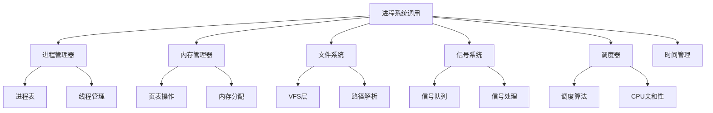

# NOS内核进程相关系统调用分析报告

## 概述

本报告分析了kernel/src/syscalls/mod.rs中的进程管理相关系统调用实现，包括传统的单体实现和新的模块化架构实现。分析涵盖了系统调用识别、函数签名、实现逻辑、错误处理、依赖关系以及迁移建议。

## 1. 发现的进程相关系统调用列表

### 1.1 核心进程管理系统调用（0x1000-0x1FFF范围）

| 系调用号 | 函数名 | Linux对应 | 描述 | 实现状态 |
|---------|--------|----------|------|----------|
| 0x1000 | sys_fork | fork | 创建子进程 | ✅ 完整实现 |
| 0x1001 | sys_execve | execve | 执行程序 | ✅ 完整实现 |
| 0x1002 | sys_waitpid | waitpid | 等待子进程 | ✅ 完整实现 |
| 0x1003 | sys_exit | exit | 进程退出 | ✅ 完整实现 |
| 0x1004 | sys_getpid | getpid | 获取进程ID | ✅ 完整实现 |
| 0x1005 | sys_getppid | getppid | 获取父进程ID | ✅ 完整实现 |
| 0x1020 | sys_wait4 | wait4 | 扩展等待 | ✅ 完整实现 |

### 1.2 进程权限和身份管理

| 系调用号 | 函数名 | Linux对应 | 描述 | 实现状态 |
|---------|--------|----------|------|----------|
| 0x1006 | sys_setuid | setuid | 设置用户ID | ✅ 完整实现 |
| 0x1007 | sys_getuid | getuid | 获取用户ID | ✅ 完整实现 |
| 0x1008 | sys_setgid | setgid | 设置组ID | ✅ 完整实现 |
| 0x1009 | sys_getgid | getgid | 获取组ID | ✅ 完整实现 |
| 0x101E | sys_geteuid | geteuid | 获取有效用户ID | ✅ 完整实现 |
| 0x101F | sys_getegid | getegid | 获取有效组ID | ✅ 完整实现 |
| 0x101D | sys_setreuid | setreuid | 设置真实/有效用户ID | ✅ 完整实现 |
| 0x101F | sys_setregid | setregid | 设置真实/有效组ID | ✅ 完整实现 |

### 1.3 进程会话和组管理

| 系调用号 | 函数名 | Linux对应 | 描述 | 实现状态 |
|---------|--------|----------|------|----------|
| 0x100A | sys_setsid | setsid | 创建会话 | ✅ 完整实现 |
| 0x100B | sys_getsid | getsid | 获取会话ID | ✅ 完整实现 |
| 0x101C | sys_setpgid | setpgid | 设置进程组ID | ✅ 完整实现 |
| 0x101D | sys_getpgid | getpgid | 获取进程组ID | ✅ 完整实现 |

### 1.4 进程调度和优先级管理

| 系调用号 | 函数名 | Linux对应 | 描述 | 实现状态 |
|---------|--------|----------|------|----------|
| 0x100C | sys_nice | nice | 调整进程优先级 | ✅ 完整实现 |
| 0x100D | sys_sched_yield | sched_yield | 让出CPU | ✅ 完整实现 |
| 0x100E | sys_sched_get_priority_max | sched_get_priority_max | 获取最大优先级 | ✅ 完整实现 |
| 0x100F | sys_sched_get_priority_min | sched_get_priority_min | 获取最小优先级 | ✅ 完整实现 |
| 0x1010 | sys_sched_setscheduler | sched_setscheduler | 设置调度策略 | ✅ 基础实现 |
| 0x1011 | sys_sched_getscheduler | sched_getscheduler | 获取调度策略 | ✅ 基础实现 |
| 0x1012 | sys_sched_setparam | sched_setparam | 设置调度参数 | ✅ 基础实现 |
| 0x1013 | sys_sched_getparam | sched_getparam | 获取调度参数 | ✅ 基础实现 |
| 0x1014 | sys_sched_setaffinity | sched_setaffinity | 设置CPU亲和性 | ✅ 基础实现 |
| 0x1015 | sys_sched_getaffinity | sched_getaffinity | 获取CPU亲和性 | ✅ 基础实现 |

### 1.5 进程控制和管理

| 系调用号 | 函数名 | Linux对应 | 描述 | 实现状态 |
|---------|--------|----------|------|----------|
| 0x1016 | sys_prctl | prctl | 进程控制 | ✅ 部分实现 |
| 0x1017 | sys_capget | capget | 获取能力 | ✅ 完整实现 |
| 0x1018 | sys_capset | capset | 设置能力 | ✅ 完整实现 |
| 0x1019 | sys_sbrk | sbrk | 调整程序断点 | ✅ 完整实现 |
| 0x101A | sys_sleep | sleep | 进程睡眠 | ✅ 完整实现 |
| 0x101B | sys_uptime | uptime | 系统运行时间 | ✅ 完整实现 |
| 0x101E | sys_getrlimit | getrlimit | 获取资源限制 | ✅ 完整实现 |
| 0x101F | sys_setrlimit | setrlimit | 设置资源限制 | ✅ 完整实现 |
| 0x1021 | sys_raise | raise | 发送信号给自己 | ✅ 完整实现 |

### 1.6 线程相关系统调用（0x8000-0x8FFF范围）

| 系调用号 | 函数名 | Linux对应 | 描述 | 实现状态 |
|---------|--------|----------|------|----------|
| 0x8000 | sys_clone | clone | 创建线程/进程 | ✅ 复杂实现 |
| 0x8001 | sys_fork | fork | 创建进程 | ✅ 调用进程模块 |
| 0x8002 | sys_vfork | vfork | 快速fork | ✅ 基础实现 |
| 0x8003 | sys_execve | execve | 执行程序 | ✅ 基础实现 |
| 0x8004 | sys_exit | exit | 退出 | ✅ 调用进程模块 |
| 0x8005 | sys_wait4 | wait4 | 等待 | ✅ 基础实现 |
| 0x8006 | sys_gettid | gettid | 获取线程ID | ✅ 完整实现 |
| 0x8007 | sys_getpid | getpid | 获取进程ID | ✅ 调用进程模块 |
| 0x8008 | sys_set_tid_address | set_tid_address | 设置TID地址 | ✅ 基础实现 |
| 0x8009 | sys_futex | futex | 快速用户空间互斥锁 | ✅ 高级实现 |
| 0x800A | sys_set_robust_list | set_robust_list | 设置健壮锁列表 | ✅ 基础实现 |
| 0x800B | sys_get_robust_list | get_robust_list | 获取健壮锁列表 | ✅ 基础实现 |
| 0x800C | sys_sched_yield | sched_yield | 让出CPU | ✅ 调用进程模块 |
| 0x800D | sys_sched_getaffinity | sched_getaffinity | 获取CPU亲和性 | ✅ 基础实现 |
| 0x800E | sys_sched_setaffinity | sched_setaffinity | 设置CPU亲和性 | ✅ 基础实现 |
| 0x800F | sys_unshare | unshare | 取消共享资源 | ✅ 完整实现 |
| 0x8010 | sys_setns | setns | 加入命名空间 | ✅ 基础实现 |

## 2. 函数签名和参数分析

### 2.1 核心进程管理函数

#### sys_fork
```rust
fn sys_fork(_args: &[u64]) -> SyscallResult
```
- **参数**: 无参数
- **返回**: 子进程中返回0，父进程中返回子进程PID
- **复杂度**: 中等（涉及进程表操作、内存复制）

#### sys_execve
```rust
fn sys_execve(args: &[u64]) -> SyscallResult
```
- **参数**: [pathname_ptr, argv_ptr, envp_ptr]
- **返回**: 成功时不返回，失败时返回错误
- **复杂度**: 高（涉及ELF加载、内存管理、文件系统操作）

#### sys_waitpid
```rust
fn sys_waitpid(args: &[u64]) -> SyscallResult
```
- **参数**: [pid, status_ptr, options]
- **返回**: 子进程PID或错误
- **复杂度**: 中等（涉及进程状态管理、信号处理）

#### sys_exit
```rust
fn sys_exit(args: &[u64]) -> SyscallResult
```
- **参数**: [status]
- **返回**: 不返回
- **复杂度**: 低（简单状态更新）

### 2.2 权限管理函数

#### sys_setuid/sys_setgid
```rust
fn sys_setuid(args: &[u64]) -> SyscallResult
fn sys_setgid(args: &[u64]) -> SyscallResult
```
- **参数**: [uid]/[gid]
- **返回**: 0表示成功
- **复杂度**: 中等（涉及权限检查、进程表更新）
- **安全特性**: 完整的POSIX权限检查实现

### 2.3 调度相关函数

#### sys_sched_setscheduler/sys_sched_setaffinity
```rust
fn sys_sched_setscheduler(args: &[u64]) -> SyscallResult
fn sys_sched_setaffinity(args: &[u64]) -> SyscallResult
```
- **参数**: [target_pid, policy/affinity, ...]
- **返回**: 0表示成功
- **复杂度**: 中等（基础实现，未完全集成到调度器）

## 3. 实现逻辑和依赖关系分析

### 3.1 核心依赖模块

1. **进程管理器** (`crate::process::manager`)
   - 进程表操作 (`PROC_TABLE`)
   - 进程创建、销毁、状态管理

2. **内存管理** (`crate::mm::vm`)
   - 页表操作 (`copyin`, `copyout`)
   - 内存映射和权限管理

3. **文件系统** (`crate::vfs`)
   - 可执行文件加载
   - 路径解析和文件访问

4. **信号处理** (`crate::ipc::signal`)
   - 进程间信号通信
   - 信号掩码和 pending 信号

5. **时间管理** (`crate::time`)
   - 睡眠和超时处理
   - 系统时钟

6. **线程管理** (`crate::process::thread`)
   - 线程创建和管理
   - futex 同步原语

### 3.2 关键数据结构

1. **进程控制块** (Process Control Block)
   - PID、PPID、状态、优先级
   - 内存布局和页表
   - 文件描述符表
   - 信号处理状态

2. **系统调用参数转换**
   - 用户空间指针验证
   - 参数类型转换和边界检查
   - 错误码映射

### 3.3 实现模式

1. **传统单体模式**
   - 直接在process.rs中实现
   - 通过dispatch函数路由
   - 紧密集成，性能较好

2. **新模块化架构**
   - 服务层抽象 (ProcessService)
   - 处理器分离 (handlers.rs)
   - 类型定义独立 (types.rs)
   - 支持动态加载和生命周期管理

## 4. 错误处理方式分析

### 4.1 错误类型层次

```rust
pub enum SyscallError {
    InvalidSyscall,      // 无效系统调用
    NotFound,           // 资源未找到
    PermissionDenied,    // 权限不足
    BadAddress,         // 无效地址
    InvalidArgument,     // 无效参数
    OutOfMemory,        // 内存不足
    IoError,            // I/O错误
    NotSupported,        // 不支持的操作
    WouldBlock,         // 会阻塞
    TimedOut,           // 超时
    Interrupted,         // 被中断
}
```

### 4.2 错误处理策略

1. **早期验证**: 参数数量和范围检查
2. **权限检查**: UID/GID验证、进程关系验证
3. **资源检查**: 内存可用性、文件存在性
4. **状态一致性**: 进程状态转换的合法性检查
5. **回滚机制**: 失败时的资源清理

## 5. 与其他模块的交互分析

### 5.1 进程表交互

```rust
// 典型的进程表操作模式
let proc_table = crate::process::manager::PROC_TABLE.lock();
let proc = proc_table.find_ref(pid).ok_or(SyscallError::NotFound)?;
// 操作进程...
drop(proc_table); // 释放锁
```

### 5.2 内存管理交互

```rust
// 用户空间内存访问模式
unsafe {
    crate::mm::vm::copyin(pagetable, user_buf, src_ptr, len)
        .map_err(|_| SyscallError::BadAddress)?;
    crate::mm::vm::copyout(pagetable, dst_ptr, kernel_buf, len)
        .map_err(|_| SyscallError::BadAddress)?;
}
```

### 5.3 调度器交互

```rust
// 进程状态转换
proc.state = crate::process::ProcState::Runnable;
crate::process::yield_cpu(); // 让出CPU
```

## 6. 复杂度评估

### 6.1 实现复杂度分级

| 复杂度 | 系调用 | 特征 | 代码行数 |
|--------|----------|------|----------|
| 低 | sys_getpid, sys_exit, sys_sched_yield | 简单状态查询/更新 | 10-30 |
| 中等 | sys_fork, sys_waitpid, sys_setuid, sys_nice | 涉及进程表操作、权限检查 | 50-100 |
| 高 | sys_execve, sys_clone, sys_futex | 复杂内存管理、ELF加载、同步原语 | 100-300 |
| 极高 | sys_sbrk | 动态内存管理、页表操作、架构相关 | 200+ |

### 6.2 性能关键路径

1. **快速路径优化** (mod.rs:715-746)
   ```rust
   #[inline(always)]
   fn fast_path_dispatch(syscall_num: usize, args: &[usize]) -> Option<SyscallResult>
   ```
   - getpid直接返回
   - 无参数转换开销

2. **缓存机制**
   - 系统调用结果缓存
   - 纯函数检测和缓存

3. **批处理支持**
   - SYS_BATCH (0x9000) 支持多系统调用原子执行
   - 减少上下文切换开销

## 7. 迁移到新模块的优先级建议

### 7.1 迁移优先级矩阵

| 优先级 | 系调用 | 理由 | 迁移复杂度 |
|--------|----------|------|----------|
| P0 (最高) | sys_fork, sys_execve, sys_waitpid, sys_exit | 核心进程生命周期，影响系统稳定性 | 高 |
| P1 | sys_getpid, sys_getppid, sys_setuid, sys_setgid | 基础进程管理，频繁调用 | 中 |
| P2 | sys_sched_*, sys_nice, sys_yield | 调度相关，影响性能 | 中 |
| P3 | sys_prctl, sys_capget, sys_capset | 进程控制，使用频率较低 | 低 |
| P4 | sys_sbrk, sys_sleep, sys_uptime | 辅助功能，独立性强 | 低 |

### 7.2 迁移策略

1. **渐进式迁移**
   - 先迁移核心进程管理 (P0-P1)
   - 再迁移调度相关 (P2)
   - 最后迁移辅助功能 (P3-P4)

2. **向后兼容性**
   - 保持传统dispatch函数
   - 新模块化架构并行运行
   - 逐步切换调用路径

3. **测试策略**
   - 单元测试覆盖
   - 集成测试验证
   - 性能基准测试

## 8. 潜在的依赖关系和挑战

### 8.1 关键依赖关系



### 8.2 主要挑战

1. **架构复杂性**
   - 传统单体实现与模块化架构并存
   - 两套API需要维护一致性
   - 测试覆盖难度增加

2. **并发安全**
   - 进程表锁竞争
   - 死锁风险
   - 原子操作需求

3. **内存管理复杂性**
   - 用户空间指针验证
   - 页表同步问题
   - 架构特定内存操作

4. **POSIX兼容性**
   - Linux系统调用语义差异
   - 错误码映射复杂性
   - 行为一致性要求

5. **性能优化挑战**
   - 快速路径与完整实现的平衡
   - 缓存一致性问题
   - 批处理语义复杂性

## 9. 建议和总结

### 9.1 立即行动项

1. **统一错误处理**
   - 建立统一的错误码映射
   - 改进错误传播机制
   - 增强错误恢复能力

2. **完善模块化架构**
   - 完成ProcessService的TODO项
   - 实现服务生命周期管理
   - 建立服务间依赖关系

3. **增强测试覆盖**
   - 添加边界条件测试
   - 增加并发场景测试
   - 性能回归测试

4. **文档和规范**
   - 完善API文档
   - 建立编码规范
   - 添加使用示例

### 9.2 长期规划

1. **性能优化**
   - 实现真正的零拷贝优化
   - 优化进程表数据结构
   - 实现NUMA感知调度

2. **安全增强**
   - 完善能力检查机制
   - 实现进程隔离
   - 增强审计功能

3. **可扩展性**
   - 插件化进程管理
   - 支持容器化场景
   - 微服务化架构支持

## 10. 结论

NOS内核的进程相关系统调用实现相对完整，涵盖了POSIX标准的核心功能。主要优势包括：

1. **功能完整性**: 支持标准的进程生命周期管理
2. **架构演进**: 从单体实现向模块化架构演进
3. **性能考虑**: 实现了快速路径和缓存优化
4. **安全机制**: 具备权限检查和能力管理

主要改进空间在于模块化架构的完善、测试覆盖的提升以及性能优化的深化。建议按照优先级矩阵进行渐进式迁移，确保系统稳定性的同时提升代码质量和可维护性。