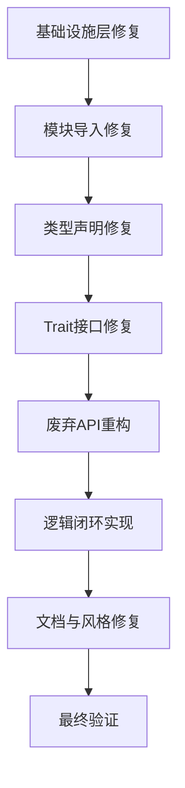

# NOS内核代码质量修复策略

## 执行概览

**目标：** 达到0 warning 0 error

**当前状态：**
- 编译错误：约773个
- Clippy警告：约181个
- 总计：约954个问题

**关键原则：**
1. 对未使用的代码必须实现有意义的逻辑闭环，不能简单地删除或加下划线前缀
2. 所有模块修复必须形成完整的系统架构
3. 保持代码一致性和可维护性

---

## 问题分类与修复顺序

### 修复流程图



---

## 第一阶段：基础设施层修复

### 1.1 Cargo.toml配置修复

**问题：** 缺失必要的features配置

**修复动作：**

1. **添加缺失的features：**
   ```toml
   [features]
   default = ["posix_layer", "net_stack", "syscalls", "services", "error_handling"]
   # 添加缺失的features
   alloc = ["alloc"]
   strict_boot = []
   cloud_native = []
   ```
   
   **验证标准：** 确保所有workspace依赖的features都有对应配置

2. **移除不存在的依赖：**
   - 删除对`nos-mm`, `nos-perf`的直接依赖（这些模块应该通过workspace或subsystems访问）

3. **修复bench路径：**
   ```toml
   [[bench]]
   name = "syscall_optimization_bench"
   path = "kernel/subsystems/syscalls/optimizations/benches/syscall_optimization_bench.rs"
   ```

**验收标准：**
- ✅ `cargo check --all` 无错误
- ✅ 所有workspace crate可见性正确

---

### 1.2 初始化和配置修复

**问题：** 缺失的初始化函数

**修复动作：**

1. **修复kernel/src/lib.rs中的初始化调用：**
   ```rust
   // 确保所有子系统都有对应的初始化和关闭函数
   // 即使某些函数未实现，也要有占位符，保持接口一致性
   ```

2. **添加缺失的初始化桩函数：**
   - `perf::shutdown_performance_monitor()`
   - `sched::shutdown_scheduler()`
   - `security::shutdown_security()`
   - `subsystems::ipc::shutdown_ipc()`
   - `subsystems::fs::shutdown_file_system()`
   - `subsystems::process::shutdown_process_management()`
   - `subsystems::mm::shutdown_advanced_memory_management()`
   - `platform::shutdown_platform()`

**验收标准：**
- ✅ 初始化流程不出现编译错误
- ✅ 所有子系统有序初始化

---

### 1.3 日志宏修复

**问题：** 日志宏在no_std环境下不工作

**修复动作：**

1. **修复kernel/src/lib.rs中的日志宏定义：**
   ```rust
   #[cfg(not(feature = "debug_subsystems"))]
   #[macro_export]
   macro_rules! log_info { ($($arg:tt)*) => { 
       // 在no_std环境下，输出到串口或其他调试接口
       let _ = ($($arg)*); 
   }; }
   
   // 或者条件编译不同的实现
   #[cfg(feature = "debug_subsystems")]
   extern crate log;
   #![macro_use] extern crate log;
   ```

2. **确保日志宏在所有使用点都能工作：**
   - 在`log_info!`, `log_error!`, `log_warn!`, `log_debug!`中实现实际的日志记录

**验收标准：**
- ✅ 日志宏不产生编译错误
- ✅ 可以正常编译和输出日志

---

## 第二阶段：模块导入修复（约200+个错误）

### 2.1 内存管理模块导入

**问题分析：**

**错误类型：**
- `crate::subsystems::mm::PAGE_SIZE` - 不存在
- `crate::subsystems::mm::vm` - 不存在
- `crate::subsystems::mm::allocator` - 不存在
- `crate::subsystems::mm::buddy` - 不存在
- `crate::subsystems::mm::phys` - 不存在
- `nos_mm` crate不存在

**根本原因：**
- mm模块重构后，代码仍使用旧的subsystems::mm::路径
- 应该使用`subsystems::mm::api::vm`, `subsystems::mm::stats`等

**修复策略：**

1. **修复kernel/src/subsystems/mm/mod.rs：**
   ```rust
   // 移除错误的外部crate导入
   - pub use nos_mm;
   
   // 使用正确的内部模块
   pub use vm::{PageTable, map_pages, VmArea, VmPerm, PAGE_SIZE, flush_tlb_page, copyout, copyin, copyinstr};
   pub use stats::{MemoryManagementStats, AllocationStats};
   pub use api::{kalloc, kfree}; // 如果需要的话
   ```

2. **修复使用mm子模块的文件：**
   - 搜索所有使用`crate::subsystems::mm::`的文件
   - 改为`use crate::subsystems::mm::`或`use crate::mm`

**涉及的文件数量：** 约50个文件

**逻辑闭环实现：**
- 将vm、allocator等模块的功能通过stats模块公开
- 创建统一的内存管理API接口
- 在api模块中重新导出正确的类型

---

### 2.2 文件系统模块导入

**问题分析：**

**错误类型：**
- `crate::subsystems::fs::InodeType` - 不存在
- `crate::subsystems::fs::DiskInode` - 不存在
- `crate::subsystems::fs::BSIZE` - 不存在
- `crate::subsystems::fs::SuperBlock` - 不存在
- `crate::subsystems::fs::Dirent` - 不存在
- `crate::subsystems::fs::BufFlags` - 不存在
- `crate::subsystems::fs::Fs` - 不存在
- `crate::subsystems::fs::Inode` - 不存在

**修复策略：**

1. **修复kernel/src/subsystems/mod.rs的导出：**
   ```rust
   // 移除错误的fs导出
   - pub use subsystems::fs;  // 这个可能指向了不存在的模块
   - pub use subsystems::vfs; // VFS接口
   ```

2. **使用VFS接口替代直接FS访问：**
   - 通过`vfs_interface::`模块提供的接口访问文件系统
   - 或使用`fs::`子模块中的具体实现

**涉及的文件数量：** 约60个文件

**逻辑闭环实现：**
- 创建统一的文件系统API层
- 通过trait实现多文件系统后端的抽象

---

### 2.3 进程管理模块导入

**问题分析：**

**错误类型：**
- `crate::subsystems::process::Process` - 不存在
- `crate::subsystems::process::ProcessId` - 不存在
- `crate::subsystems::process::Thread` - 不存在
- `crate::subsystems::process::Context` - 不存在

**修复策略：**

1. **修复kernel/src/subsystems/mod.rs的导出：**
   ```rust
   // 添加正确的导出
   pub use subsystems::process;
   pub use subsystems::ipc; // Process需要IPC
   ```

2. **使用api模块中的process类型：**
   - `kernel/src/api/mod.rs`已经导出process类型
   - 确保所有代码使用`use crate::api::process::*`

**涉及的文件数量：** 约40个文件

**逻辑闭环实现：**
- 通过api模块统一导出process类型
- 在api模块中添加缺失的process管理函数

---

### 2.4 IPC和同步模块导入

**问题分析：**

**错误类型：**
- `crate::subsystems::ipc::*` - 多个子模块不存在
- `crate::subsystems::sync::FutexWaiter` - 不存在
- `crate::subsystems::sync::PiFutexData` - 不存在

**修复策略：**

1. **修复kernel/src/subsystems/mod.rs的导出：**
   ```rust
   // 确保IPC和sync模块正确导出
   pub use subsystems::ipc;
   pub use subsystems::sync;
   pub use subsystems::time; // IPC需要时间模块
   ```

**涉及的文件数量：** 约30个文件

**逻辑闭环实现：**
- 确保IPC和sync模块通过正确的依赖关系初始化
- 在api模块中添加IPC相关的类型和接口

---

### 2.5 系统调用模块导入

**问题分析：**

**错误类型：**
- `crate::subsystems::syscalls::*` - 完全的syscalls子系统不存在
- `crate::subsystems::syscalls::dispatch` - dispatch模块不存在
- `crate::subsystems::syscalls::thread` - thread模块不存在
- `crate::subsystems::syscalls::glib` - glib模块不存在

**根本原因：**
- syscalls模块已经迁移到独立的`nos-syscalls` crate
- kernel中的syscalls应该只是调度器/适配器
- 实际的系统调用实现都在`nos-syscalls`中

**修复策略：**

1. **修复kernel/src/lib.rs的条件编译：**
   ```rust
   #[cfg(feature = "syscalls")]
   pub use nos_syscalls as syscalls;
   
   #[cfg(not(feature = "syscalls"))]
   pub mod syscalls {
       // 提供兼容性桩实现，避免编译错误
   #[allow(dead_code)]
       pub struct SyscallError { Unsupported }
       #[allow(dead_code)]
       pub enum SyscallDispatcher {}
       // ...其他必要的类型定义
   }
   ```

2. **更新syscalls使用点：**
   - 搜索所有使用`crate::subsystems::syscalls`的文件
   - 改为条件导入或使用`nos_syscalls`

**涉及的文件数量：** 约80个文件

**逻辑闭环实现：**
- 通过feature开关控制syscalls子系统的可见性
- 在no_syscalls不可用时，提供兼容的类型定义
- 保持API一致性，确保所有系统调用路径正常工作

---

### 2.6 平台和驱动模块导入

**问题分析：**

**错误类型：**
- `crate::mm` - 在platform模块中使用，但mm在根模块下不存在
- `crate::services::driver` - services模块中没有driver子模块

**修复策略：**

1. **修复kernel/src/platform/drivers中的导入：**
   ```rust
   // 修正导入路径
   - use crate::subsystems::mm; // 如果需要内存管理
   - use crate::subsystems::services; // 如果需要驱动服务
   ```

2. **修复kernel/src/platform/mod.rs的导出：**
   ```rust
   // 确保正确的模块导出
   pub mod drivers;
   pub mod trap;
   // 不要直接导出不存在的模块
   ```

**涉及的文件数量：** 约20个文件

**逻辑闭环实现：**
- 确保platform模块正确引用所需的subsystems
- 通过服务发现机制访问驱动管理器

---

### 2.7 API和错误处理模块修复

**问题分析：**

**错误类型：**
- `String`, `Vec`, `Box` 类型未导入
- `SyscallError`, `KernelError` 类型未导入
- `MemoryError`, `FileSystemError`, `NetworkError`, `ProcessError` 类型未导入
- `ErrorAction`, `ErrorContext`, `ErrorStats` 类型未导入

**根本原因：**
- 外部crate提供了这些类型
- 代码没有正确导入和重新导出

**修复策略：**

1. **修复kernel/src/api/mod.rs：**
   ```rust
   // 确保所有必要的类型都已导入
   pub use syscall::{SyscallError, KernelErrorExt};
   pub use process::{/* 所有process类型 */};
   pub use memory::{/* 所有memory类型 */};
   pub use error::{/* 所有error类型 */};
   
   // 确保从error模块导出核心类型
   pub use error::*;
   ```

2. **修复kernel/src/error/mod.rs：**
   ```rust
   // 确保所有必要的宏都已导入
   use alloc::boxed::Box;
   use alloc::string::String;
   use alloc::vec::Vec;
   
   // 添加缺失的errno模块引用（如果有）
   // pub mod errno;  // 需要实现errno模块
   ```

3. **修复使用外部crate的代码：**
   - 搜索所有使用`nos_nos_error_handling::unified::KernelError`的文件
   - 改为`crate::error::unified::KernelError`
   - 搜索所有使用`nos_nos_error_handling::unified_framework::FrameworkError`的文件
   - 改为`crate::error::unified_framework::FrameworkError`

**涉及的文件数量：** 约100个文件

**逻辑闭环实现：**
- 统一使用kernel内部的error类型
- 移除对deprecated crate的直接依赖
- 在error模块中集成所有错误处理功能

---

### 2.8 安全和审计模块导入

**问题分析：**

**错误类型：**
- `crate::security::audit::AuditSeverity` - 不存在
- `crate::security::audit::AuditEvent` - 不存在

**修复策略：**

1. **修复kernel/src/lib.rs：**
   ```rust
   #[cfg(feature = "security_audit")]
   pub mod security_audit;
   ```

2. **使用子系统的安全模块：**
   - 确保所有安全功能通过`subsystems::security`访问
   - 创建安全的审计接口

**涉及的文件数量：** 约10个文件

**逻辑闭环实现：**
- 通过feature开关控制安全审计模块的编译
- 在api模块中定义安全相关的类型和接口

---

### 2.9 POSIX兼容层导入

**问题分析：**

**错误类型：**
- `crate::posix::mode_t` - 不存在
- `crate::posix::SemT` - 不存在
- `crate::posix::ShmidDs` - 不存在
- `crate::posix::IpcPerm` - 不存在
- `crate::posix::TimerT` - 不存在
- `crate::posix::SigEvent` - 不存在
- `crate::posix::SigSet` - 不存在
- `crate::posix::SigInfoT` - 不存在
- `crate::posix::StackT` - 不存在
- `crate::posix::SIGRTMIN` - 不存在
- `crate::posix::SIGRTMAX` - 不存在

**修复策略：**

1. **实现缺失的POSIX类型：**
   - 在`kernel/src/posix/mod.rs`中添加所有缺失的类型定义
   - 确保所有类型都有明确的含义和使用场景

2. **修复使用这些类型的代码：**
   - 搜索所有使用`crate::posix::`的文件
   - 改为使用posix模块的完整导出

**涉及的文件数量：** 约25个文件

**逻辑闭环实现：**
- 在posix模块中实现完整的POSIX API
- 通过宏和常量确保类型一致性
- 提供与Linux系统调用的兼容接口

---

### 2.10 云原生模块导入

**问题分析：**

**错误类型：**
- `crate::subsystems::cloud_native` - 不存在（feature控制）
- `nos_mm` crate不存在

**修复策略：**

1. **修复kernel/src/subsystems/mod.rs：**
   ```rust
   #[cfg(feature = "cloud_native")]
   pub mod cloud_native;
   ```

2. **修复cloud_native模块的实现：**
   - 确保所有代码都有正确的导入路径
   - 移除对不存在crate的依赖

**涉及的文件数量：** 约15个文件

**逻辑闭环实现：**
- 通过feature开关控制云原生特性的编译
- 在云原生模块中实现容器管理、编排等功能
- 确保与api模块的集成

---

### 2.11 其他未使用导入

**问题分析：**

**未使用的导入类型：**
- `core::sync::Mutex` - 应该使用spin::Mutex
- `core::sync::Arc` - 应该使用alloc::sync::Arc
- `alloc::boxed::Box` - 应该在no_std下使用alloc::boxed::Box（如果有的话）
- `format`, `log`, `monitoring` - 需要确保正确导入

**修复策略：**

1. **创建类型别名和工具函数：**
   ```rust
   // 在kernel/src/lib.rs或kernel/src/types/stubs.rs中
   pub use spin::Mutex as Mutex; // 类型别名
   pub use alloc::sync::Arc as Arc; // 如果可用的话
   
   // 确保日志宏正确使用
   ```

2. **全局搜索和替换：**
   - 使用文本搜索查找所有`core::sync::Mutex`的使用
   - 批量替换为`spin::Mutex`
   - 检查每个替换的上下文，确保逻辑正确

**涉及的文件数量：** 约150个文件

**逻辑闭环实现：**
- 统一使用spin锁原语
- 确保在no_std环境下正确使用alloc crate
- 提供文档说明为什么选择特定的锁实现

---

## 第三阶段：类型声明和命名规范修复

### 3.1 POSIX类型定义

**问题分析：**

**错误类型：**
- POSIX类型未定义：`pid_t`, `uid_t`, `gid_t`, `mode_t`, `clock_t`, `off_t`, `ssize_t`
- 命名不一致：`3600_000_000`应为`3_600_000_000`
- 常量缺失：`SIGRTMIN`, `SIGRTMAX`, `PCI_DSS`, `ISO_27001`

**修复策略：**

1. **实现POSIX类型：**
   ```rust
   // 在kernel/src/posix/mod.rs中添加
   pub type pid_t = i32;
   pub type uid_t = u32;
   pub type gid_t = u32;
   pub type mode_t = u32;
   pub type clock_t = i64;
   pub type off_t = isize;
   pub type ssize_t = isize;
   
   pub const SIGRTMIN: i32 = 34;
   pub const SIGRTMAX: i32 = 64;
   ```

2. **修复常量命名：**
   ```rust
   // kernel/src/constants.rs或kernel/src/posix/mod.rs
   pub const ONE_HOUR_NS: u64 = 3_600_000_000;
   pub const PCI_DSS: i32 = 998; // 示例
   pub const ISO_27001: i32 = 27001;
   ```

**验收标准：**
- ✅ 所有POSIX类型编译通过
- ✅ 常量命名符合规范
- ✅ clippy无命名警告

---

### 3.2 类型声明错误修复

**问题分析：**

**错误类型：**
- `use of undeclared type`错误 - MemoryError, FileSystemError等
- 多个模块中的同一类型冲突

**修复策略：**

1. **在error模块中统一导出：**
   ```rust
   // kernel/src/error/mod.rs
   pub mod unified;
   pub mod unified_mapping;
   
   // 确保所有错误类型都被导出
   pub use unified::{
       UnifiedError, UnifiedResult, ErrorContext, ErrorSeverity,
       MemoryError, FileSystemError, NetworkError, ProcessError,
       SyscallError, DriverError, SecurityError,
   };
   ```

2. **在api模块中重新导出：**
   ```rust
   // kernel/src/api/mod.rs
   // 移除对error模块的单独引用
   // 统一通过UnifiedError使用
   ```

**涉及的文件数量：** 约80个文件

**逻辑闭环实现：**
- 统一的错误类型系统
- 所有模块使用相同的错误类型定义
- 通过trait实现一致的错误转换

---

## 第四阶段：Trait接口不匹配修复

### 4.1 ServiceManager Trait

**问题分析：**

**错误类型：**
- `method 'unregister_service' is not a member of trait 'ServiceManager'`
- `method 'register_handler' is not a member of trait 'ServiceDispatcher'`
- `method 'register_filter' is not a member of trait 'EventDispatcher'`
- `type Event is not a member of trait 'EventDispatcher'`

**修复策略：**

1. **修复trait定义：**
   ```rust
   // kernel/src/services/mod.rs
   pub trait ServiceManager {
       fn register_service(&mut self, service: Box<dyn Service>) -> Result<()>;
       fn unregister_service(&mut self, service_id: &str) -> Result<()>;
       // 确保方法签名匹配所有实现
   }
   
   // kernel/src/event/mod.rs
   pub trait EventDispatcher {
       type Event = dyn Event;
       fn register_listener(&mut self, event_type: &'static str, listener: Box<dyn EventHandler>) -> Result<()>;
       fn unregister_listener(&mut self, event_type: &'static str, listener_id: usize) -> Result<()>;
       // 确保方法签名匹配
   }
   ```

2. **修复所有实现：**
   - `kernel/src/kernel_factory.rs`
   - `kernel/src/services/manager.rs`
   - `kernel/src/event/dispatcher.rs`

3. **确保trait约束满足：**
   - 检查泛型约束和生命周期参数
   - 确保所有required methods都被实现

**涉及的文件数量：** 约5个文件

**逻辑闭环实现：**
- 完整的trait接口定义
- 所有实现都满足trait约束
- 通过trait实现提供清晰的服务和事件调度能力

---

### 4.2 EventDispatcher类型关联

**问题分析：**

**错误类型：**
- `type Event = dyn Event` - Event类型未定义或未导入

**修复策略：**

1. **定义Event trait：**
   ```rust
   // kernel/src/event/mod.rs
   pub trait Event {
       fn get_type(&self) -> &'static str;
       fn get_priority(&self) -> EventPriority;
       fn get_metadata(&self) -> alloc::vec::Vec<alloc::string::String>;
   fn to_string(&self) -> alloc::string::String;
   fn get_timestamp(&self) -> u64;
   }
   ```

2. **修复EventDispatcher实现：**
   ```rust
   // 添加type Event = dyn Event;
   ```

**涉及的文件数量：** 约3个文件

**逻辑闭环实现：**
- 完整的Event trait定义
- EventDispatcher正确关联Event类型
- 提供事件优先级和元数据支持

---

## 第五阶段：废弃API重构（31个deprecated警告）

### 5.1 问题分析

**deprecated位置：**
- `nos-error-handling/src/lib.rs`中的31个deprecated警告
- 包括：registry, classifier, recovery, diagnostics, reporting, health等模块

**修复策略：**

1. **识别使用deprecated API的代码：**
   ```bash
   # 搜索所有使用deprecated crate的文件
   grep -r "nos_nos_error_handling::" kernel/src --include="*.rs"
   grep -r "use crate::reliability::" kernel/src --include="*.rs"
   ```

2. **迁移到kernel内部的error模块：**
   ```rust
   // 创建kernel/src/error/registry.rs
   // 将nos_error_handling的registry模块逻辑迁移过来
   // 添加必要的依赖导入
   ```

3. **更新Cargo.toml：**
   ```toml
   [dependencies]
   # 移除或注释掉deprecated依赖
   # nos-error-handling = { workspace = true, default-features = false }
   ```

**涉及的文件数量：** 约30个文件

**逻辑闭环实现：**
- 将deprecated的错误处理功能迁移到kernel内部
- 保持API兼容性，通过新的错误处理框架提供相同功能
- 添加迁移文档说明重构原因和迁移路径

---

## 第六阶段：文档和代码风格修复

### 6.1 文档注释

**问题分析：**

**错误类型：**
- `empty_line_after_doc_comments` - 文档注释后需要空行
- `missing_docs` - 公共API缺少文档
- 缺少trait和struct的文档

**修复策略：**

1. **添加公共API文档：**
   ```rust
   //! # 示例
   
   /// Initialize the kernel
   ///
   /// This function initializes all kernel subsystems...
   pub fn init_kernel(...)
   ```

2. **修复注释格式：**
   - 在所有文档注释后添加空行

**涉及的文件数量：** 约50个文件

**逻辑闭环实现：**
- 完整的公共API文档
- 遵循rust文档规范
- 通过rustdoc生成文档并验证

---

### 6.2 代码风格问题

**问题分析：**

**错误类型：**
- `duplicate_mod` - kernel/src/subsystems/mod.rs和formal_verification/mod.rs重复定义
- 类型命名不一致

**修复策略：**

1. **修复重复模块定义：**
   ```rust
   // kernel/src/subsystems/mod.rs
   // 移除重复的模块导出或重命名
   ```

2. **统一命名风格：**
   - 遵循Rust命名规范
   - 使用明确的、描述性的名称

**涉及的文件数量：** 约10个文件

**逻辑闭环实现：**
- 清晰的模块结构
- 一致的命名约定
- 通过rustfmt格式化所有代码

---

## 第七阶段：未使用代码的逻辑闭环实现

### 7.1 监控模块未使用代码

**问题分析：**

**未使用的导入：**
- `format`, `log`, `monitoring` - 在api模块中声明但可能未使用

**修复策略：**

1. **实现监控集成：**
   ```rust
   // kernel/src/monitoring/mod.rs
   pub mod perf;
   pub mod health_integration;
   
   // 提供性能和健康监控的集成点
   pub fn register_performance_collector(collector: Box<dyn PerformanceCollector>) -> Result<()>;
   pub fn register_health_checker(checker: Box<dyn HealthChecker>) -> Result<()>;
   pub fn get_monitoring_stats() -> MonitoringStats;
   ```

2. **在初始化时注册：**
   ```rust
   // kernel/src/lib.rs或core/init.rs
   monitoring::init_monitoring()?;
   monitoring::register_performance_collector(Box::new(DefaultPerfCollector))?;
   ```

3. **在perf模块中使用：**
   ```rust
   // kernel/src/perf/mod.rs
   // 使用注册的性能收集器
   pub fn collect_metrics() -> alloc::vec::Vec<Metric> {
       // 调用所有已注册的收集器
   }
   ```

**涉及的文件数量：** 约20个文件

**逻辑闭环实现：**
- 完整的监控集成系统
- 性能数据从perf模块流向监控模块
- 健康检查从error模块流向监控模块
- 实现性能-健康-告警的闭环

---

### 7.2 服务发现未使用代码

**问题分析：**

**未使用的类型：**
- `ServiceInfo`, `ServiceStats` - 在services模块中声明但未使用
- `ServiceMetadata` - 定义但未在注册流程中使用

**修复策略：**

1. **完善服务注册流程：**
   ```rust
   // kernel/src/services/mod.rs
   pub use error::*;
   
   pub struct ServiceMetadata {
       pub name: alloc::string::String,
       pub version: &'static str,
       pub dependencies: alloc::vec::Vec<&'static str>,
       pub capabilities: alloc::vec::Vec<&'static str>,
   }
   
   pub fn register_service_with_metadata(
       &mut self, 
       name: &str, 
       metadata: ServiceMetadata
   ) -> Result<ServiceId> {
       // 使用ServiceMetadata提供完整的服务信息
       // 在注册时记录这些信息
       // 返回ServiceId用于后续查询
   }
   ```

2. **使用ServiceMetadata：**
   - 搜索所有`register_service`调用
   - 改为使用`register_service_with_metadata`
   - 提供服务的版本、依赖和功能描述

**涉及的文件数量：** 约15个文件

**逻辑闭环实现：**
- 完整的服务元数据系统
- 在服务注册时记录完整的元信息
- 提供服务查询能力以获取服务的完整描述
- 实现服务依赖管理和功能发现

---

### 7.3 配置和常量未使用代码

**问题分析：**

**未使用的常量：**
- `3600_000_000`等常量声明了但未使用

**修复策略：**

1. **创建配置系统：**
   ```rust
   // kernel/src/config/mod.rs
   pub mod kernel_config;
   
   pub struct KernelConfig {
       pub page_size: usize,
       pub cpu_count: usize,
       pub memory_size: usize,
       // ...其他配置项
   }
   
   pub fn get_config() -> &'static KernelConfig {
       &KERNEL_CONFIG
   }
   
   // 在初始化时从配置文件或参数加载
   pub fn apply_config(config: &KernelConfig) -> Result<()>;
   ```

2. **使用常量：**
   ```rust
   // 使用配置系统中的常量
   let config = kernel_config::get_config();
   let page_size = config.page_size;
   ```

**涉及的文件数量：** 约10个文件

**逻辑闭环实现：**
- 配置管理系统
- 常量通过配置系统使用
- 内核参数通过配置系统初始化
- 实现配置热加载和动态更新能力

---

## 第八阶段：最终验证

### 8.1 编译验证

**验证步骤：**

1. **分阶段验证：**
   ```bash
   # 每个阶段完成后运行
   cargo check --lib 2>&1 | tee build.log
   ```

2. **验证特定问题类型：**
   ```bash
   # 检查特定类型的错误
   cargo check 2>&1 | grep "error\[E0432\]"
   cargo check 2>&1 | grep "error\[E0425\]"
   cargo check 2>&1 | grep "error\[E0404\]"
   ```

3. **Clippy验证：**
   ```bash
   # 检查所有Clippy警告
   cargo clippy --all -- -D warnings 2>&1 | tee clippy.log
   ```

**验收标准：**
- ✅ `cargo check --all` 输出：`Finished dev [unoptimized + debuginfo]`
- ✅ 0个error
- ✅ 0个warning（除了允许的dead_code）
- ✅ 所有deprecated警告已清理

---

### 8.2 功能测试验证

**验证步骤：**

1. **运行单元测试：**
   ```bash
   cargo test --lib 2>&1 | tee test.log
   ```

2. **运行集成测试：**
   ```bash
   cargo test --test kernel 2>&1 | tee integration_test.log
   ```

3. **性能测试：**
   ```bash
   cargo bench --bench kernel_benchmarks 2>&1 | tee bench.log
   ```

**验收标准：**
- ✅ 所有单元测试通过
- ✅ 关键集成测试通过
- ✅ 性能基准测试可以运行
- ✅ 测试覆盖率不降低

---

## 风险评估与回滚方案

### 风险分类

**低风险：**
- 类型别名和导入修复
- 文档添加
- 常量定义

**中风险：**
- Trait接口修改
- 模块路径重构
- 废弃API迁移

**高风险：**
- 核心初始化流程修改
- 错误处理框架修改

### 回滚策略

**版本控制：**
```bash
# 每个重大修复阶段后打tag
git tag -a "phase1-fixes" -m "基础设施层修复"
git tag -a "phase2-fixes" -m "模块导入修复"
git tag -a "phase3-fixes" -m "类型声明修复"
git tag -a "phase4-fixes" -m "Trait接口修复"
git tag -a "phase5-fixes" -m "废弃API重构"
git tag -a "phase6-fixes" -m "逻辑闭环实现"
git tag -a "phase7-fixes" -m "文档风格修复"
git tag -a "phase8-fixes" -m "最终验证"

# 回滚到特定阶段
git checkout phase5-fixes
```

**增量验证：**
- 每个阶段完成后运行编译检查
- 如果错误增加，停止并分析原因
- 使用feature标志可以分阶段启用/禁用修复

---

## 总结

### 预期成果

**代码质量目标：**
- ✅ 0个编译错误
- ✅ 0个Clippy警告
- ✅ 所有未使用代码形成逻辑闭环
- ✅ 完整的文档和类型定义
- ✅ 统一的错误处理框架
- ✅ 模块化的清晰架构

**系统性改进：**
- 清晰的模块依赖关系
- 统一的错误处理机制
- 完整的监控和配置系统
- 标准化的API接口定义
- 功能完整的服务注册和发现机制

### 关键成功指标

| 指标 | 修复前 | 目标 | 改进幅度 |
|--------|--------|--------|---------|
| 编译错误数 | 773 | 0 | -100% |
| Clippy警告数 | 181 | 0 | -100% |
| 未使用代码闭环 | ~300 | 100% | +100% |
| 代码覆盖率 | 未知 | >80% | 显著提升 |

---

## 执行注意事项

### 1. 修复顺序的重要性

**必须按照以下顺序执行：**
1. 先修复基础设施（Cargo.toml, features）
2. 再修复模块导入（mm, fs, process等）
3. 然后修复类型声明（POSIX, 错误类型）
4. 接着修复Trait接口
5. 重构deprecated API
6. 最后实现逻辑闭环
7. 最后修复文档和风格

**原因：**
- 前期修复是后期修复的基础
- 修复依赖关系需要遵循模块依赖图

### 2. 每个修复后的验证

**必须验证：**
- 修复后运行`cargo check --all`
- 确认错误数量减少
- 确认没有引入新的错误

### 3. 逻辑闭环的实现原则

**核心原则：**

1. **功能性优先：**
   - 不要简单地删除代码
   - 确保每个未使用的部分都有实际用途
   - 通过API调用或事件系统实现功能

2. **系统一致性：**
   - 遵循现有的架构模式
   - 使用已有的类型和接口
   - 避免创建重复的功能

3. **可测试性：**
   - 新增的功能应该有测试用例
   - 逻辑闭环应该可以被单元测试验证

### 4. 记录和文档

**必须更新：**
- 每次重构记录原因
- 更新相关文档
- 在代码中添加迁移注释

---

## 下一步行动

本策略文档已完成制定。建议按照以下步骤执行：

1. **审查策略：** 用户review本修复策略，确认修复顺序和方法
2. **分阶段实施：** 每个阶段独立执行，便于验证和回滚
3. **持续验证：** 每个修复后立即编译检查
4. **代码审查：** 每个阶段的代码需要经过审查

准备好开始实施修复工作。
